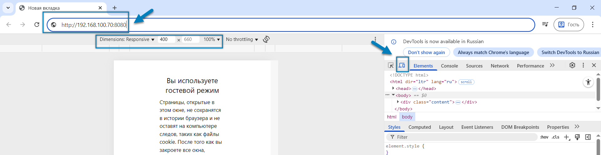

Эмулятор ТСД может быть запущен, если для сотрудника установлен флаг 
[**Интерфейс ТСД в браузере**](../masterdata/referenceemployees.md#вкладка-разрешения).
При этом приложение эмулятора будет работать с определёнными функциональными ограничениями по сравнению с полноценным
apk-приложением. Эмулятор предназначен в первую очередь для демонстрационного использования, а не для полноценной
работы.

Эмулятор может работать:
- на персональном компьютере
- на мобильном устройстве, например смартфоне

<tip>
**Важно**
- устройства, на которых запускается эмулятор, должны видеть работающий сервер WMS в рамках локальной сети 
</tip>

Для запуска эмулятора на персональном ПК:
1. Открыть браузер Chrome.
2. Открыть режим разработчика с помощью клавиши F12.
3. Нажать на кнопку в панели разработчика (на рисунке отмечено стрелкой) или использовать комбинацию клавиш Ctrl +
   Shift + M для открытия панели эмуляции мобильного устройства.
4. При необходимости изменить разрешение экрана панели эмуляции мобильного устройства.
5. Ввести IP-адрес сервера приложения WMS в адресной строке: обязательно указать протокол http и порт 8080,
   например: `http://192.168.100.70:8080`. Действительный IP-адрес сервера можно найти в свойствах сетевого подключения
   на серверном ПК или узнать у администратора.
6. Когда появится интерфейс окна входа в систему ввести логин и пароль

 
Рис. 1 Подготовка к запуску Эмулятора ТСД на ПК

<info>
- Если эмулятор запускается на том же компьютере, где установлен сервер WMS, можно использовать 
адрес `http://localhost:8080` или `http://127.0.0.1:8080` — это упростит подключение и исключит сетевые ошибки.
</info>

Для запуска эмулятора на мобильном устройстве:
1. Ввести IP-адрес сервера приложения WMS в адресной строке: обязательно указать протокол http и порт 8080,
   например: `http://192.168.100.70:8080`. Действительный IP-адрес сервера можно найти в свойствах сетевого подключения
   на серверном ПК или узнать у администратора.
2. Когда появится интерфейс окна входа в систему ввести логин и пароль. Так как приложение эмулятора ТСД блокирует
   всплывающую клавиатуру (чтобы она не перекрывала интерфейс при работе с другими окнами), ввод учетных данных
   осуществляется из буфера обмена. Данные в буфер обмена можно заранее поместить из другого приложения, содержащего
   поле ввода (например, текстовый редактор, почта или браузер).

[//]: # (todo - можно добавить фото экрана мобильного устройства)

