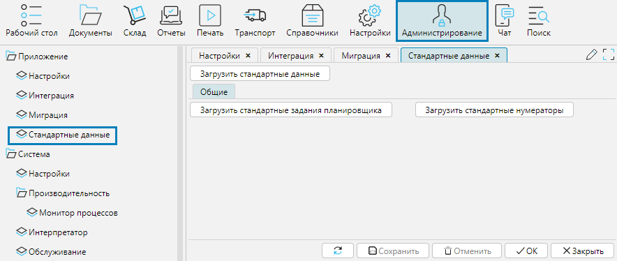

Система предоставляет возможность загрузить стандартные данные, т.е. данные, которые с большой долей вероятности будут востребованы в любой конфигурации приложения.

**Загрузить стандартные данные** - загружает все доступные стандартные данные. 
Чтобы данные были загружены и сохранены необходимо нажать на кнопку, затем нажать **Сохранить** внизу формы.

**Загрузить стандартные задания планировщика** - загружает задания планировщика, такие как например, обслуживание БД. 
Чтобы данные были загружены и сохранены необходимо нажать на кнопку, затем нажать Сохранить внизу формы.

**Загрузить стандартные нумераторы** - загружает настроенные нумераторы для объектов, например, входящих и исходящих документов. 
Чтобы данные были загружены и сохранены необходимо нажать на кнопку, затем нажать **Сохранить** внизу формы.

  
Рис. 1 Форма Стандартные данные  

