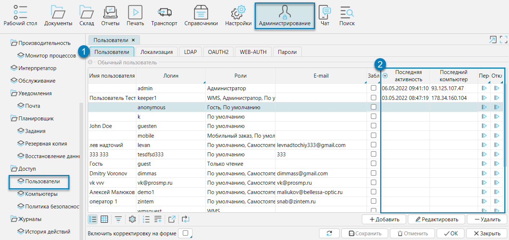
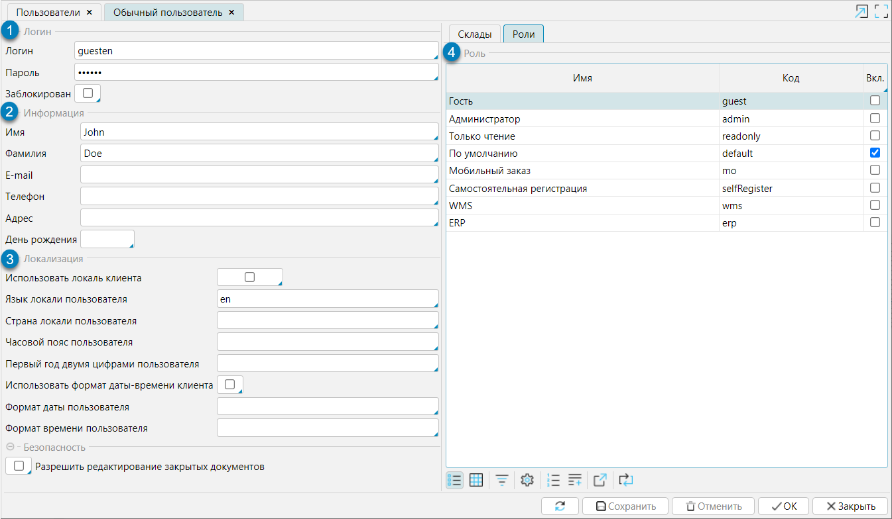
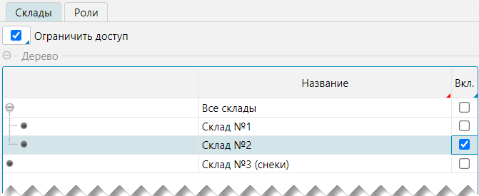

В системе предусмотрено два вида пользователей:

- **Обычный пользователь**, для которого гарантируется авторизация и возможность работать в системе в соответствии с правами доступа 
(см. раздел [Политика безопасности (настройка доступа пользователей)](politics.md))
- **Сотрудник** - пользователь, который работает на складе(ах) и выполняет функции оператора и/или кладовщика. 
Кроме прав доступа для сотрудника доступны настройки, относящиеся к непосредственному выполнению складских операций. 
Создание и настройка сотрудников описаны в разделе [Справочник сотрудников](../../../control/employee.md).

- Все сотрудники являются и пользователями, соответственно на форме **Администрирование - Доступ - Пользователи** представлен исчерпывающий 
список всех пользователей системы (рис. 1).

В таблице на вкладке **Пользователи** (рис. 1(1)) приведены общие данные обо всех пользователях системы: имя, логин, присвоенные роли, статус блокировки, e-mail. 
Также по каждому пользователю отображается (рис. 1(2)) дата и время последней активности в системе и данные компьютера, с которого пользователь работал; 
с помощью соответствующих кнопок можно **Переподключить** или **Отключить** пользователя от системы. 

  
Рис. 1 Список пользователей системы  

При открытии на редактирование карточки пользователя (двойное нажатие мыши на запись пользователя или кнопка **Редактировать**), 
откроется форма **Обыкновенного пользователя** (рис. 2), или форма **Сотрудника** (см. раздел [Справочник сотрудников](../../../control/employee.md)), 
если пользователь является сотрудником.  Для пользователя указывается следующая информация:

1. **Данные для входа в систему**: логин и пароль. Также можно заблокировать пользователя. Заблокированный пользователь не может войти в систему.
2. **Личные данные пользователя**: имя и фамилия, контактные данные, дата рождения.
3. **Настройки локализации**, которые позволяют задать формат даты, времени, используемого языка, отличный от используемого по умолчанию. По умолчанию используются локальные настройки сервера.
4. На вкладке **Роли** устанавливаются роли пользователя, которые определяют его уровень доступа. 
Подробнее о настройках ролей читайте в разделе [Политика безопасности (настройка доступа пользователей)](politics.md).
5. (рис. 3) На вкладке **Склады** управляют доступом пользователя к складам. Пользователь имеет доступ только к документам доступного ему/ей склада. 
По умолчанию открыт доступ ко всем складам системы, чтобы ограничить его, необходимо отметить признак **Ограничить доступ** и отметить склады, 
которые должны быть доступны пользователю.  В интерфейсе (список складов, топология, остатки, документы и т.д.) сотрудник с ограниченным доступом видит 
только данные по складам, которые ему доступны.

  
Рис. 2 Карточка Обыкновенного пользователя

  
Рис. 3 Вкладка Склады

