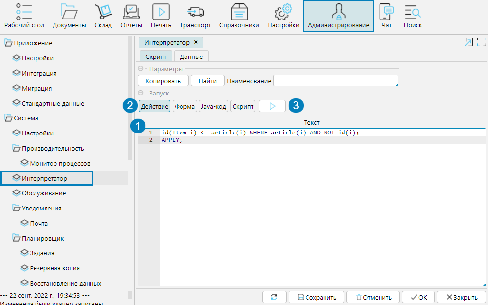
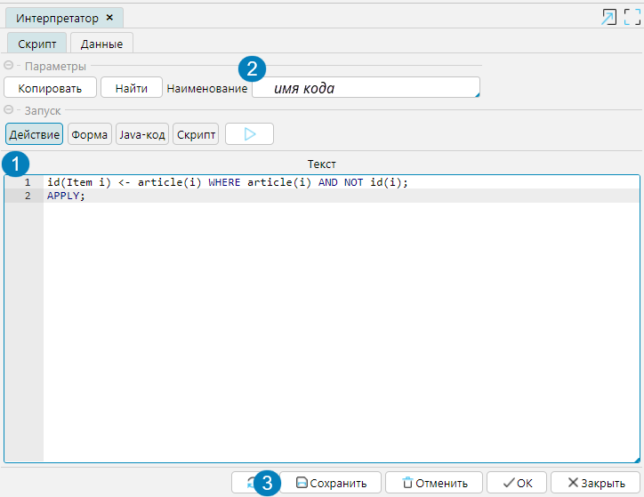
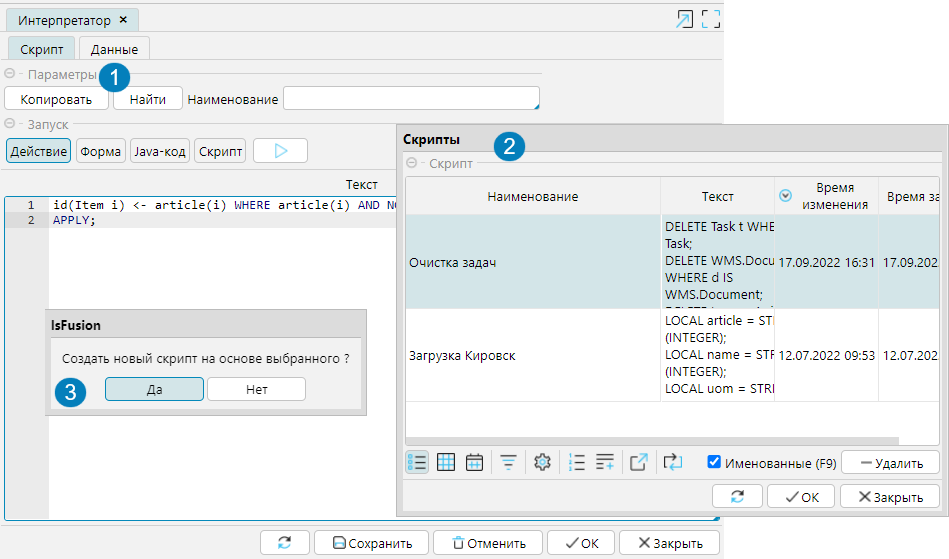

Механизм интерпретатора позволяет оперативно выполнять программный код на языке lsFusion.

Чтобы выполнить код на форме **Администрирование - Интерпретатор**, необходимо:
1. В поле **Текст** напечатать программный код для выполнения.
2. Выбрать, к чему относится программный код: Действие, форма, Java-код или скрипт.
3. Запустить выполнение кнопкой 

  
Рис. 1 Выполнение кода в интерпретаторе  

Если программный код необходимо выполнять периодически, его можно сохранить:

1. В поле **Текст** напечатать программный код
2. В поле **Наименование** ввести название кода (необязательно)
3. Нажать **Сохранить**.

  
Рис. 2 Сохранение кода  

Для выполнения сохраненного кода необходимо:

1. Нажать кнопку **Найти**.
2. В открывшемся окне выбрать нужный скрипт и нажать OK. С помощью фильтра Именованные можно отобрать только скрипты с именем.
3. В открывшемся окне необходимо подтвердить создание скрипта на основе выбранного.
4. Выполнить запуск скрипта (рис. 1)

Рис. 3 Выполнение сохраненного кода  

