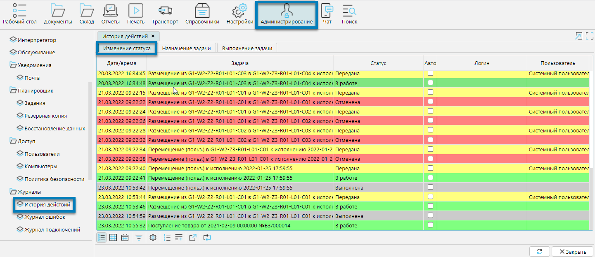
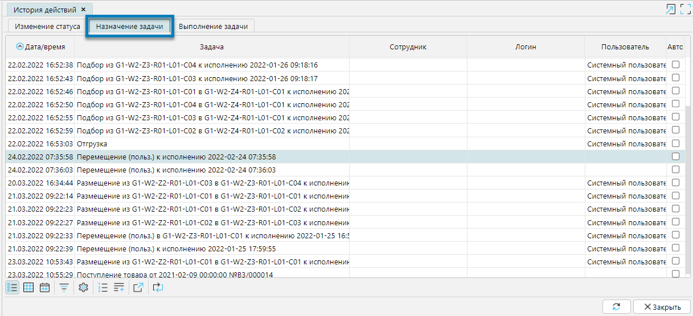
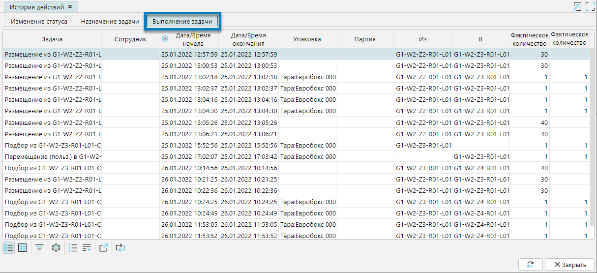

На форме **История действий** модуля **Администрирование** отображаются все предпринятые действия по назначению и выполнению задач по складским операциям (рис. 1).

На вкладке **Изменение статуса** отображаются все статусы, через которые проходила задача, дата и время изменения статуса и пользователь, который изменил статус (рис. 1).

На вкладке **Назначение задачи** по каждой задаче отображается дата и время, когда задача была назначена сотруднику, кому и кем она была назначена (рис. 2).

На вкладке **Выполнение задачи** отображаются все действия, которые были предприняты по каждой задаче с фиксацией даты и времени начала и окончания действия, 
сотрудника, который его выполнял и подробностей самого действия (рис. 3).

  
Рис. 1 Изменение статуса задачи  

  
Рис. 2 Назначение задачи  

  
Рис. 3 Выполнение задачи  

