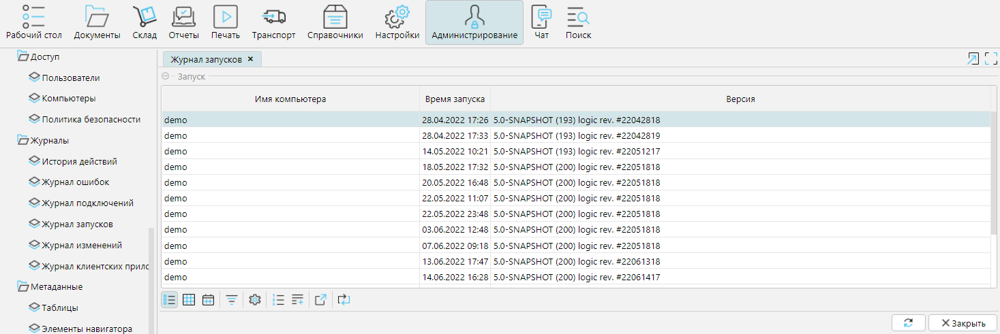

На форме **Администрирование - Журналы - Журнал запусков** отображается информация о дате и времени запуска (перезапуска) сервера приложений. 
Также видно имя компьютера, на котором установлен сервер и версия программы lsFusion WMS.

  

  