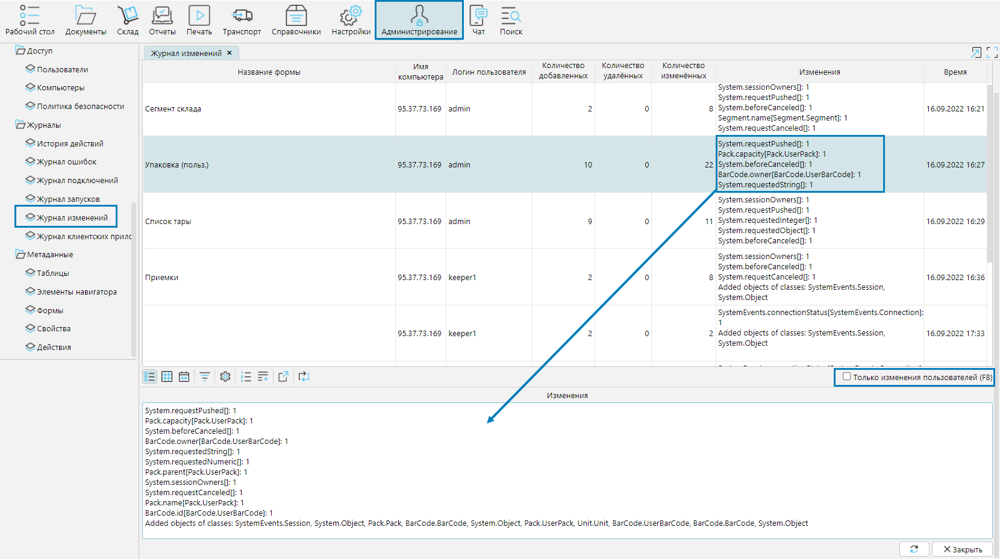

**Журнал изменений** находится в модуле **Администрирование** и содержит подробную информацию о примененных в системе изменениях, 
которые также отражены в [Журнале подключений](connection.md) в секции **Сессия**.

В колонке **Изменения** отображается список свойств (колонок), в которых менялись значения, а также количество изменений (строк). 
Логируются только изменения на текущей форме. Зависимые свойства, которые меняются одновременно в других таблицах, в данный список не попадают.

**Только изменения пользователя** - фильтр отображает только изменения, сделанные пользователями (без системных изменений).

  

