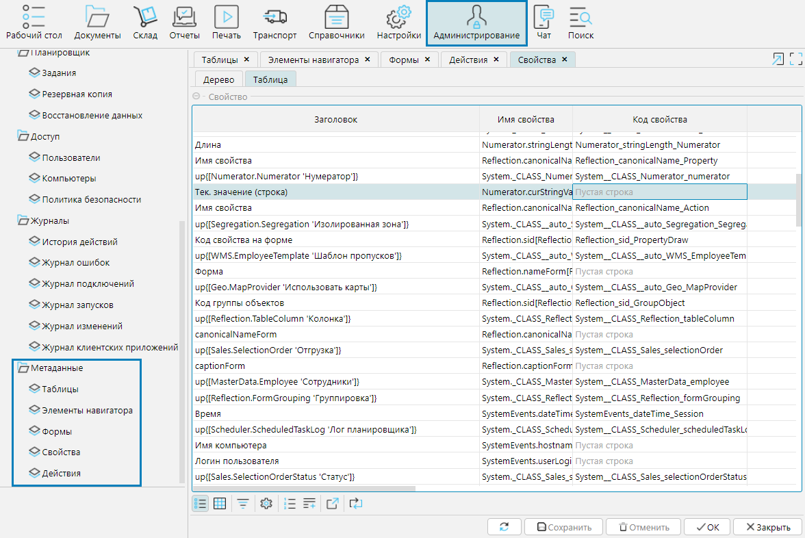

В разделе **Метаданные** модуля **Администрирование** приведены справочные данные об используемых в системе формах, свойствах, 
действиях и характеризующих их свойствах и признаках.

На форме **Таблицы** отображена информация о таблицах базы данных и доступны действия с таблицами, описание которых приводится в п. **Обслуживание системы**.

  

