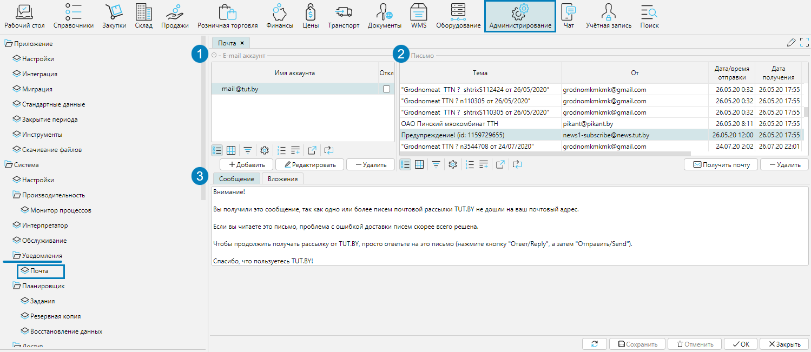
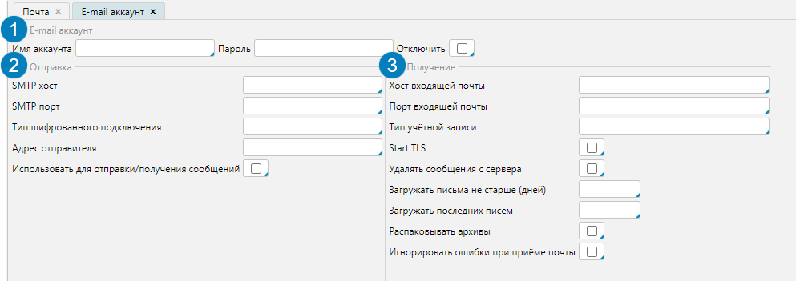
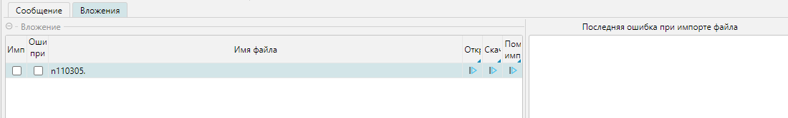

В системе есть возможность настроить получение/отправку e-mail сообщений. Они могут использоваться для обмена сообщениями с контрагентами или сотрудниками, 
импорта вложений в качестве документов, а также отправки/получения уведомлений в связи с событиями/действиями в системе.

На форме **Администрирование - Уведомления - Почта** можно настроить и просмотреть настроенные почтовые аккаунты и поступившие по почте сообщения.

  
Рис. 1 Форма Почта

В блоке **e-mail аккаунт** (рис. 1(1) отображаются настроенные аккаунты. Управление аккаунтами осуществляется 
кнопками **Добавить, Редактировать** и **Удалить**. Для аккаунта необходимо заполнить данные подключения (рис. 2), 
значения полей для Вашего e-mail аккаунта можно уточнить у провайдера:

1. Имя и пароль доступа в аккаунт. Также e-mail можно сделать неактивным, если отметить признак **Отключить**.
2. Настройки отправки сообщений
3. Настройки получения сообщений

  
Рис. 2 Настройка почтового аккаунта

В блоке **Письмо** (рис. 1(2)отображается список входящей корреспонденции.

**Получить почту** - загружает новые письма, для этого действия можно настроить автоматическое выполнение в Планировщике.

**Удалить** - удаляет выделенное письмо.

На вкладке **Сообщение** (рис. 1(3) отображается сообщение выделенного электронного письма.

На вкладке **Вложения** (рис. 3) отображается список вложений выделенного электронного письма. 
Если вложение импортировано в систему, то будет отмечен чекбокс **Импортировано**. 
Если при импорте произошли ошибки, будет отмечен чекбокс **Ошибки при импорте**. 
Вложение можно **Открыть, Скачать** или **Пометить импортированным** соответствующими кнопками в строке вложения.  
Если были ошибки при импорте, то сообщение о последней ошибке будет отображаться в блоке **Последняя ошибка при импорте файла**. 

  
Рис. 3 Вкладка Вложения  

