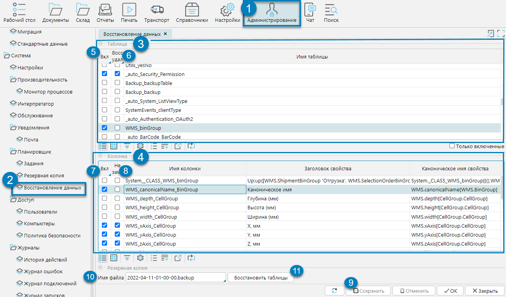

Механизм восстановления данных на форме **Администрирование - Планировщик - Восстановление** данных предполагает только частичное восстановление, 
то есть восстановление не всех таблиц из архива, а только выбранных пользователем (рис. 1(1,2); 
далее в скобках указаны соответствующие маркеры на рис. 1). 
Для этого в секции **Таблица** (3), в поле _**Вкл**_ (5) устанавливается отметка напротив нужных таблиц. 
При этом для каждой таблицы можно определить состав восстанавливаемых колонок – отметка в поле **_Вкл_** (7)секции **Колонка** (4).

_**Восстанавливать удаленные объекты**_ (6) - для каждой таблицы можно устанавливать полноту восстанавливаемых данных: 
если отметка не стоит, то ранее удаленные в текущей БД объекты (например, товары) не восстанавливаются, в противном случае – восстанавливаются все данные.

_**Не замещать**_ (8) - для каждой колонки можно установить режим замещения данных: 
если отметка не стоит, то замещение происходит для любых значений колонки, иначе – ранее заполненные значения не замещаются, замещаются только пустые.

После выбора нужных Таблиц/Колонок, а также режимов восстановления, установки необходимо сохранить – кнопка **Сохранить** (9). 
В поле **Имя файла** (10) выбирается нужных бэкап и нажимается кнопка **Восстановить** (11).

Полное восстановление БД осуществляется с помощью специального скрипта.
  
Рис. 1 Восстановление данных  

