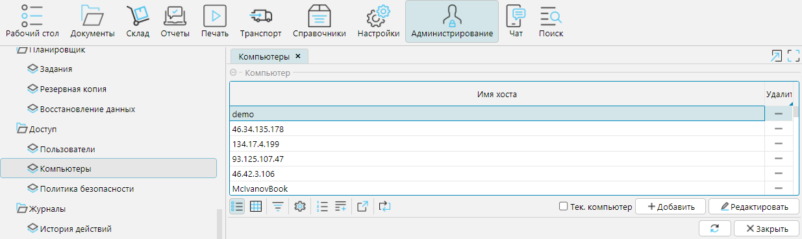

На форме **Администрирование - Доступ - Компьютеры** отображается список всех компьютеров (по имени или IP-адресу), 
которые когда-либо подключались к системе. Список формируется автоматически.

**Добавить** - добавление компьютера в список вручную

**Редактировать** - изменение имени компьютера

**Удалить** - удаление компьютера из списка. Если с удаленного из списка компьютера вновь произойдет подключение, он снова появится в списке.

**Тек. компьютер** - при включении фильтра отображается только имя компьютера текущего пользователя.

  

