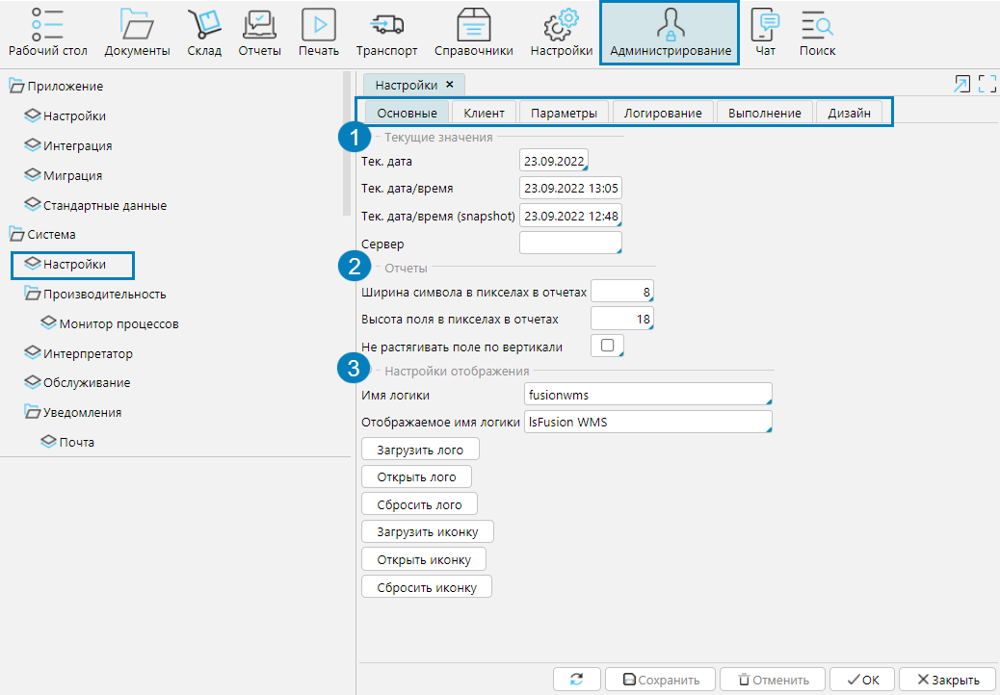
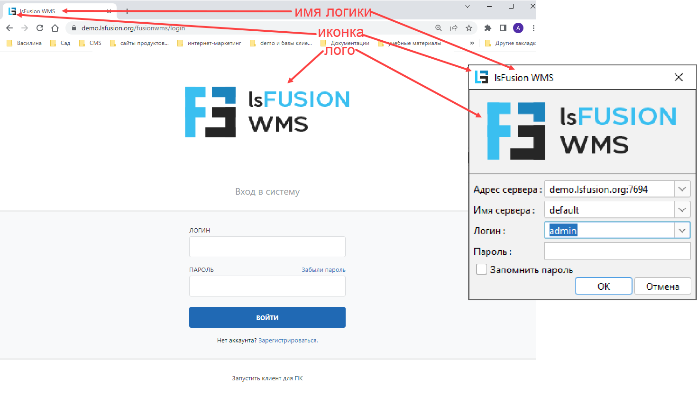
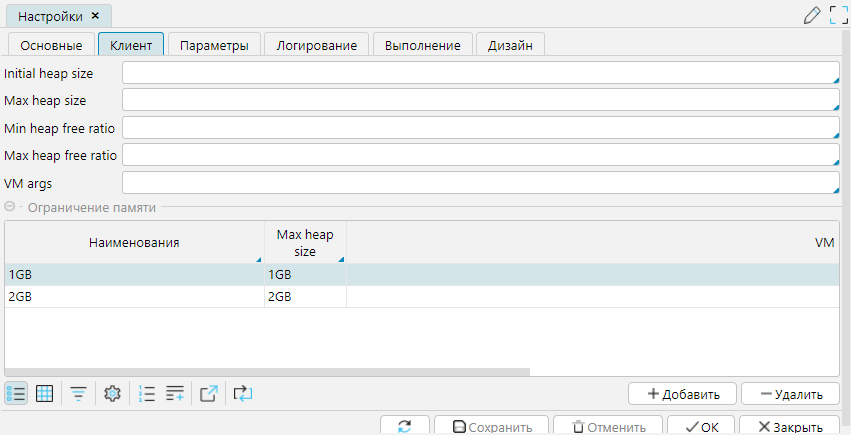
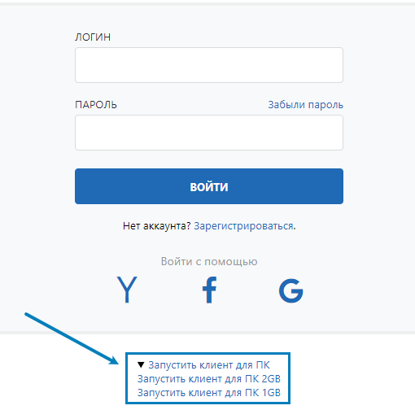
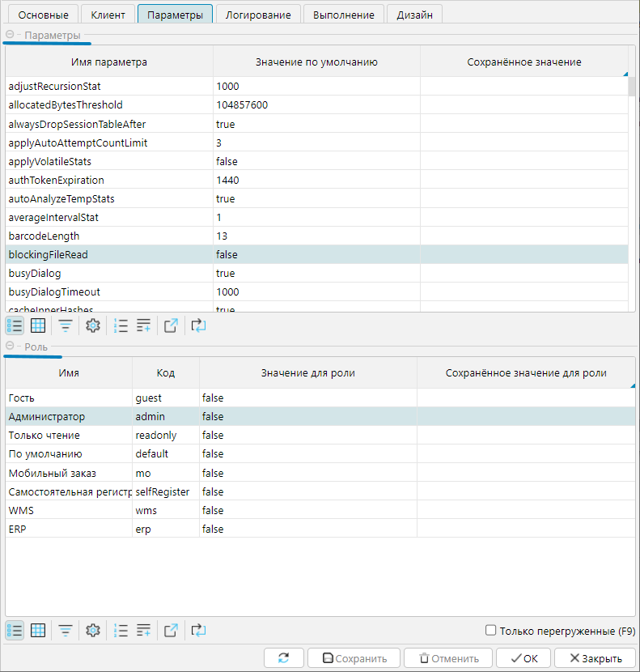
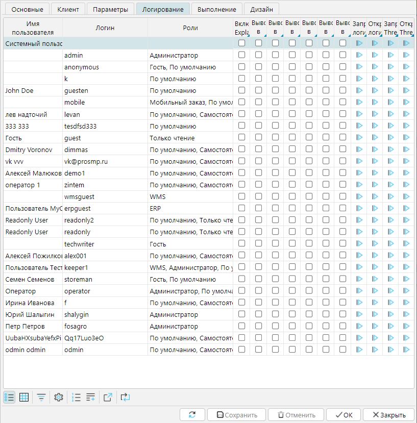
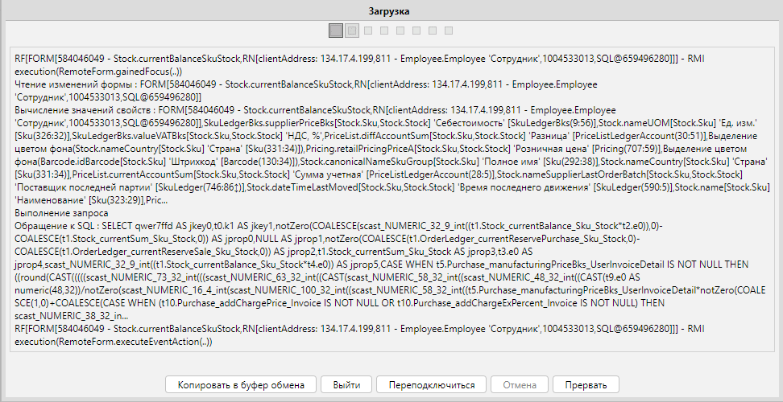
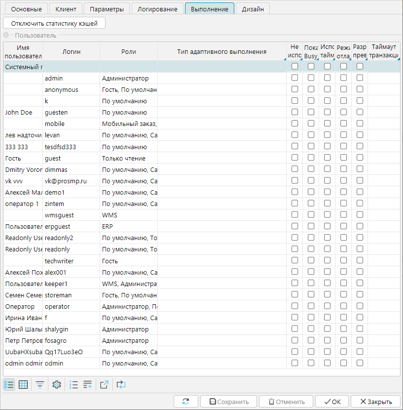
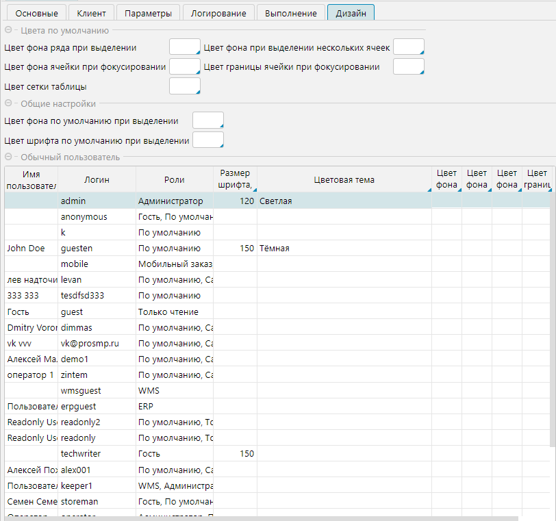

На форме **Администрирование - Система - Настройки** можно управлять системными параметрами lsFusion WMS. 
Форма состоит из вкладок, на каждой из которых доступно управление различными типами параметров. 
После внесения изменений в какие-либо параметры необходимо **Сохранить** изменения.

## Вкладка Основные

1. **Текущие значения** - здесь можно изменить значение текущей даты и времени:  

**Тек. дата** - текущая дата, которая ежедневно меняется планировщиком.  

**Тек. дата/время** - отображается дата и время открытия формы (в соответствии с датой/временем на сервере).  

**Тек. дата/время (snapshot)** - дата и время изменяются планировщиком.

**Сервер** - если указан сервер, то некоторые действия можно будет запустить только непосредственно с указанного сервера, например задания планировщика. 
Если поле пустое, или указан сервер, на котором установлен сервер-приложений (соответствует имени компьютера в Журнале запусков), то действия доступны всем клиентам.

2\. **Отчеты**

3\. **Настройки отображения** - определяют, как будет оформлено отображение клиента (рис. 2). 
Для web-клиента изменения применятся только после перезагрузки сервера.

**Имя логики** - имя бизнес-логики

**Отображаемое имя логики** - указанное имя будет отображаться как название вкладки браузера, где запущен web-клиент или стартового окна desktop-клиента.

**Загрузить/Открыть/Сбросить лого** - позволяет загрузить/просмотреть/удалить файл изображения,  которое будет демонстрироваться на стартовом экране клиента.

**Загрузить/Открыть/Сбросить иконку** - позволяет загрузить/просмотреть/удалить файл изображения, которое будет отображаться рядом с именем логики.  

  
Рис. 1 Форма Настройки вкладка Основные  

  
Рис. 2 Стартовый экран клиентского приложения  

## Вкладка **Клиент**

На данной вкладке можно установить параметры heap памяти для desktop-клиента и установить варианты параметров его запуска.

    
  
Рис. 3 Вкладка Клиент  

## Вкладка **Параметры**

На данной вкладке можно задать параметры работы системы. В блоке **Параметры** задаются глобальные значения.  
В блоке **Роль** можно изменить значение выделенного параметра для каждой роли. Значения основных параметров описаны в [документации платформы lsFusion](https://docs.lsfusion.org/ru/Working_parameters/).
  

## Вкладка **Логирование**

На данной вкладке можно управлять параметрами логирования на уровне конкретных пользователей.

**Включен Explain** - включает запись файла лога планов запросов сервера БД, превышающих по времени выполнения установленный в миллисекундах параметр explainThreshold.

**Выводить в лог операции сервера** - включает запись файла расширенных логов сервера приложений

**Выводить в лог SQL запросы** - включает запись в файл всех SQL запросов

**Выводить в лог действия пользователей** - в лог remote будут записываться все действия пользователя.

**Выводить в лог инфо о временных таблицах, Выводить в лог сист. инфо (debug), Выводить в лог синх. инфо (debug)** - 
параметры логирования системной информации, предназначены для разработчиков.

Приведенные ниже команды работают только на desktop клиенте.

**Запросить логи** - формируется и выполняется запрос, по которому логи клиента запаковываются в архив и отправляются на сервер

**Открыть логи** - после того, как логи были получены сервером, их можно просмотреть по данной команде

**Запросить ThreadDump** - формируется и выполняется запрос, по которому список активных потоков клиента отправляется на сервер

**Открыть ThreadDump** - после того, как список потоков был получен сервером, его можно просмотреть по данной команде
  
Рис. 5 Вкладка Логирование  

## Вкладка **Выполнение**

На данной вкладке можно управлять некоторыми параметрами функционирования системы на уровне пользователя.

**Отключить статистику кэшей** - при работе системы осуществляется сбор статистики кэшей, который потребляет память. 
Для экономии памяти его можно отключить. Однако учитывая, что потребление памяти данным процессом исключительно низкое, отключение, обычно нецелесообразно.

**Тип адаптивного выполнения** - данный параметр определяет поведение системы в случае, когда запросы выполняются дольше, чем установлено в системе. 
Возможны 3 типа выполнения запросов: материализация подзапросов, нет, отключение nested loop.
- Материализация подзапросов - используется по умолчанию, в этом случае система разбивает запрос на подзапросы и выполняет их.
- Нет - изменений в выполнении запроса не происходит.
- Отключение nested loop - выполнение запроса продолжается с отключенным nested loop

**Не использовать nested loop** - для пользователя все запросы будут выполняться с отключенным nested loop

**Показывать busydialog** - по умолчанию busydialog отображается, но если глобальными настройками он скрыт, 
то для отдельных пользователей можно включить его отображение.
  
Рис. 6 Busydialog  

**Использовать таймаут в запросах** - настройка для desktop-клиента, включает механизм, который повторно отправляет запрос с клиента на сервер, если первоначально в установленный таймаут запрос не дошел до сервера.

**Режим отладки** - при потере соединения с сервером клиент самостоятельно переподключается при восстановлении соединения.

**Разрешено превышение потребляемой памяти** - выключает механизм защиты от высокого потребления памяти

**Таймаут транзакций (сек.)** - при установке таймаута любая транзакция будет прерываться при достижении таймаута.

Рис. 7 Вкладка Выполнение  

## Вкладка **Дизайн**

На данной вкладке можно установить настройки оформления интерфейса клиентского приложения по умолчанию и для каждого зарегистрированного пользователя.

Значения параметров аналогичные настройкам индивидуального дизайна в профиле пользователя [см. п. Пользовательская настройка интерфейса](../../common/settings.md). 
  
Рис. 8 Вкладка Дизайн
