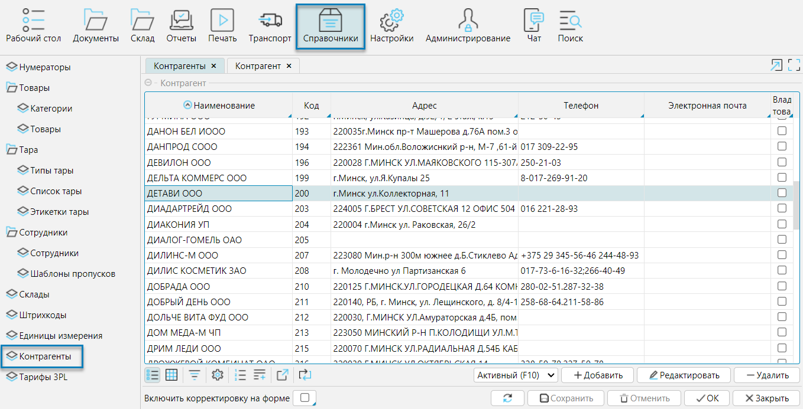
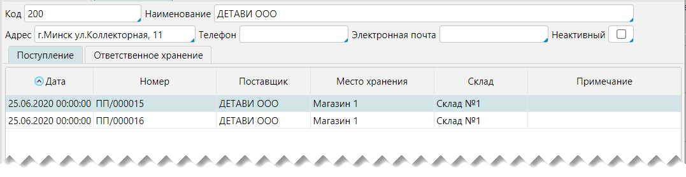
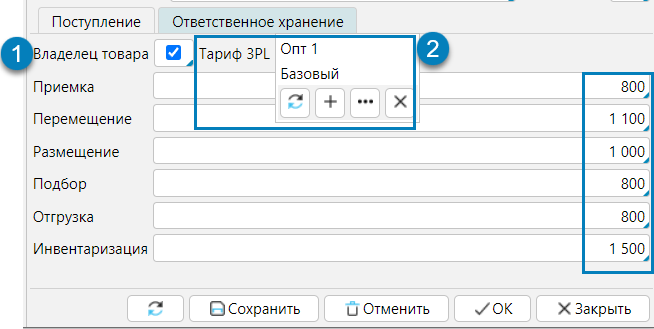

Справочник контрагентов может как импортироваться из внешней системы, так и создаваться и редактироваться в lsFusion WMS. 
Справочник доступен в меню **Справочники - Контрагенты** (рис. 1) или **Рабочий стол - Контрагенты**.  
Для управления списком контрагентов используют кнопки **Добавить, Редактировать, Удалить**.

  
Рис. 1 Список контрагентов  

На форме контрагента (рис. 2) указывают его **Наименование, Код**, т.е. уникальный идентификатор, и контактные данные: **Адрес, Телефон, Электронная почта**.

**Неактивный** - признак, что с контрагентом по каким-либо причинам не ведется деятельность, неактивные контрагенты не могут быть выбраны в документах

Вкладка **Поступление** - на данной вкладке отображаются все документы-поступления от контрагента

Вкладка **Ответственное хранение** - на данной вкладке отображается информация о предоставлении логистических услуг контрагенту (рис.3). 
Если данному контрагенту предоставляются логистические услуги, то необходимо отметить признак **Владелец товара** (1), 
после этого появятся дополнительные поля (2).  В поле **Тариф 3PL** выбирают тариф, по которому оказываются услуги. 
Стоимость услуг по каждой складской операции будет автоматически указана в соответствии с тарифом. Управление тарифами осуществляется на форме **Справочники - Тарифы 3PL**.

  
Рис. 2 Карточка контрагента

  
Рис. 3 Вкладка Ответственное хранение

