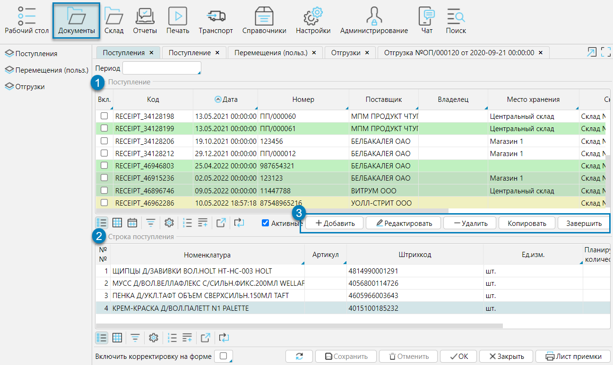

Документы по товародвижению могут как импортироваться из внешней ERP системы, так и создаваться в lsFusion WMS. 
Формы со списками документов доступны в меню **Документы** (рис. 1), а также наиболее часто используемые документы доступны в меню **Рабочий стол - Документы**.

Рассмотрим структуру формы списка документов на примере формы **Поступления**.

В верхней части формы (рис. 1 (1)) в таблице приведен список документов, спецификация выделенного документа отображается в нижней части формы(рис. 1 (2)). 
В таблице документов по каждому документу в колонках содержаться доступные данные, в нижней таблице отображаются данные по каждой строке спецификации документа.

В зависимости от статуса обработки документа он выделен соответствующим цветом, например, загруженные документы - белые, те, 
которые находятся в работе - желтые и т.д. Под таблицей документов отображаются функциональные кнопки действий с документами (рис.1(3)). 
Состав отображаемых кнопок зависит от статуса документа и настроек прав доступа пользователя.

**Добавить** - создание нового документа

**Редактировать** - открытие документа с возможностью вносить изменения

**Удалить** - удаление документа

**Копировать** - создание копии выделенного документа, основные атрибуты документа, включая спецификацию будут скопированы

**Завершить** - переводит документ в статус завершенного, т.е. работа с документом закончена.

**Открыть** - доступен только для завершенных документов, возвращает завершенный документ в работу

**В архив** - доступен только для завершенных документов, делает документ неактивным

**Из архива** - доступен только для архивированных документов, возвращает документ в активный статус. 

  
Рис. 1 Список приходных документов

