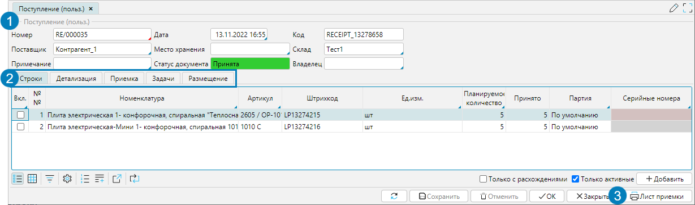
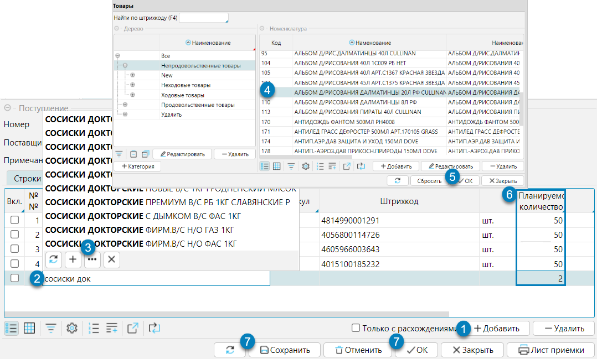
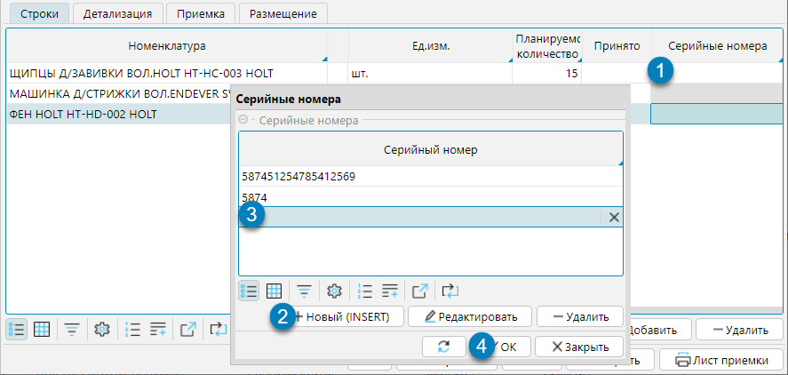
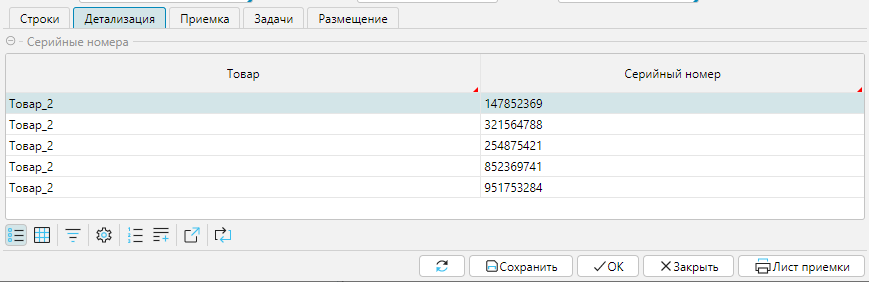
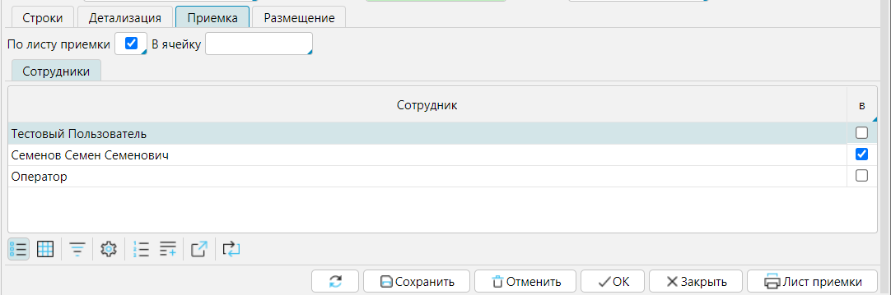
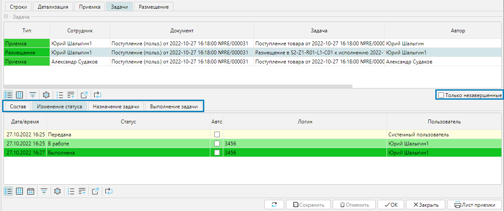
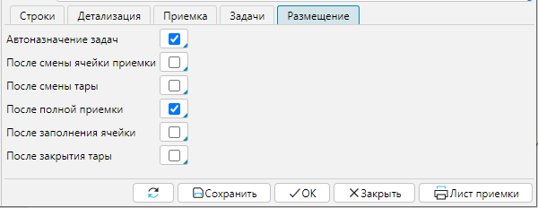

Перечень документов доступен на форме **Рабочий стол - Документы - Поступления** или **Документы - Поступления**.

В шапке документа (рис. 1(1) указываются следующие параметры.

**Номер** - номер документа

**Дата** - дата и время документа

**Код** - уникальный идентификатор документа, формируется автоматически системой. При формировании листа приемки данный код преобразуется в QR-код документа.

**Поставщик** - контрагент, являющийся поставщиком товаров в спецификации

**Место хранения** - текстовое поле

**Склад** - склад, на который поступает товар

**Примечание** - текстовое поле для заметок

**Статус документа** - отображает этап работы с документом. При определенных действиях с документом изменяется автоматически. Например, если работник с ТСД приступил к работе с документом, статус изменится на "В работе"

**Владелец** - если товар принимается на ответственное хранение, то в поле указывается контрагент-владелец товара

**Только с расхождениями** - фильтр отображает только те позиции, в которых планируемое и принятое количество не совпадает.

**Только активные** - фильтр отображает только ненулевые позиции, активен по умолчанию.

  
Рис. 1 Документ поступления

На вкладках (рис.1(2)) **Строки**, **Детализация**, **Приемка**, **Задачи**, **Размещение** отображаются данные по принимаемым товарам и 
могут быть изменены настройки процессов приемки и размещения. 

## Вкладка Строки

На вкладке отображено, какие товары поступают по документам и их количество. Состав может регулироваться кнопками **Добавить** и **Удалить**.

По кнопке **Добавить** (рис. 2) появляется новая строка, где необходимо указать товар: при наборе части наименования система предоставит варианты (2) 
из справочника товаров, или можно открыть окно **Товары** и выбрать нужный товар (3-5). Для каждого добавленного товара необходимо указать количество товаров, 
которое должно поступить по документу в колонке **Планируемое количество** (6). Все изменения в документе необходимо сохранять (7).

  
Рис. 2 Добавление товара в спецификацию  

## Ввод серийных номеров

Если ведется учет товара по серийным номерам, и серийные номера предоставлены поставщиком, эти данные вносятся в приходный документ на вкладке **Строки**. 
В колонке **Серийные номера** поля активны только для товаров, которые учитываются по серийным номерам (см. раздел Справочник товаров). 
Серийные номера могут заполняться при приемке сканированием ТСД (см. п. Приемка ТСД) или могут быть введены в документ оператором. 
Для заполнения серийных номеров оператором необходимо (рис. 3):

1. кликнуть в поле **Серийные номера**
2. в открывшемся окне кнопкой **Новый** добавить строку ввода серийного номера
3. ввести серийный номер
4. после ввода всех номеров (шаги 2-3) нажать **ОК**

  
Рис. 3 Ввод серийных номеров

Введенные серийные номера отображаются на вкладке **Детализация** в блоке **Серийные номера**. 

## Вкладка Детализация

На вкладке отображаются серийные номера товаров, поступивших по документу. Серийные номера могут быть введены до приемки по данным поставщика или 
во время приемки сканированием серийного номера ТСД. 

  
Рис. 4 Вкладка Детализация

## Вкладка Приемка

На вкладке отображаются настройки процесса приемки для документа. 
По умолчанию они соответствуют общим настройкам в системе (см. раздел Настройки логики Приемки), однако могут быть изменены в документе.

**По листу приемки** - вкл./выкл. приемки по листу приемки

**В ячейку** - можно указать в какую конкретно ячейку должен быть принят товар по документу

**Сотрудники** - Можно назначить конкретного сотрудника, который должен осуществить приемку

  
Рис. 5 Вкладка Приемка

## Вкладка Задачи

На этой вкладке отображаются все задачи на приемку и размещение, которые созданы по документу. По умолчанию на вкладке активен фильтр **Только незавершенные**, 
и, соответственно, отображаются  только те задачи, которые созданы, но еще не выполнены. Чтобы просмотреть все задачи, необходимо снять фильтр.

В нижней части во вкладках отображаются данные по выделенной задаче. 

  
Рис. 6 Вкладка Задачи

## Вкладка Размещение

Здесь отображаются настройки размещения принятого товара. По умолчанию они соответствуют общим настройкам в системе 
(см. [раздел Настройки логики Размещение](../../logics/placement.md))). При необходимости настройки можно изменить на этой вкладке. 
Изменения нужно сохранить, действуют измененные параметры только на документ.

**Автоназначение задач** - при активном признаке система назначает исполнителя задачи автоматически.

**После смены ячейки приемки** - при приемке товара если кладовщик меняет ячейку (сканирует другую ячейку), 
в которую принимает товар, программа создает задачу на размещение товара, принятого в предыдущую ячейку.

**После смены тары** - при приемке товара если кладовщик меняет тару (сканирует другую тару), 
в которую принимает товар, программа создает задачу на размещение предыдущей тары.

**После полной приемки** - после того, как задача на приемку товара завершена, программа создает задачи на размещение всего принятого товара.

**После заполнения ячейки** - при приемке товара если объем помещенного в ячейку товара/тары равен или превышает объем ячейки, 
то она считается заполненной и программа создает задачи на размещение принятого в такую ячейку товара. При расчете максимального объема, 
который вмещает ячейка, учитывается коэффициент заполнения, указанный для упаковки товара (см. [Карточка товара](../../control/goods/card.md)).

**После закрытия тары** - при приемке товара в рамках одной задачи если кладовщик закрывает тару, программа создает задачу на ее размещение. 

  
Рис. 7 Вкладка Размещение

