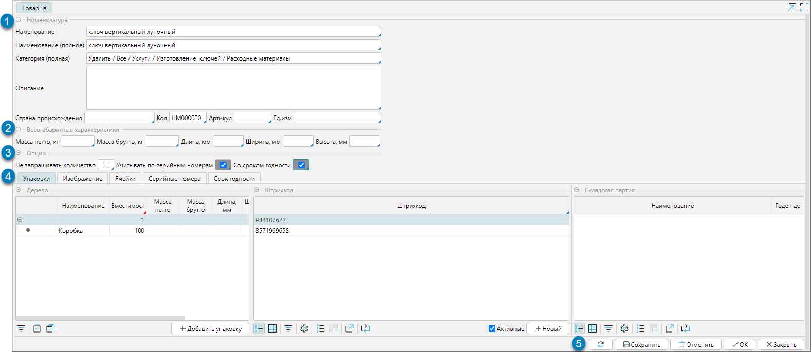
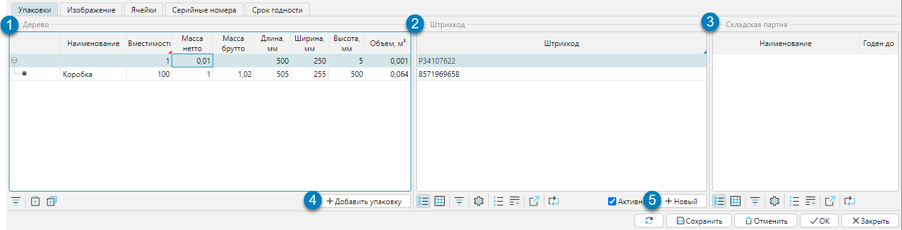
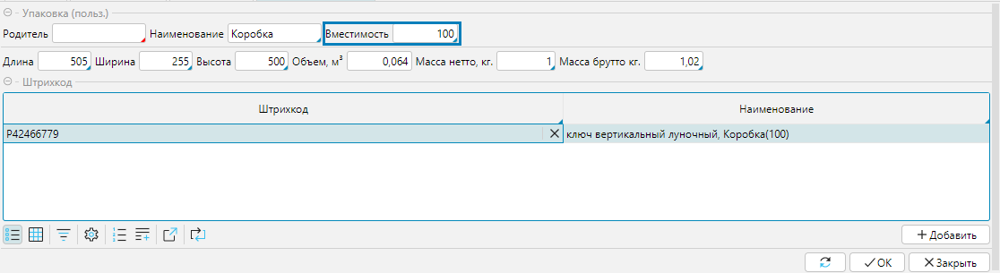
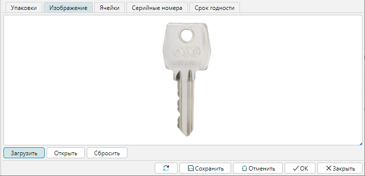
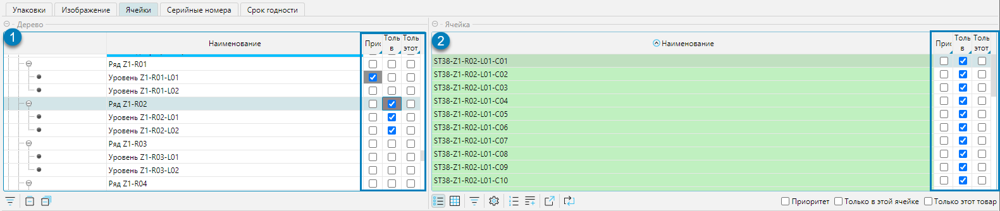
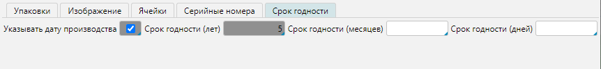

В карточке товара отображается вся основная информация о товаре: базовые характеристики (рис. 1(1)), весогабаритные характеристики (рис. 1(2)), 
специфические данные (рис. 1(3)) и подробное описание (рис. 1(4)).

**Наименование/Наименование (полное)** - могут отличаться и использоваться в разных документах.

**Категория (полная)** - товарная категория с учетом вложенности

**Описание** - текстовое поле с неограниченным количеством символов для хранения произвольного описания товаров

**Страна происхождения, Код, Артикул, Ед. изм.** (единица измерения) - базовые характеристики.

**Масса нетто/брутто, Длина, Ширина, Высота** - весогабаритные характеристики (базовой единицы измерения).

**Ввод ВГХ при сканировании** - включает механизм получения данных о ВГХ упаковки товара из весоизмерительного оборудования при приемке товара. 
При сканировании кода результата измерения ВГХ упаковки товара, данные записываются в карточку товара для соответствующей упаковки. 
Если данные в карточке товара уже были заполнены, они перезаписываются новыми измерениями.

**Не запрашивать количество** - используется для работы с товарами, которые обычно поступают в единственном экземпляре. 
Для таких товаров ТСД не запрашивает количество, а автоматически проставляет "1".

**Учитывать по серийным номерам** - если активирован признак, в карточке товаров будет доступна вкладка **Серийные номера**, 
где фиксируются серийные номера поступивших товаров, а ТСД будет запрашивать данные на приемке.

**Со сроком годности** - если активирован признак, в карточке товаров будет доступна вкладка **Срок годности** для указания соответствующих параметров.

  
Рис.1 Карточка товара

## Вкладка Упаковка

Для каждого товара на данной вкладке ведется учет всех возможных вариантов упаковок, отображаются весогабаритные характеристики и штрихкоды. 
В блоке **Дерево** отображается иерархия упаковок, с отображением коэффициента пересчета в родительскую единицу и весогабаритных характеристик (рис. 2(1)). 
Для создания упаковки используют кнопку **+Добавить упаковку** (рис. 2(4)) и заполняют соответствующую форму (рис. 3), 
где в поле **Вместимость** указывается количество единиц родительской упаковки в текущей.

Для каждого вида упаковки товара обязателен хотя бы один штрихкод, который отображается в блоке **Штрихкод** (рис. 2(2)). 
При создании новой упаковки штрихкод генерируется автоматически.  Штрихкод товара, загружаемый из внешней системы, учитывается как штрихкод базовой упаковки товара. 
Количество штрихкодов упаковок товара не ограничено, но при этом каждый штрихкод должен быть уникален. 
Для добавления штрихкода упаковки товара используется кнопка **+Новый** (рис. 2(5).

В блоке **Складская партия** отображаются принятые партии товаров и их сроки годности, если применимо (рис. 2(3)).

  
Рис. 2 Вкладка Упаковка

    
Рис. 3 Добавление упаковки

## Вкладка Изображение

Здесь отображается изображение товара.

**Загрузить** - загружает в систему файл изображения из указанного расположения.

**Открыть** - открывает загруженный файл изображения в отдельном окне.

**Сбросить** - удаляет загруженный файл изображения. 

  
Рис. 4 Вкладка Изображение  

## Вкладка Ячейки

На вкладке **Ячейки** отображается структура доступных складов (рис. 5(1)) с детализацией каждого элемента до ячеек (рис. 5(2)). 
Здесь можно указывать закрепление ячеек слада за текущим товаром.

**Приоритет** - отмеченные ячейки и зоны будут рассматриваться в первую очередь при размещении товара.

**Только в этой ячейке** - товар будет размещаться только в отмеченных ячейках.

**Только этот товар** - в отмеченных ячейках будет размещаться только текущий товар.

  
Рис. 5 Вкладка Ячейки

## Вкладка Серийные номера

Отображается, если отмечено свойство **Учитывать по серийным номерам** (рис.1(3)). На вкладке отображаются серийные номера поступивших товаров.

## Вкладка Срок годности

Отображается, если отмечено свойство **Со сроком годности** (рис.1(3)). На вкладке устанавливаются параметры, 
по которым программа рассчитает срок годности поступившего товара (рис. 5). При приемке ТСД запросит указать либо срок годности, либо дату производства. 

  
Рис. 6 Вкладка Срок годности

