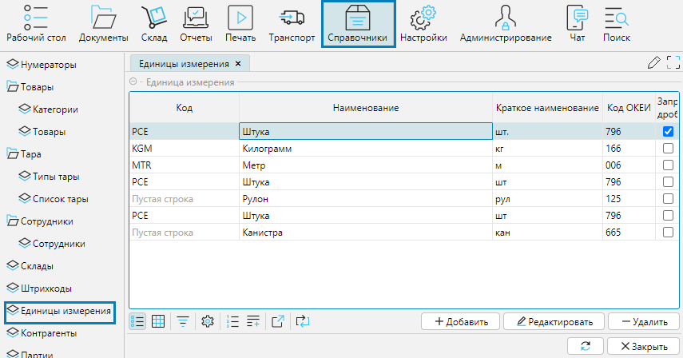
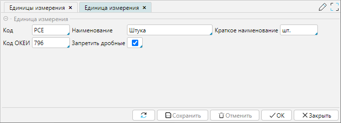

На форме **Справочники - Единицы измерения** должны быть введены все единицы измерения, которые используются для товаров.

  
Рис. 1 Справочник единиц измерения  

Для каждой единицы измерения указывают:

**Код** - идентификатор единицы измерения в системе

**Наименование** - принятое название единицы измерения

**Краткое наименование** - сокращенное обозначение единицы измерения, которое отображается на формах (документах, отчетах и т.д.)

**Код ОКЕИ** - значение кода единицы измерения в Общероссийском классификаторе единиц измерения

**Запретить дробные** - если данный признак отмечен, то при сканировании ТСД любой упаковки товара, у которого установлена такая базовая единица измерения, 
невозможно будет ввести дробное количество.

  
Рис. 2 Карточка единицы измерения

