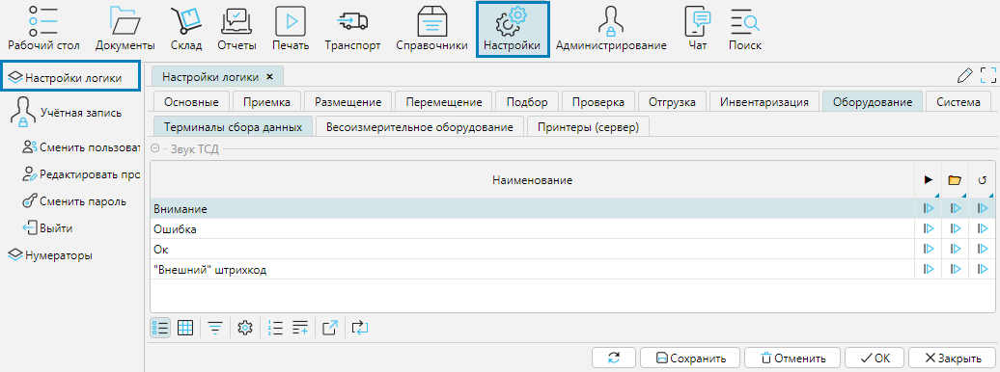
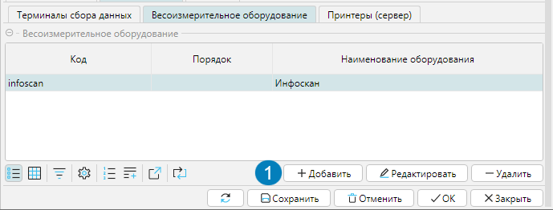
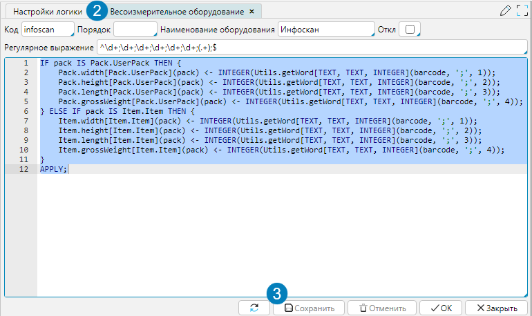

На форме **Настройки - Настройки логики** на вкладке **Оборудование** осуществляется управление используемым на складах оборудованием  (рис. 1).

## Терминалы сбора данных

На вкладке **Терминалы сбора данных** можно управлять звуковым сопровождением работы ТСД. 
Перечень действий, которые могут сопровождаться звуком представлен в таблице **Звук ТСД**. 
Чтобы выполнить действие необходимо нажать на кнопку  в соответствующей ячейке:

 - воспризвести звук действия.   
 - загрузить файл звука действия.  
 - сбросить загруженный файл звука действия.  

  
Рис. 1 Настройки звука ТСД  

## Весоизмерительное оборудование

lsFusion WMS интегрируется с любым весоизмерительным оборудованием, которое формирует QR-код (или иной машиночитаемый код) с ВГХ упаковки. 
Весоизмерительное оборудование используется на приемке для тех [товаров](../control/goods/card.md), у которых отмечен признак **Ввод ВГХ при сканировании**. 
Система распознает QR-код, сформированный весоизмерительным оборудованием, и записывает данные ВГХ упаковки в карточку товара (см. п. [Карточка товара](../control/goods/card.md)). 
На вкладке **Весоизмерительное оборудование** настраиваются шаблоны распознавания QR-кодов, которые формируют весоизмерительные приборы. 
Таким образом, если различные модели оборудования формируют QR-код по одинаковому шаблону, для них достаточно настроить единую интеграцию.

Чтобы настроить интеграцию необходимо:

1. Использовать кнопку **Добавить** (рис. 2(1)) чтобы создать новую интеграцию с весоизмерительным оборудованием.
2. В открывшемся окне настройки весоизмерительного оборудования (рис.3) указать параметры:  
    a. **Код** - уникальный идентификатор шаблона обработки отсканированного QR-кода.  
    b. **Порядок** - целое число, определяющее порядок обработки (среди всего настроенного оборудования) при сканировании.  
    c. **Наименование оборудования** - произвольное, понятное пользователям системы название шаблона обработки, например модель(и) оборудования.  
    d. **Откл.** - делает настроенный шаблон обработки отсканированного QR-кода неактивным.  
    e. **Регулярное выражение** - строка содержащая POSIX Regular Expression (https://www.postgresql.org/docs/14/functions-matching.html#FUNCTIONS-POSIX-REGEXP), 
которое применяется для получения данных, закодированных в QR-коде.  
    f. **Поле для ввода скрипта** постобработки шаблона QR-кода на языке lsFusion (поддерживается автодополнение текста и подсветка синтаксиса)  

**Алгоритм обработки отсканированного QR-кода**

1. После сканирования строка содержащаяся в QR проверяется на точное совпадение со всеми штрихкодами в базе.
2. При отсутствии точных совпадений строка проверяется на соответствие каждому из активных шаблонов разрешенных пользователю в порядке, 
определенном полем шаблона **Порядок**
3. При нахождении шаблона, который позволит выделить з строки действующий штрихкод упаковки будет выполнено действие постобработки
4. В постобработку передаются два параметра: barcode, содержащий целиком отсканированную строку и pack, содержащий ссылку на упаковку
Код постобработки при выполнении действия вставляется в модуль с уникальным именем. Заголовок этого модуля формируется системой, 
он объявляет уникальное имя модуля и в инструкции REQUIRE перечисляет все модули, которые есть в проекте. Таким образом, 
из кода можно использовать все элементы системы из других модулей.

3\. **Сохранить** введенные данные.

  
Рис. 2 Вкладка Весоизмерительное оборудование

  
Рис. 3 Настройка весоизмерительного оборудования

:::tip **Пример кода для стандартного шаблона инфоскан**
***
**Регулярное выражение**
> ^\d+;\d+;\d+;\d+;\d+;\d+;(.+);$
***
**Код постобработки**
> setWidth (pack, INTEGER(Utils.getWord[TEXT, TEXT, INTEGER](barcode, ';', 1)));
> setLength (pack, INTEGER(Utils.getWord[TEXT, TEXT, INTEGER](barcode, ';', 2)));
> setHeight (pack, INTEGER(Utils.getWord[TEXT, TEXT, INTEGER](barcode, ';', 3)));
>
> setGrossWeigth (pack, NUMERIC[11,3](Utils.getWord[TEXT, TEXT, INTEGER](barcode, ';', 4)));

:::

