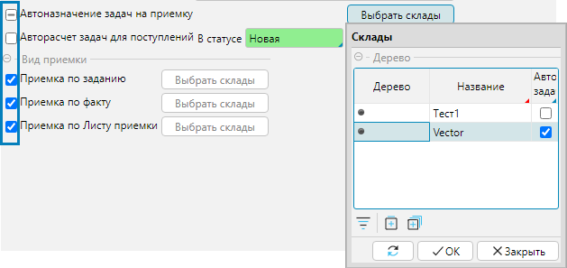

На форме **Настройки - Настройки логики** доступны параметры, которые регулируют бизнес-логику складских процессов. 
Большинство параметров могут быть изменены не только на данной форме, но также непосредственно на формах соответствующих объектов в системе: складов и документов.

Вид отметки чекбокса показывает применение свойства в системе:

 - свойство не применено  
 - свойство применено глобально  
 - свойство применено к выборочным складам (рис.1)  

  
Рис. 1 Варианты отметки чекбоксов

