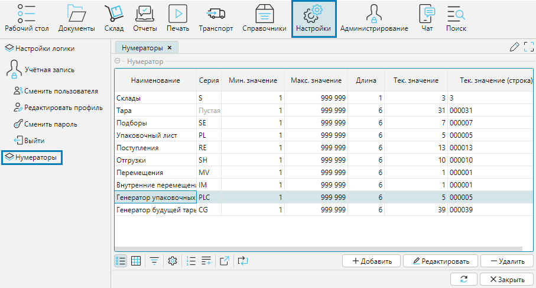
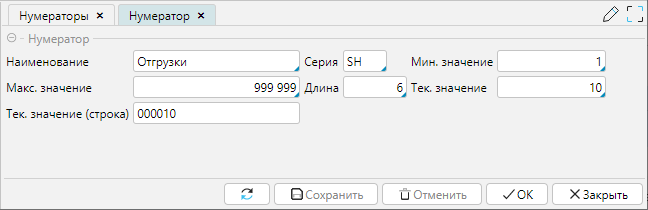

Нумераторы задают правила для автоматического формирования уникального номера или штрихкода объекта. 
На форме **Настройки - Нумераторы** отображается список всех нумераторов в системе. 

  
Рис. 1 Форма Нумераторы

Для каждого нумератора необходимо указать:

**Наименование** - поле для ввода понятного названия нумератора.

**Серия** - поле для ввода серии, т.е. общей для всех объектов части номера.

**Мин. значение** - поле для задания значения, с которого начнется нумерация по счетчику (крайнее нижнее значение).

**Макс. значение** - поле для задания значения, до которого будет происходить нумерация по счетчику (крайнее верхнее значение).

**Длина** - поле для задания значения, из скольких символов будет состоять длина счетчика (пустые значения заменяются нулями).

**Тек. значение** - текущие значение счетчика.

**Тек. значение (строка)** -  текущие значение счетчика с учетом длины.

  
Рис. 2 Форма настройки нумератора  

