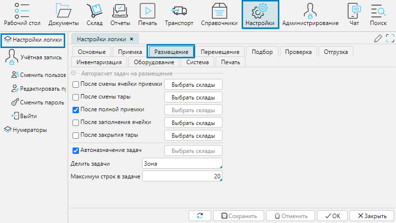
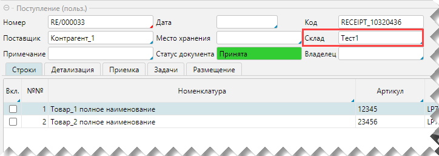
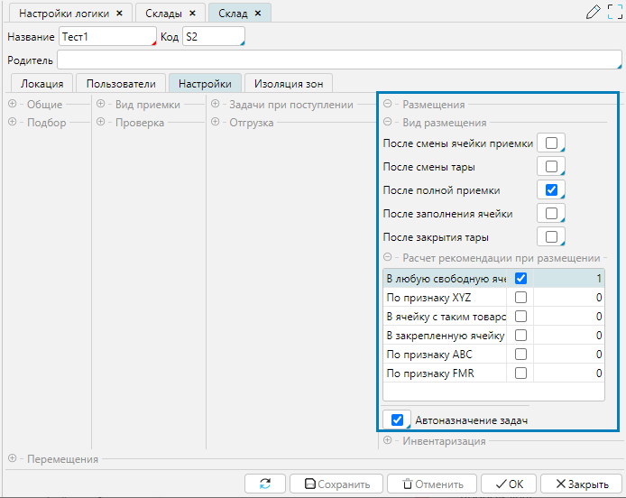

Размещение - это частный случай перемещения, при котором принятый товар перемещается в зону хранения.  В системе есть возможность управлять триггерами, 
запускающими процесс размещения, и настраивать параметры, которые влияют на выбор рекомендуемой системой ячейки для размещения товара.

  
Рис. 1 Настройки логики размещения

На форме **Настройки - Настройки логики** на вкладке **Размещение** настраиваются триггеры для автоматического создания задач. 
Каждый триггер можно применяться как ко всем складам в системе, так и к отдельным, выбранным по кнопке **Выбрать склады**.

**После смены ячейки приемки** - при приемке товара если кладовщик меняет ячейку (сканирует другую ячейку), 
в которую принимает товар, программа создает задачу на размещение товара, принятого в предыдущую ячейку.

**После смены тары** - при приемке товара если кладовщик меняет тару (сканирует другую тару), 
в которую принимает товар, программа создает задачу на размещение предыдущей тары.

**После полной приемки** - после того, как задача на приемку товара завершена, программа создает задачи на размещение всего принятого товара.

**После заполнения ячейки** - при приемке товара если объем помещенного в ячейку товара/тары равен или превышает объем ячейки, 
то она считается заполненной и программа создает задачи на размещение принятого в такую ячейку товара. При расчете максимального объема, 
который вмещает ячейка, учитывается коэффициент заполнения, указанный для упаковки товара (см. [Карточка товара](../control/goods/card.md)).

**После закрытия тары** - при приемке товара в рамках одной задачи если кладовщик закрывает тару, программа создает задачу на ее размещение.

**Автоназначение задач** - при активном признаке система назначает исполнителя задачи автоматически.

**Делить задачи** - в данном поле указывается сегмент склада по которому система будет разделять задачи. 
По документу приемки программа создаст задач столько (или больше, в зависимости от ограничения по строкам), сколько указанных в поле сегментов 
будут служить отправными точками перемещения. Например, если основанием для деления является зона, товары по приходному документу приняли в 3 разные зоны, 
то программа создаст не менее 3 задач на размещение.

Основанием для деления задач могут быть только те сегменты иерархии, которые в родительском сегменте от корня дерева имеют не более одного основного подуровня:

  
Рис. 1a Сегменты склада

**Максимум строк в задаче** - при создании задач на размещение программа будет включать в одну задачу строк не больше указанного количества. 
Если размещение прихода предполагает большее количество действий, чем указано в поле, будет создано несколько задач.  
:::danger Внимание
Поле **Максимум строк в задаче** обязательно должно быть заполнено!  
Если поле остается пустым, задачи создаваться не будут!
:::

## Расчет рекомендации ячейки

При формировании задачи на размещение программа указывает рекомендуемую ячейку, куда разместить товар на хранение. 
Рекомендация рассчитывается исходя из: 
- данных в документах прихода 
- настроек рекомендаций склада.

1. В документе поступления, по которому проводится приемка, указан склад или группа складов, на которую принимается товар.  
Рекомендованная ячейка для размещения принятого по документу товара также будет находиться на указанном складе или группе складов.

  
Рис. 2 Склад в документе поступления

2\. На форме **Склада** на вкладке **Настройки** в блоке **Размещения** настраиваются параметры размещения товара на складе.

**Виды размещения** отображают триггеры на размещение настроенные для склада в **Настройках логики**. Здесь их также можно изменять. 
Внесенные изменения отображаются на обеих формах.

В секции **Расчет рекомендации** при размещении необходимо отметить параметры, которые будут применяться на складе и указать целым числом приоритет их применения: 
чем выше число, тем выше приоритет, т.е. сначала применяется признак с приоритетом 10, потом 9, 8 и т.д.

Параметры размещения применимы только к упаковкам товаров и таре, содержащей товар одного вида (монопаллета), тара с товарами различных видов размещается экспертно.

**В любую свободную ячейку** - программа порекомендует первую ячейку, которая имеет достаточно свободного объема для размещения товара

**По признаку XYZ /ABC/FMR** - программа будет учитывать соответствующие настройки ячеек складов 
(см. [Построение структуры склада](../topology/structure.md)) и товаров (см. [Справочник товаров](../control/goods/goods.md))

**В ячейку с таким товаром** - размещение будет рекомендовано в ячейки, содержащие такой же товар или пустые

**В закрепленную ячейку** - будут рекомендована ячейки, закрепленные для размещаемого товара. 
Подробнее о закреплении ячеек см. [Карточка товара](../control/goods/card.md) или [Построение структуры склада](../topology/structure.md).

  
Рис. 3 Настройка рекомендации ячейки размещения

 
