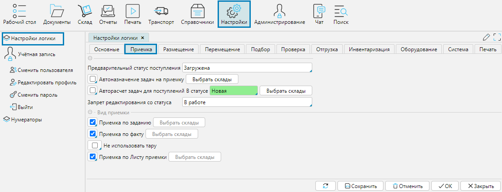

На форме **Настройки - Настройки логики** вкладка **Приемка** осуществляется управление логикой процесса приемки товаров на складах.

**Предварительный статус поступления** - новый импортированный или созданный в системе документ будет иметь указанный в этом поле статус.

**Автоназначение задач на приемку** - при включенном признаке сформированные задачи будут назначаться автоматически на первого освободившегося кладовщика 
с соответствующими разрешениями. Чтобы включить для всех складов, необходимо отметить чекбокс, 
чтобы включить признак только для отдельных складов необходимо нажать кнопку **Выбрать** склады и отметить склады, для которых будет активирован признак.

**Авторасчет задач для поступлений в статусе** - включает автоматическое создание задач на приемку для документов, переведенных в указанный статус. 
Если отметить чекбокс, применяется ко всем складам, чтобы включить авторасчет задач для отдельных складов, 
нажмите **Выбрать склады** и отметьте склады, для которых включить признак.

**Запрет редактирования со статуса** - после того, как документ [Поступление](../control/documents/receipt.md) переходит в указанный в поле статус, пользователи не смогут больше вносить в него изменения. 
Также, при поступлении каких-либо данных по API, предполагающих изменение документа, изменения внесены не будут.

 
## Виды приемки

**Приемка по заданию** - включает механизм приемки при котором создается задание на приемку и его получает сотрудник с ТСД для выполнения.

**Приемка по факту** - включает механизм приемки, при котором сотрудник с ТСД самостоятельно выбирает документ, по которому будет проводить приемку.

**Не использовать тару** - при отмеченном свойстве невозможно будет принять товары на тару.

**Приемка по листу приемки** - включает механизм, при котором оператор печатает лист приемки и передает его кладовщику для проведения операции.

Чтобы включить механизмы только для отдельных складов, используйте кнопку **Выбрать склады**. 

  
Рис. 1 Настройки логики процесса приемки

