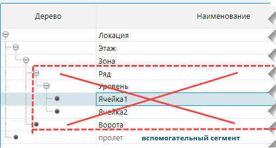
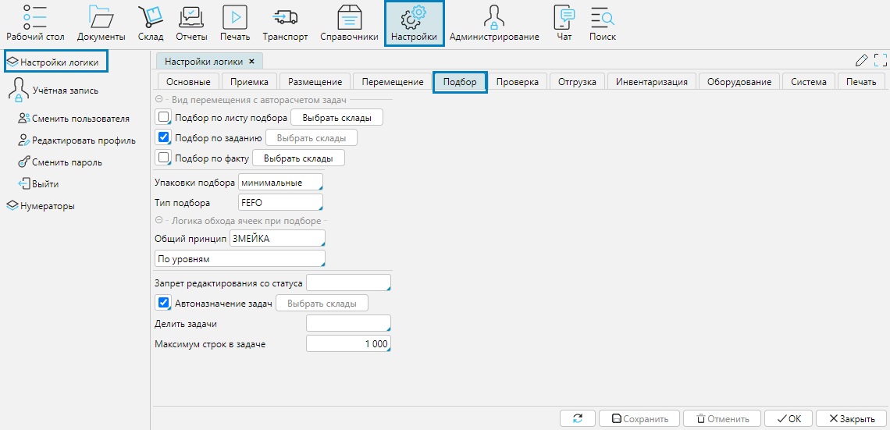

На форме **Настройки - Настройки логики** вкладка **Подбор** осуществляется управление логикой процесса подбора товаров для отгрузки со склада.

**Подбор по листу подбора**/**по заданию**/**по факту** - для выбора вида подбора для всех складов необходимо отметить галочкой вид. 
Чтобы установить вид подбора на определенный склад, нужно выбрать этот склад(ы) в поле.

**Упаковки подбора** - минимальная упаковка, которую будет использовать при подборе система. 
При подборе система вначале подбирает количество самыми крупными возможными упаковками, затем использует упаковки по убыванию объема, 
пока не подберет необходимое количество, т.е. начинает с закрытых тар и заканчивает базовыми, или установленными в данном поле.

**Запрет редактирования со статуса** - после того, как документ [Подбор](../control/documents/selection.md) переходит в указанный в поле статус, 
пользователи не смогут больше вносить в него изменения. Также, при поступлении каких-либо данных по API, предполагающих изменение документа, изменения внесены не будут.

**Автоназначение задач** - при активном признаке система назначает исполнителя задачи автоматически.

**Делить задачи** - в данном поле указывается сегмент склада по которому система будет разделять задачи. По документу программа создаст задач столько 
(или больше, в зависимости от ограничения по строкам), сколько указанных в поле сегментов будут служить отправными точками перемещения. 
Например, если основанием для деления является зона, товары для подбора находятся  в 3 разных зонах, то программа создаст не менее 3 задач на подбор.

Основанием для деления задач могут быть только те сегменты иерархии, которые в родительском сегменте от корня дерева имеют не более одного основного подуровня:

  
Рис. 1 Сегменты склада

**Максимум строк в задаче** - при создании задач на размещение программа будет включать в одну задачу строк не больше указанного количества. 
Если выполнение операции по документу подбора предполагает большее количество действий, чем указано в поле, будет создано несколько задач.

:::danger Внимание
Поле **Максимум строк** в задаче обязательно должно быть заполнено!   
Если поле остается пустым, задачи создаваться не будут!
:::

  
Рис. 2 Настройки процесса подбора

