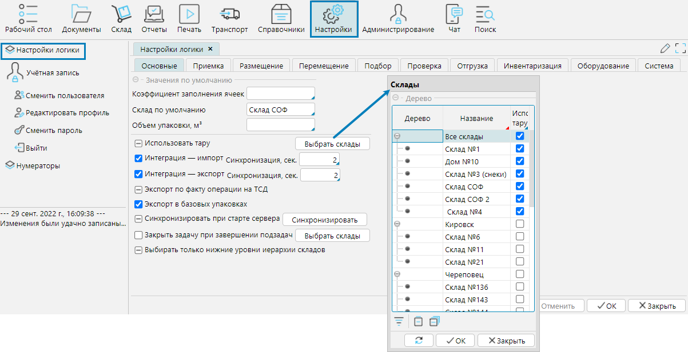

На форме **Настройки - Настройки** логики вкладка **Основные** осуществляется управление настройками, которые относятся к общей логике работы WMS системы.

**Коэффициент заполнения ячеек** - соотношение совокупного объема помещенных в ячейку товаров к объему ячейки, 
при достижении которого ячейка будет считаться заполненной.

Склад по умолчанию - данный склад будет по умолчанию указан в новых документах.

**Объем упаковки м3** - если в системе не указаны размеры упаковки, для такой упаковки система будет использовать установленное в этом поле значение 
для расчета заполненности ячеек.

**Использовать тару** - если отмечен этот признак, то на складах для проведения складских операций обязательно должна быть использована тара 
(см. [Справочник тары](../control/tare.md)). Чтобы настроить возможность использовать тару на отдельных складах, 
необходимо нажать кнопку **Выбрать склады** и отметить склады, на которых допускается использование тары.

**Интеграция импорт - Синхронизация, сек.** - интервал импорта данных из внешней ERP системы

**Интеграция экспорт - Синхронизация, сек.** - интервал экспорта данных во внешнюю ERP систему

**Экспорт по факту операции на ТСД** - после завершения операции на ТСД данные сразу будут экспортированы во внешнюю систему

**Экспорт в базовых упаковках** - при экспорте данных во внешнюю ERP систему количество товара будет указано в пересчете в базовые упаковки, 
независимо от того, в каких упаковках осуществляются операции.

**Синхронизировать при старте сервера** - при каждом старте сервера приложений будет осуществляться синхронизация данных с внешней ERP системой.

**Закрыть задачу при завершении подзадач** - если задача разбита на составляющие, то по завершении выполнения подзадач, главная задача будет завершена автоматически.

**Выбирать только нижние уровни иерархии складов** - если свойство не отмечено, в документах в поле **Склад** будет доступен выбор 
любого узла иерархии справочника складов, т.е. как группы складов, так и отдельных складов. Если свойство отмечено, для выбора будут доступны 
только нижние уровни дерева складского комплекса, т.е. отдельные склады. Подробнее об иерархии складского комплекса в п. [Склады](../topology/stock.md).

  
Рис.1 Форма Настройки логики

