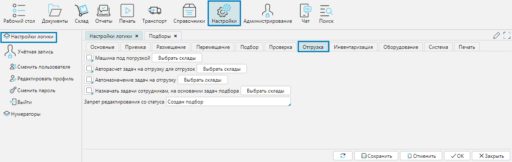

На форме **Настройки - Настройки логики** вкладка **Отгрузка** осуществляется управление логикой процесса отгрузки товаров со складов. 
По каждому признаку нужно указать склады, где он действует.

**Машина под погрузкой** -

**Авторасчет** задач на отгрузку для отгрузок - включает автоматическое создание задач.

**Автоназначение задач на отгрузку** - при активном признаке система назначает исполнителя задачи  автоматически.

**Назначать задачи сотрудникам на основании задач подбора** -

**Запрет редактирования со статуса** - после того, как документ [Отгрузка](../control/documents/documents.md) переходит в указанный в поле статус, 
пользователи не смогут больше вносить в него изменения. Также, при поступлении каких-либо данных по API, предполагающих изменение документа, изменения внесены не будут.

  
Рис. 1 настройки процесса отгрузки  

