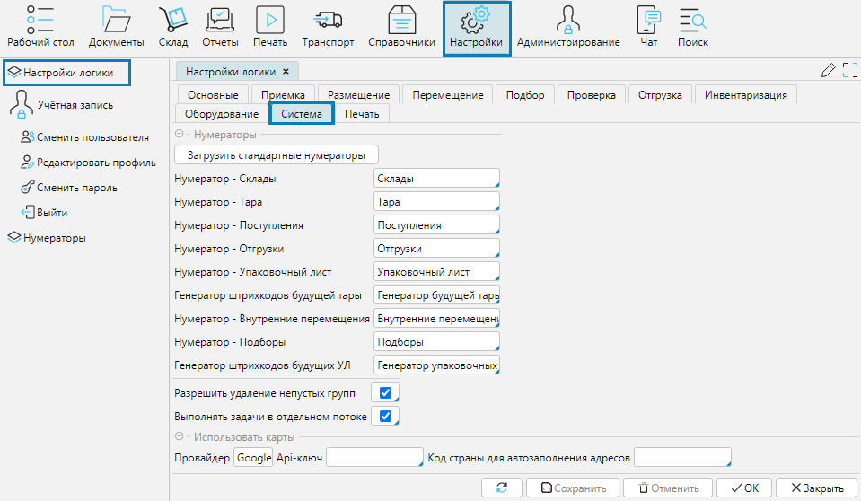

На форме **Настройки - Настройки логики** вкладка **Система** назначают нумераторы для формирования уникальных номеров или штрихкодов объектов. 
Для каждого объекта необходимо установить настроенный нумератор.

Как настроить нумератор объекта описано в ст. [Нумераторы](numerators.md).

**Загрузить стандартные нумераторы** - загружает в систему набор настроенных нумераторов. Необходимо нажать кнопку, а затем нажать **Сохранить**. 
Загруженные нумераторы отобразятся на форме **Настройки - Нумераторы**.

**Разрешить удаление непустых групп** - по умолчанию товарную группу можно удалить только если в ней нет товаров. Если отмечен данный признак, 
то система позволит удалить товарную группу, в которой есть товары. Товары будут удалены вместе с товарной группой.

**Выполнять задачи в отдельном потоке** - выполнение задач в отдельном потоке увеличивает быстродействие системы. 

  

