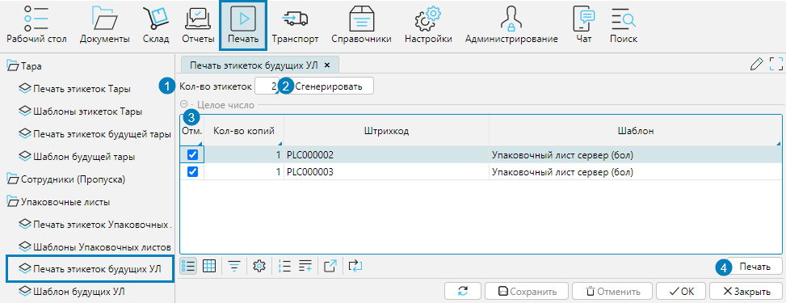
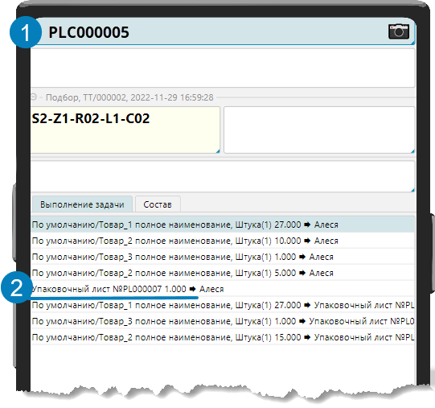
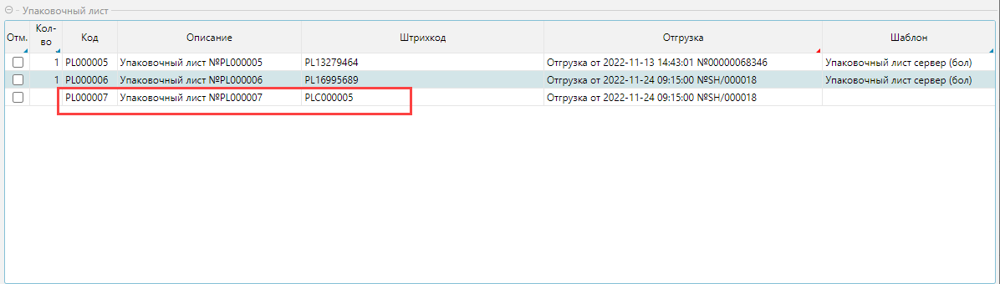

В системе предусмотрена возможность маркировки укомплектованного товара заранее распечатанным упаковочным листом:

1. Оператор печатает будущие упаковочные листы
2. Кладовщик выходит работать с готовым набором упаковочных листов
3. Кладовщик маркирует укомплектованный товар этикеткой упаковочного листа и сканирует ее
4. В системе создается упаковочный лист.

## Печать будущих упаковочных листов

Чтобы напечатать будущие упаковочные листы, необходимо на форме **Печать - Печать этикеток будущих УЛ** осуществить следующие действия (рис. 1):

1. В поле **Кол-во этикеток** указать количество этикеток, которые надо сгенерировать для печати.
2. Нажать кнопку **Сгенерировать** и программа создаст указанное количество штрихкодов будущих упаковочных листов.
3. Отметить сгенерированные штрихкоды в колонке **Отм.** Для этого удобно использовать групповую корректировку (см. Режим представления данных таблица).
4. Нажать кнопку **Печать**. В соответствии с установленным шаблоном печати будут напечатаны этикетки упаковочных листов для отмеченных штрихкодов.
5. Данные по напечатанным этикеткам на форме не сохраняются и доступны пока форма не закрыта.  

Данные по напечатанным этикеткам на форме не сохраняются и доступны пока форма не закрыта.  

  
Рис. 1 Печать этикеток будущих УЛ

## Маркировка комплектации напечатанным упаковочным листом

Cотрудник с ТСД подбирает и комплектует товар, когда весь товар собран, сканирует штрихкод заранее распечатанной этикетки упаковочного листа (рис. 2(1)). 
Система формирует в базе упаковочный лист по распознанному штрихкоду (рис. 2(2), рис. 3).

  
Рис. 2 Сканирование будущего упаковочного листа

  
Рис. 3 Созданный в системе упаковочный лист по отсканированной этикетке будущего упаковочного листа

