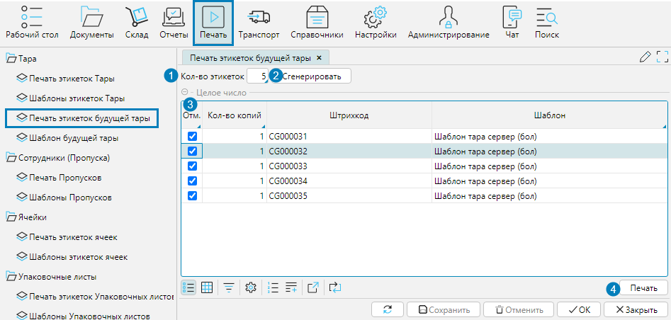
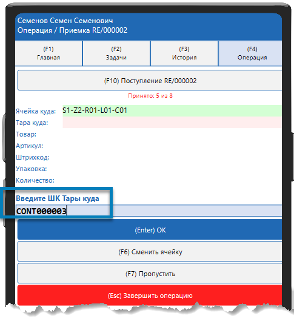
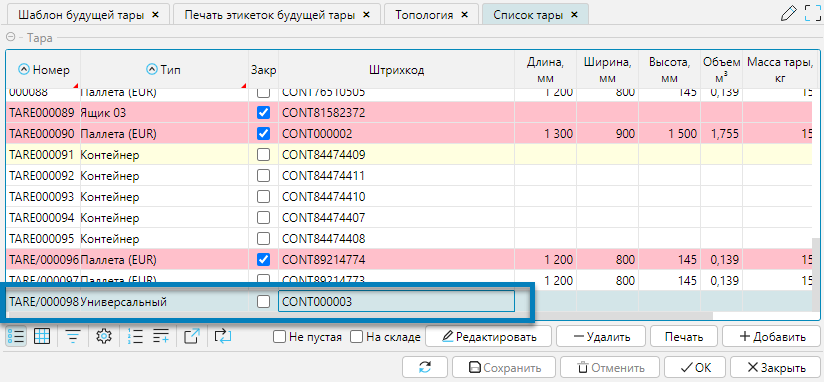

В системе предусмотрена возможность самостоятельной маркировки тары кладовщиком в процессе выполнения складских операций уже готовыми этикетками.

1. Оператор генерирует и печатает этикетки будущей тары
2. Кладовщик перед началом работы берет напечатанные этикетки
3. В процессе работы, если кладовщик использует новую не промаркированную тару, он самостоятельно маркирует ее готовой этикеткой
4. При сканировании этикетки будущей тары система автоматически генерирует и добавляет в справочник тары новый объект.

## Печать этикеток будущей тары

Чтобы напечатать этикетки для последующей маркировки тары, необходимо на форме **Печать - Печать этикеток будущей тары** осуществить следующие действия (рис. 1):

1. В поле **Кол-во этикеток** указать количество этикеток, которые надо сгенерировать для печати.
2. Нажать кнопку **Сгенерировать** и программа создаст указанное количество штрихкодов будущей тары.
3. Отметить сгенерированные штрихкоды в колонке **Отм.** Для этого удобно использовать групповую корректировку (см. Режим представления данных таблица).
4. Нажать кнопку **Печать**. В соответствии с установленным шаблоном печати будут напечатаны этикетки тары для отмеченных штрихкодов.

Данные по напечатанным этикеткам на форме не сохраняются и доступны пока форма не закрыта.  

  
Рис. 1 Печать этикеток будущей тары

## Создание тары в справочнике по этикетке будущей тары

Если в процессе работы кладовщик использует немаркированную тару, то:

1. Кладовщик маркирует тару этикеткой будущей тары
2. Сканирует эту этикетку в качестве тары в процессе выполнения операции
3. Система распознает тип штрихкода по настроенному нумератору (см. [Система](../logics/logics.md)) и создает новую пустую тару (рис.2,3). 
Будет создана тара того типа, который стоит по умолчанию (см. [Справочник тары](../control/tare.md)).

  
Рис. 2 Процесс создания тары по штрихкоду будущей тары

  
Рис. 3 Созданная по штрихкоду тара в справочнике тары

