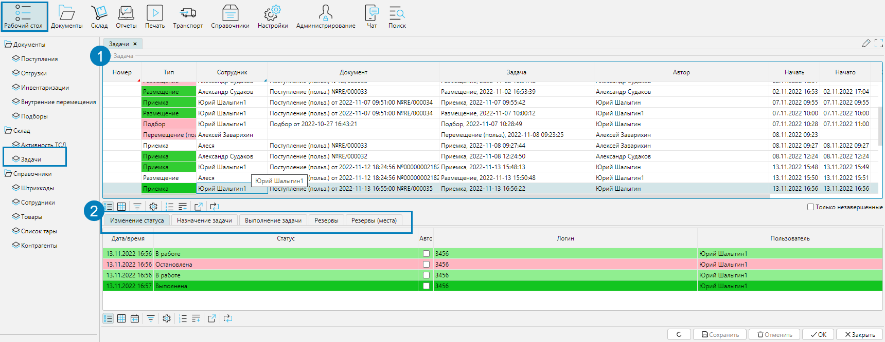
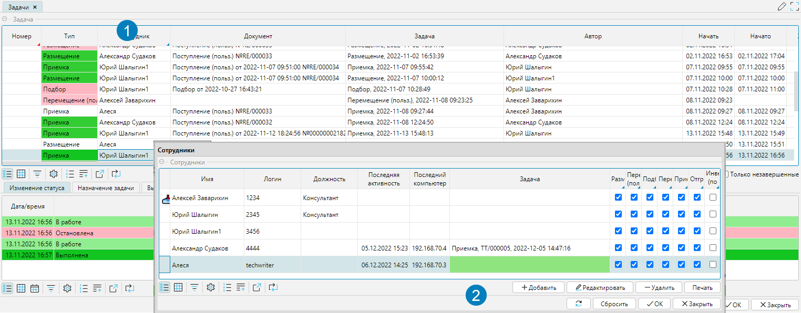

Все задачи доступны на форме **Рабочий стол - Задачи**. В верхнем блоке представлен список активных задач. По умолчанию включен фильтр **Только незавершенные**. 
Для просмотра всех задач фильтр **Только незавершенные** нужно снять.

На вкладках в нижней части представлены подробные данные по выделенной задаче.

Статус задач обозначается цветом.

  
Рис. 1 Форма Задачи

Исполнитель задачи в основном назначается автоматически системой. Если необходимо назначить иного исполнителя, надо кликнуть в поле **Сотрудник** задачи и 
выбрать сотрудника из открывшегося справочника.

  
Рис. 2 Назначение исполнителя вручную

