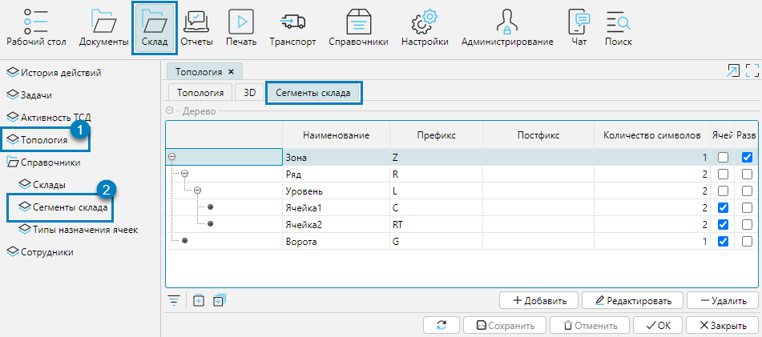
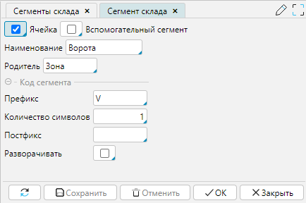
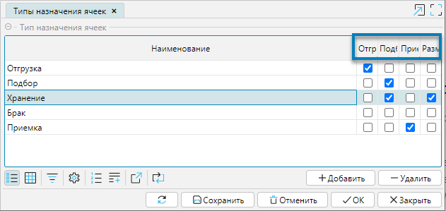

Сегменты склада используются для отображения структуры каждого отдельного склада. В системе можно использовать неограниченное количество настраиваемых сегментов.

Справочник структурных элементов склада формируется на форме **Сегменты склада**, которая доступна в меню **Склад - Справочники** (рис. 1(2)) или 
на форме **Склад - Топология** на вкладке **Сегменты склада** (рис. 1(1)).

  
Рис. 1 Справочник сегментов склада

Для каждого сегмента могут быть указаны следующие признаки и свойства:

**Ячейка** - признак того, что данный сегмент является базовой (минимальной) единицей складской структуры.

**Вспомогательный сегмент** - признак того, что данный сегмент не задействован непосредственно в складских операциях.

**Наименование** - имя структурного элемента.

**Родитель** - родительский элемент структуры, который может состоять из включенных в него элементов.

**Префикс, Количество символов, Постфикс** - составляющие уникального кода сегмента склада, который является составной частью штрихкода адреса хранения.

**Разворачивать** - если отмечено, то при открытии формы Топология, в иерархии склада элементы данного уровня будут развернуты.

  
Рис. 2 Форма сегмента склада 

## Назначение ячеек

Для того чтобы ячейки склада участвовали в тех или иных складских операциях, в топологии склада им присваивается тип назначения. 
Количество и функции типов назначения ячеек настраиваются на форме **Типы назначения ячеек** в меню **Склад - Справочники** и зависят от логики работы склада.

Для каждого созданного типа ячейки указывается Наименование и отмечается функции данного типа в системе: **Отгрузка, Подбор, Приемка, Размещение**. 
Одному типу ячеек может быть назначено несколько функций. 

Рис. 3 Настройка типов назначения ячеек

