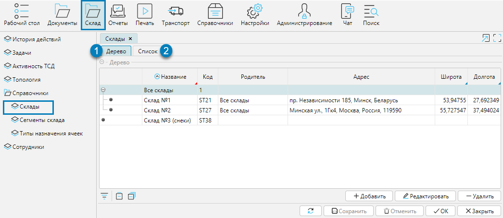
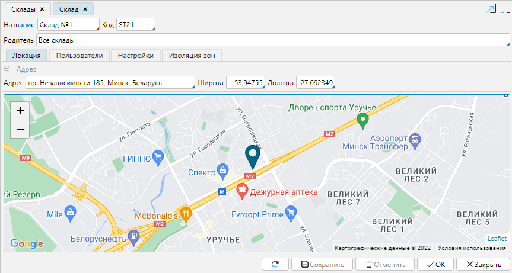
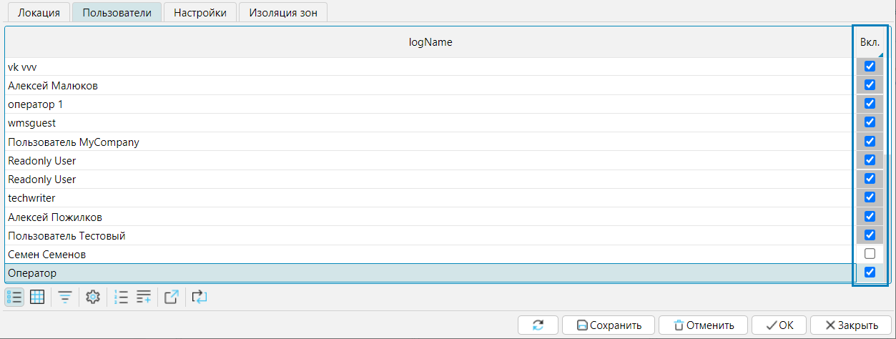
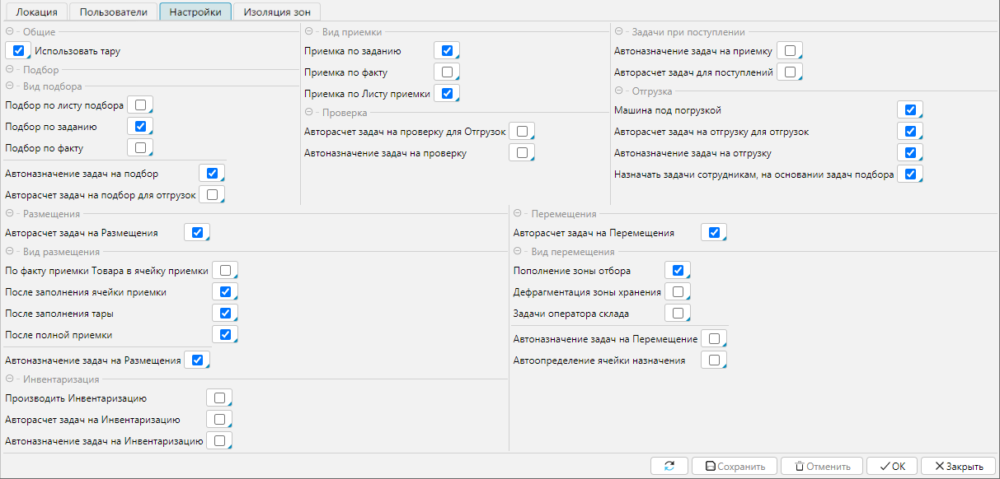
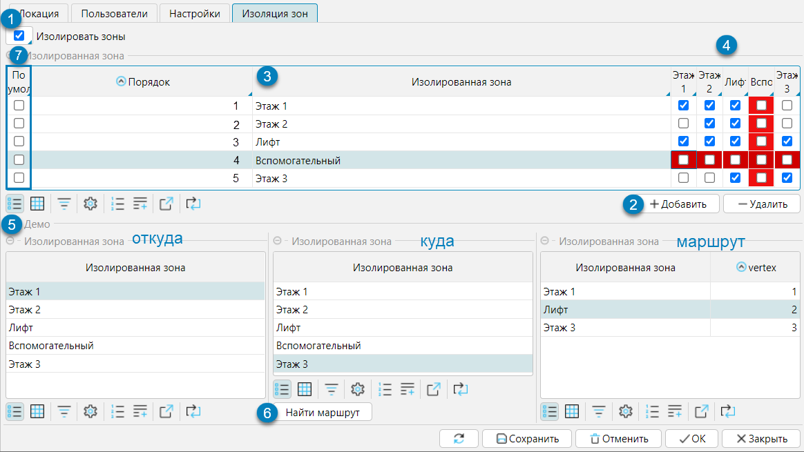

Перечень складов, обслуживаемых системой отображается на форме **Склады**, которая доступна в меню **Склад - Справочники** (рис. 1) а также в меню **Справочники**. 
Список складов доступен в иерархическом (рис. 1(1)) и табличном (рис. 1(2)) представлении.  Просмотреть параметры склада можно кнопкой **Редактировать**, 
а в табличном [представлении](../common/mode.md) также двойным нажатием левой клавишей мыши.

  
Рис. 1 Список складов 

В карточке склада указывается **Название** склада, его уникальный **Код**, который будет участвовать в формировании штрихкодов-адресов всех ячеек склада. 
В поле **Родитель** указывается какому узлу иерархического дерева принадлежит склад.

На вкладке **Локация** на карте отображается местоположение склада. Оно может быть определено автоматически по введенному **Адресу** или 
по введенной **Широте** и **Долготе**. (рис. 2)

  
Рис. 2 Карточка склада

На вкладке **Пользователи** отображаются все пользователи системы и их доступ к складу. Если у пользователя включено ограничение доступа к складам 
(см. [раздел Справочник сотрудников](../control/employee.md)), то на вкладке отметкой в колонке **Вкл.** можно предоставить или 
лишить пользователя доступа к складу, т.е. пользователь, у которого нет доступа к складу, не сможет видеть склад и относящиеся к нему документы. 
Если ограничение по складу не включено, то колонка **Вкл.** подсвечивается серым фоном и редактировать доступ невозможно.

  
Рис. 3 Вкладка Пользователи  

На вкладке **Настройки** отображаются настройки логики данного склада. Их можно устанавливать и изменять непосредственно на данной вкладке, 
либо в меню **Настройки - Настройки логики**. Измененные настройки отобразятся на обеих формах.

  
Рис. 4 Вкладка Настройки карточки склада

На вкладке **Изоляция зон** производятся настройки логики разделения склада по зонам для настройки автоматического формирования задач по складским операциям. 
Если на складе выделяются зоны, имеющие разные параметры (например, этажи, между которыми можно перемещаться на лифте или по лестнице, 
зоны с разным температурным режимом и т.д.) или логически (например по уровню доступа) и данная ограниченность должна быть учтена при формировании 
маршрута выполнения складских операций, то на вкладке **Изоляция зон** (рис. 5) создается структура зон и возможных направлений построения маршрута:

1. Отметить признак наличия изолированных зон (1)
2. Кнопкой **Добавить**(2) создать строку для каждой зоны, все созданные зоны также отображаются как столбцы (4)
3. Указать имя зоны в поле **Изолированная зона**(3) и при необходимости порядковый номер в поле **Порядок**, который определяет порядок отображения зон на этой форме. 
В колонке **По умолчанию**(7) можно отметить, какая из зон будет назначаться ячейкам в топологии склада по умолчанию, 
если не задана другая зона (см. раздел [Построение структуры склада](structure.md))
4. Для каждой из созданных зон отметить галочкой, в какую из зон возможно движение. Например (рис. 5), из зоны _Этаж 1_ возможно перемещение в зоны _Этаж1_, 
_Этаж 2_ и _Лифт_.  Красным цветом выделены полностью изолированные зоны, для которых невозможно построить маршрут.
5. В блоке **Демо**(5) при выборе начальной и конечной зоны маршрута будет построен кратчайший маршрут для перемещения груза. 
Для пары зон, для которых не существует путь на графе, система не будет строить маршруты на перемещение одной задачей. 
Например, для перемещения груза с первого этажа на третий, будет создано 2 задачи: перемещение с первого этажа в лифт, перемещение из лифта на 3 этаж. 
Кнопка **Найти маршрут** пересчитывает маршрут, если были внесены изменения в доступность зон.  

  
Рис. 5 Вкладка Изоляция зон 

