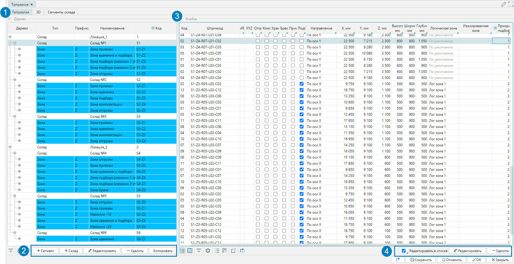
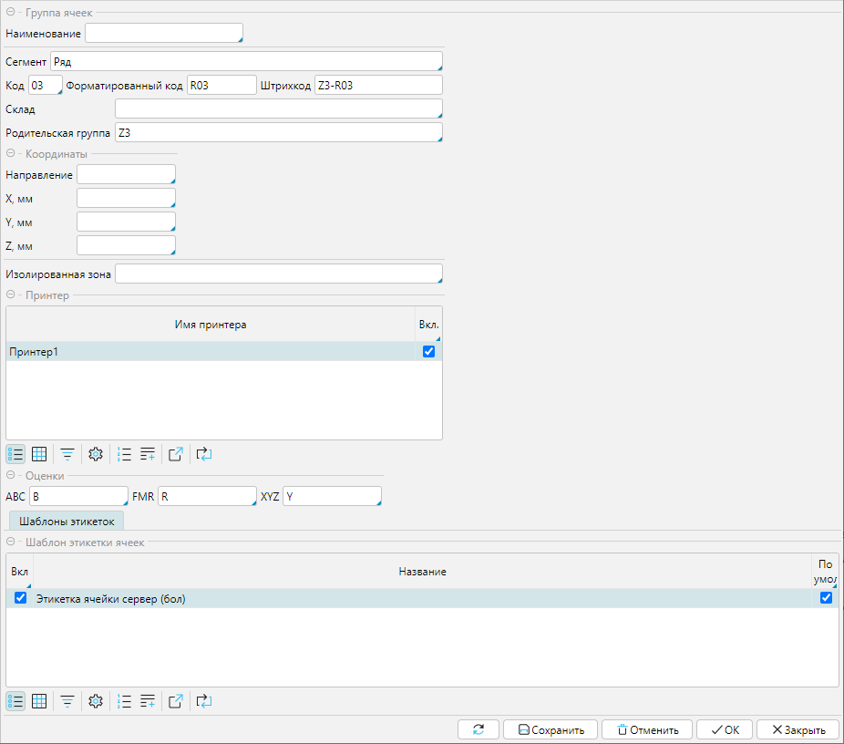
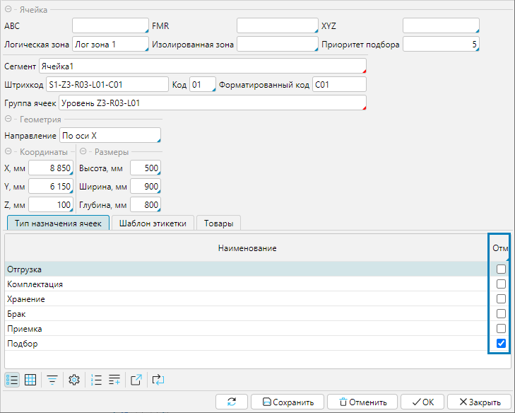
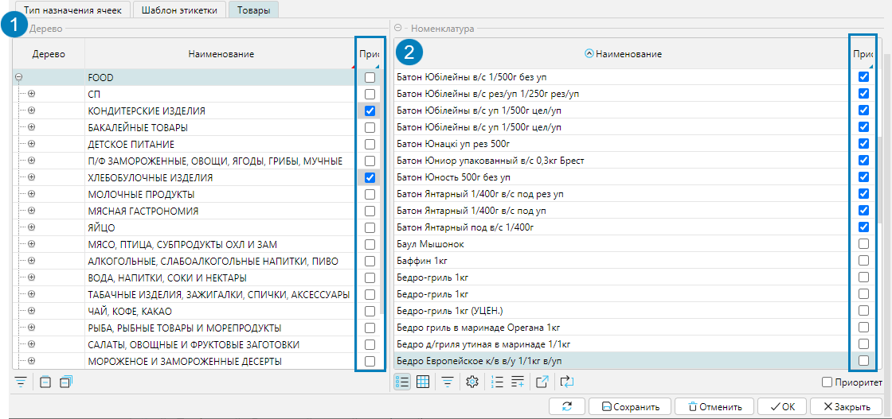
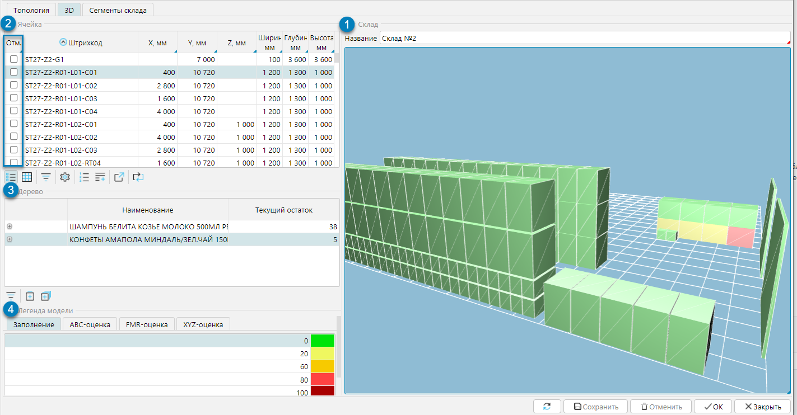

Структура склада отображается на форме **Топология** (рис. 1) меню **Склады**. Форма состоит из 3 вкладок (рис. 1(1)): 
1. **Топология**, где отображается и редактируется иерархическая структура всех складов комплекса 
2. **3D**, где визуализируется склад в 3D модели 
3. **Сегменты склада**, которая описана в одноименном [параграфе](segment.md).

На вкладке **Топология** для построения и редактирования структуры склада используются кнопки (рис. 1 (2)):

**+Склад** - доступна только на уровне складов, открывает форму нового склада (см. § [Склады](stock.md)) , 
в которой заполняются данные нового склада и при сохранении он будет добавлен на форму **Топология**.

**+Сегмент** - открывает форму новой группы ячеек (рис. 2), в которую необходимо внести данные и сохранить. 
Настроенный сегмент будет добавлен в структуру склада. Таким образом добавляются сегменты склада, которые не являются ячейками.

**Удалить** - удаляет элемент склада и все подчиненные структурные элементы, если в них нет товара.

**Копировать** - копирует выделенный элемент структуры со всеми подчиненными элементами. При нажатии откроется форма скопированной группы ячеек, 
где можно поменять настройки. Сохраненный с изменениями элемент будет добавлен в структуру склада.

**Редактировать** - открывает выделенную группу ячеек для редактирования. 

  
Рис. 1 Форма Топология

На форме группы ячеек задаются настройки элемента склада (рис. 2):

**Наименование** - имя структуры склада. Если оно не задано, то автоматически будет отображаться составное имя из типа сегмента и 
последовательно указанных через дефис кодов родительских и текущего сегментов.

**Тип** - тип [сегмента склада](segment.md).

**Код** - код группы ячеек, уникальный в рамках родительского сегмента, при сохранении нового сегмента создается автоматически.

**Форматированный код** - код, отображаемый по правилам составления кода [сегмента склада](segment.md), при сохранении нового сегмента создается автоматически.

**Штрихкод** - автоматически составляется из форматированных кодов родительской группы полок и текущей группы ячеек

**Склад** - задается только для групп ячеек склада наивысшего уровня.

**Координаты** - координаты для построения 3D модели склада.

**Изолированная зона** - если данная группа ячеек относится к какой-либо изолированной зоне (см. п. [Склады](stock.md)), ее нужно указать в данном поле.

**Принтер** - используется для печати с ТСД

**Оценки** - если используются результаты ABC-, XYZ- и FMR-анализа при размещении товаров, в этом разделе устанавливаются оценки, которые будет использовать алгоритм размещения.

**Шаблоны этикеток** - шаблон для печати этикеток ячеек группы.

  
Рис. 2 Настройки группы ячеек склада

В блоке **Ячейка** отображаются все базовые элементы, ячейки, входящие в выделенный курсором в Дереве элемент склада, и настройки каждой ячейки (рис. 1(4). 
На вкладке **Назначение ячейки** отображаются товары, которые закреплены за выделенной ячейкой.

Кнопками **Добавить** и **Удалить** регулируется состав ячеек, 
а также можно редактировать свойства ячеек либо непосредственно в блоке включив признак **Редактировать** в списке, 
либо открыв форму ячейки кнопкой **Редактировать** (рис. 1(5)).  Для ячейки, задаются (рис. 3):

**ABC**, **XYZ**, **FMR** - значение оценки соответствующего анализа. Наследуется от родительского сегмента.

**Логическая зона** - если ячейка принадлежит к какой-либо логической зоне (см. п. [Логические зоны](zone.md))), она указывается в данном поле. 
Принадлежность к логической зоне влияет на алгоритм автоматического создания задач на подбор (см. [Документ подбор](../control/documents/selection.md)).

**Изолированная зона** - если для склада настроены изолированные зоны (см. раздел [Склады](stock.md)), в данном поле указывается, 
к какой зоне принадлежит ячейка. Если в системе задана зона по умолчанию, поле будет автоматически заполнено. Зону, указанную по умолчанию, можно изменить.

**Приоритет подбор**а - приоритет ячейки при формировании плана подбора товара. Чем больше значение, тем выше приоритет (т.е. приоритет 1 ниже, чем приоритет 2). 
Подбор товаров будет в первую очередь осуществляться из ячеек с наивысшим приоритетом.

**Код** - код ячейки, уникальный в рамках родительского сегмента, при сохранении новой ячейки создается автоматически.

**Форматированный код** - код, отображаемый по правилам составления кода [сегмента склада](segment.md), при сохранении нового сегмента создается автоматически.

**Штрихкод** - уникальный штрихкод ячейки, состоит из кодов всей иерархии родительских сегментов, начиная с кода склада.

**Группа ячеек** - код родительского сегмента.

**Координаты, Размеры** -  координаты X, Y, Z точки начала построения ячейки в 3D модели(рис. 5) и размеры ячейки.

На вкладке **Тип назначения ячеек** отмечается тип ячейки.  Ячейке может быть назначено несколько типов. 
Как настраивается тип назначения ячейки описано в §Сегменты склада.

На вкладке **Товар** отображается структура категорий товаров (рис. 4 (1)) и относящиеся к каждой категории товары (рис. 4 (2)) 
для настройки приоритета размещения товаров в текущей ячейке.

**Приоритет** - отмеченные ячейки и зону будут рассматриваться в первую очередь при размещении товара.

    
Рис. 3 Настройка свойств ячейки

  
Рис. 4 Закрепление товаров за ячейкой

## 3D модель склада

На вкладке **3D** отображается 3D модель тех складов, в которых для ячеек заданы координаты. В блоке **Склад** (рис. 5(1) необходимо выбрать склад для отображения. 
В блоке **Ячейка** (рис. 5 (2)) будет отображен список всех ячеек склада с указанием координат и габаритов ячеек. 
На 3D модели склада цветом выделяется ячейка, подсвеченная курсором, или группа ячеек, для которых отмечен признак **Отм.** 
Также на 3D модели можно курсором выделить ячейку или группу ячеек и они соответственно будут выделены в блоке **Ячейка**.

В блоке **Дерево** (рис. 5(3)) отображаются товары, которые находятся в выделенной ячейке.

В блоке **Легенда модели** (рис. 5(4)) можно настроить цветовое отображение на вкладках:

**Заполнение** - наполненность ячеек. Необходимо в строке указать процент заполнения ячейки и цвет, которым будет окрашена ячейка при таком проценте заполнения.

**ABC-оценка**, **XYZ-оценка**, **FMR-оценка** - для каждого значения можно настроить цвет отображения ячейки.

При переключении между вкладками, на 3D модели отображается соответствующее цветовое оформление. 

  
Рис. 5 3D модель склада

