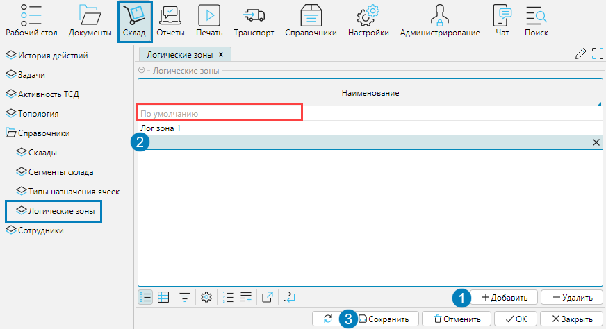

Логические зоны - это виртуальные зоны. Деление на логические зоны может осуществляться по любому основанию. 
В топологии устанавливается принадлежность складских ячеек определенной логической зоне. В соответствии с логической зоной осуществляется создание задач на подбор.

Справочник логических зон находится в меню **Склад - Справочники - Логические зоны**.

Для создания логической зоны необходимо:

1. Создать строку на форме кнопкой Добавить
2. Ввести название логической зоны
3. Сохранить изменения

Логическая зона **По умолчанию** - логическая зона, которая автоматически назначается всем новым складским ячейкам, 
даже если вы не используете деление по логическим зонам. В этом случае весь складской комплекс представляет собой единую логическую зону. 
Данную зону невозможно удалить. 

  

