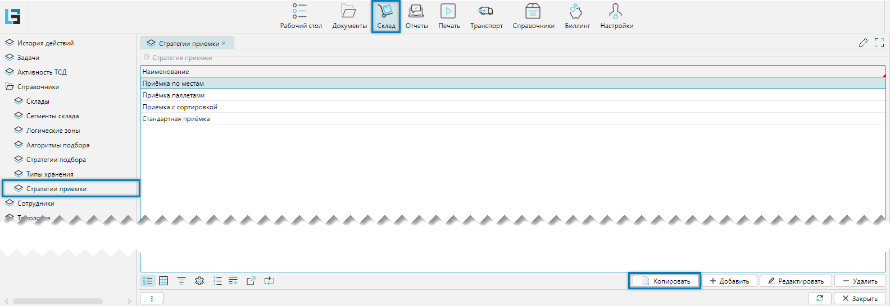
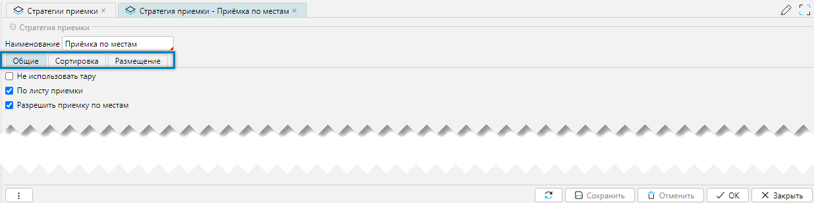
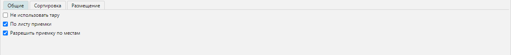
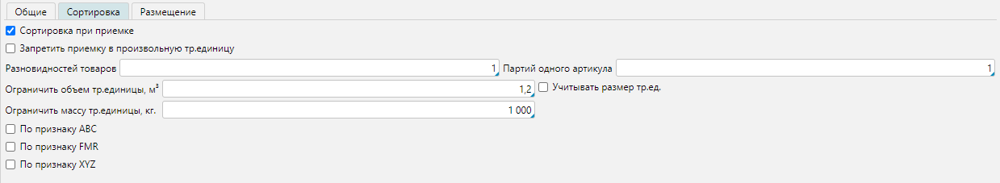
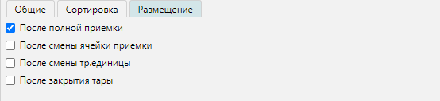

Стратегия приемки — это механизм, определяющий правила обработки поступающих товаров.

Ключевым элементом механизма стратегии приемки является справочник **Стратегии приемки**.  
Справочник доступен из меню **Склад-Справочники-Стратегии приемки** (Рис. 1). 

Справочник устанавливает наборы настроек, относительно которых строится процесс приемки. В отличие от настроек, 
рассмотренных в разделе [вид приемки](receipttype.md), стратегии приемки расширяют возможности приемки относительно 
групп настроек, объектов системы и вариантов применения. Созданные стратегии можно связать с разными объектами 
системы, определив таким образом действия по умолчанию, связанные с приемкой товара в порядке следования их 
приоритетов:

1. Настройки приемки определяются стратегией приемки, заданной для [документа](receipt.md#вкладка-приемка).
2. Если не задана стратегия для документа, то настройки приемки определяются стратегией приемки, заданной для
   [контрагента](../masterdata/legalentites.md#вкладка-поступления).
3. Если не задана стратегия для контрагента, то настройки приемки определяются стратегией приемки, заданной для  
   [склада](../topology/stocks.md#вкладка-настройки).
4. Если не задана стратегия для склада, то настройки приемки определяются стратегией приемки, заданной для 
   [системы](../wmssettings/options.md#вкладка-приемка) в целом. 
5. Если ни одна из стратегий не задана, то настройки приемки определяются отдельными опциями так, как будто модуль 
   расширенной приемки не подключен. 

<info>
    **Важно:**
    - Механизм управления стратегиями приемки доступен только при подключенном модуле **Расширенная приемка**.
    - Стратегия сохраняется для документа в момент изменения склада или контрагента в документе, поэтому изменение 
      стратегии приемки для контрагента или склада влияет только на вновь создаваемые и не влияет на существующие 
      документы 
</info>

## Отображение справочника
 
_Рис. 1 Форма отображения справочника_

Кнопка **Копировать** создает новую стратегию на основании текущей для последующего 
[редактирования](receiptstrategy.md#редактирование-стратегии).

## Редактирование стратегии

 
_Рис. 2 Форма редактирования стратегии_

Редактирование:
- **Наименование** - наименование стратегии
***

### Вкладка Общие
Определяет [виды приемки](receipttype.md)  

 
_Рис. 3 Вкладка Общие_

***

### Вкладка Сортировка
Вкладка отвечает за настройку правил приемки товара с сортировкой. Процесс приемки товара с сортировкой меняет 
порядок приема товаров с ТСД, так как процесс начинается не сканирования поддона, куда будет размещен товара, а со 
сканирования товара. На основании характеристик товара система будет предлагать поддон для размещения товара.    

 
_Рис. 4 Вкладка Сортировка_

Редактирование:
- **Сортировка при приемке** - флаг включает режим приемки с сортировкой.
- **Запретить приемку в произвольную тр. единицу** - значение флага влияет на размещение товара в чужую, не 
  рекомендованную системой, транспортную единицу. Если флаг не включен, то такое действие возможно после выдачи 
  предупреждения и диалога да/нет. Если флаг включен, то такое действие не возможно и после выдачи предупреждения 
  система не даст разместить товар в чужой транспортной единице. 
- **Разновидностей товаров** - устанавливает числовое значение сколько разных товаров можно положить на один поддон. 
  Если значение не установлено, то проверка не производится. 
- **Партий одного артикула** - устанавливает числовое значение сколько разных партий одного артикула можно положить на 
  один поддон. Если значение не установлено, то проверка не производится.
- **Ограничить объем тр. единицы, м3** - система отслеживает, что бы на поддон не было положено товаров больше 
  заданного объема.
- **Учитывать размер тр. ед.** - если флажок включен, то будет учитываться объем транспортной единицы (длина, ширина,
  высота - габариты условной коробки) в объем которой можно поместить товар. Если установлены оба параметра: 
  **Ограничить объем тр. единицы** и флажок **Учитывать размер тр. ед.**, то система выберет наименьшие значение. 
- **Ограничить массу тр. единицы, кг** - если флажок включен, то система не даст загрузить поддон весом больше, чем 
  указано. Если в процессе приемки вес будет превышен, то система автоматически предложит взять новый поддон. 
- **По признаку ABC** - если первоначально был выбран товар с определенным [признаком](../masterdata/items.md#оценки)
  в поддон, то система в дальнейшем будет рекомендовать класть товары с аналогичным признаком в этот поддон. 
- **По признаку FMR** - аналогично описанию признака ABC. 
- **По признаку XYZ** - аналогично описанию признака ABC.

<info>
   **Важно:**
   - Приемка позволяет сортировать на общий набор поддонов товар по разным задачам приемки, оформленных на нескольких 
     сотрудников. Например, если сотруднику **1** был рекомендован поддон, на который он положил товар с признаком 
     **А** (_анализ ABC_), то при появлении аналогичного товара у сотрудника **2** ему будет рекомендован поддон 
     сотрудника **1**. 
</info>

<info>
   **Примечание:**
   - Вкладка Сортировка доступна, если отключен флажок [Не использовать тару](receiptstrategy.md#вкладка-общие)
</info>
***

### Вкладка Размещение
Настройки вкладки определяют когда может быть начато размещение товара в процессе приемки товара: по окончанию 
приемки или параллельно с ней.

 
_Рис. 5 Вкладка Размещение_

Редактирование:
- **После полной приемки** - когда весь товар принят и завершены все задачи по приемке для всех кладовщиков будет 
  создан системой документ размещения принятого товара
- **После смены ячейки приемки** - после смены ячейки приемки системой будет создан документ размещения уже 
  принятого в ячейку приема товара.    
- **После смены тр. единицы** - по заполненности поддона, в который выполнялась приемка товара, будет создан 
  документ размещения. Если используется приемка с сортировкой, то флажок не ставится.  
- **После закрытия тары** - после закрытия тары будет создан документ размещения закрытого поддона. Может работать с 
  любыми видами приемки. 

