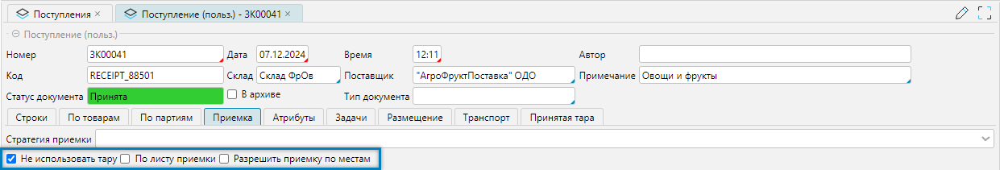
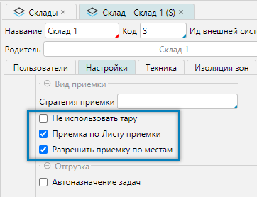
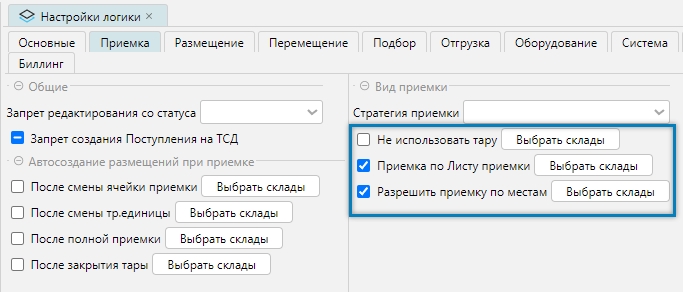

При оформлении [Документа поступления](receipt.md#вкладка-приемка) можно задать вид приемки: 

 
_Рис. 1 Фрагмент формы редактирования документа поступления_

Настройки вида приемки:
- **Не использовать тару** - стандартный процесс приема товаров при работе с ТСД состоит из сканирования ячейки куда
  ведется приемка, сканирование тары на которой товар принимается, сканирование товара и ввода количества. При
  установленном флаге будет пропускаться шаг сканирования тары.
- **Приемка по Листу приемки** - при установленном флаге разрешает сотруднику с ТСД самостоятельно создавать для
  себя задачу на приемку сканированием по штрихкоду или QR-коду листа приемки, ранее созданного оператором. Если
  флаг не включен, то задача сотруднику назначается оператором.
- **Разрешить приемку по местам** - могут быть рассмотрены два варианта применения:
  - Приемка монопаллетами, когда ожидается, что все паллеты скомплектованы одинаково и на основании количества товара
    одной паллеты, принимается количество товара для всех последующих разгружаемых с машины и считанных ТСД, паллет.
  - Если зона приемки товара не вмещает прибывший товар, то приемка может быть разбита на два этапа.
    Сканирование поддонов, на которых находится разгружаемый товар и перемещение их в зону дальнейшей обработки.
    После разгрузки машины (или параллельно) вторым этапом производится обычная приемка со сканированием товара.

Система также позволяет выполнить предварительную настройку приемки, которая будет действовать по умолчанию при выборе 
склада для документа поступления, определив настройки: 
- для [склада](../topology/stocks.md#вкладка-настройки):

   
  _Рис. 2 Фрагмент формы редактирование свойств склада_

- логики работы [системы](../wmssettings/options.md#вкладка-приемка):

   
  _Рис. 3 Фрагмент формы редактирования Настройки логики_

Настройки действуют в порядке приоритета следования:
1. Оператором на уровне документа поступления.
2. Если определены предварительные настройки вида приемки для выбранного склада.
3. Если определены предварительные настройки вида приемки для системы.

<info>
  **Примечание:**
  - Если настройки были определены заранее, то при редактировании документа поступления в момент изменения склада будут 
    использованы предварительные настройки. 
  - При необходимости оператор самостоятельно может изменить текущие настройки в документе поступления.
</info>

