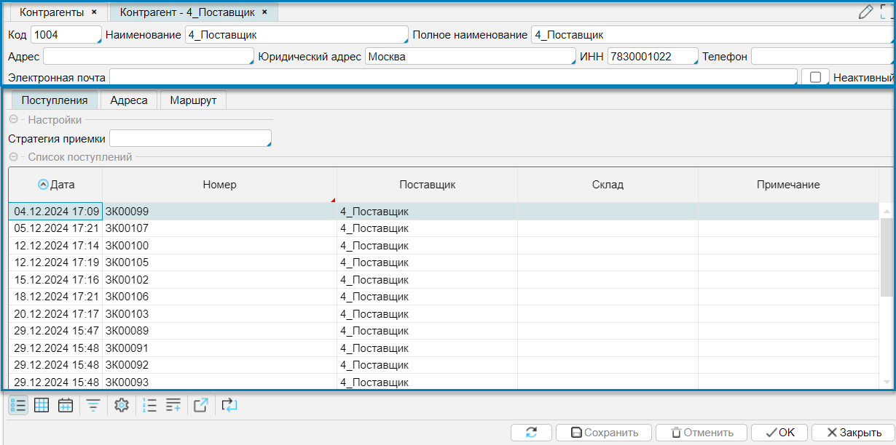

Справочник контрагентов может как импортироваться из внешней системы, так и создаваться и редактироваться в lsFusion WMS. 
Справочник доступен в меню **Справочники - Контрагенты** (рис. 1 ) или **Рабочий стол - Контрагенты**. 
Для редактирования списка контрагентов используют кнопки **Добавить, Редактировать, Удалить** (Рис. 1).  
Для управления отображением контрагентов используют фильтр (Рис. 1 (1)). Фильтр позволяет отобразить **Активных** и (или) 
**Неактивных** контрагентов. Неактивные контрагенты - это те, с которыми по каким-либо причинам не ведется деятельность 
и они не могут быть выбраны в документах.

  
Рис. 1 Список контрагентов

При редактировании контрагентов (Рис. 2) на форме отображается несколько функциональных групп:
- общие реквизиты клиента: 
  - **Код** - код контрагента, который является уникальным идентификатором
  - **Наименование** - краткое наименование контрагента
  - **Полное наименование**
  - **Адрес** - физический адрес контрагента
  - **Юридический адрес**
  - **ИНН** - идентификационный номер налогоплательщика
  - **Телефон**
  - **Электронная почта**
  - **Активный** - признак активного или неактивного клиента
- отдельные вкладки, связанные со своим списком дополнительных реквизитов
  - Поступления - отображаются все документы-поступления от контрагента
  - Адреса - настройки дополнительного модуля "Транспорт", которые описаны в разделе (?)
  - Маршруты - настройки дополнительного модуля "Транспорт", которые описаны в разделе (?)

  
Рис. 2 Форма редактирования контрагента

