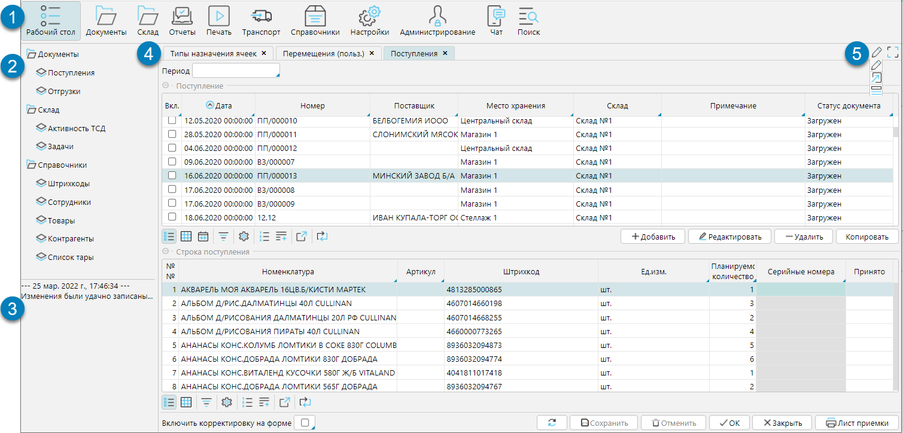
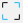
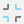
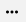
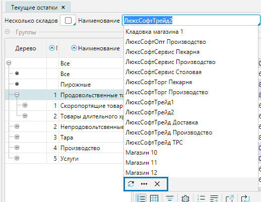
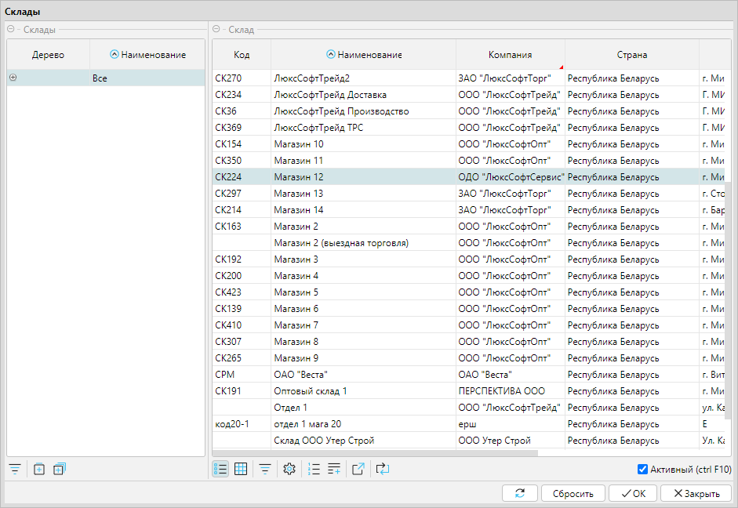
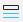
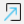
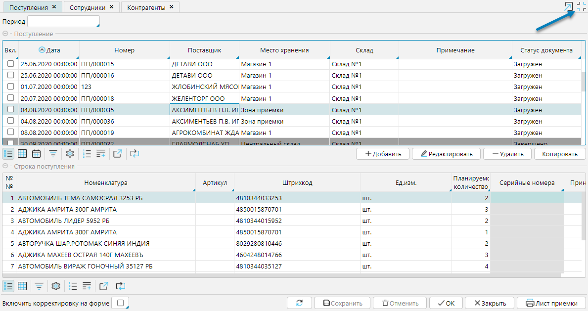
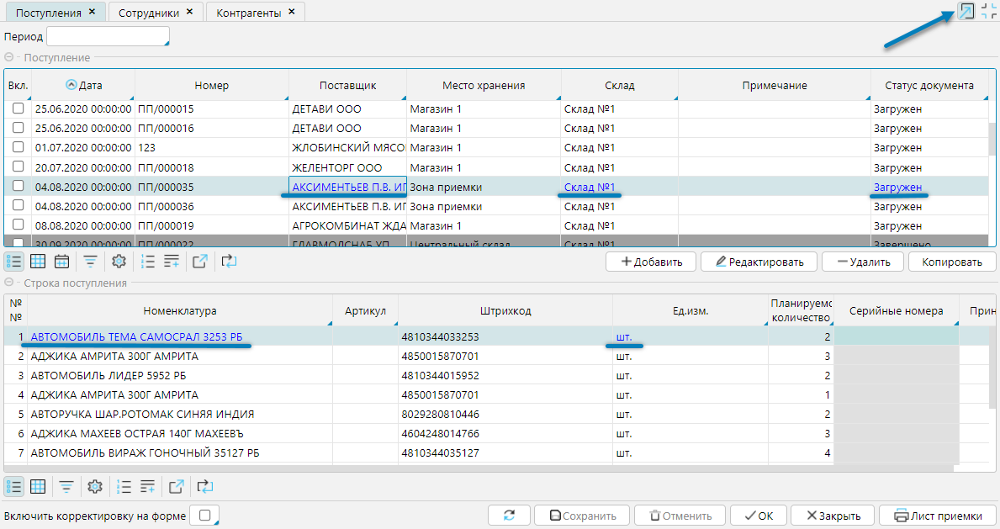

На рисунке 1 представлены основные элементы интерфейса.

Рис. 1 Основные элементы пользовательского интерфейса

1. Главное меню. В нем отображаются функциональные модули системы. При выборе модуля, формы модуля, которые доступны для работы, отображаются в левом меню - Навигаторе.
2. Меню модуля- перечень форм, доступных в выбранном модуле.
3. Область отображения истории действий пользователя в текущей сессии.
4. Рабочий стол - окно, в котором открываются рабочие формы. Все открытые формы представлены вкладками, между которыми можно переключаться, как в интернет-броузере.
5. Функциональные кнопки:
   -  - кнопка перехода в полноэкранный режим, в котором скрыты главное меню и меню модуля. Для возврата в обычный режим используется кнопка  (рис. 4)
   -  - режим по умолчанию.  При заполнении полей, включая поля с выбором из выпадающего списка, программа предлагает варианты автозаполнения. Если это поле с выбором из справочника, то программа отображает первые 15 вариантов. Чтобы просмотреть все возможные варианты выбора нужно нажать  и отобразится окно справочника (рис. 3), из которого можно выбрать значение.

     
   
     Рис. 2 Режим по умолчанию
   
     
   
     Рис. 3 Справочник для выбора значения поля
   
   -  - режим диалоговых окон. В этом режиме при необходимости выбрать в поле значение из справочника, сразу открывается диалоговое окно.
   -  - кнопка перехода в режим "Переход по ссылке". В данном режиме в выделенных курсором строках подсвечиваются объекты, на формы которых можно перейти, и переход совершается по кликну на объект. Чтобы выйти из режима необходимо снова нажать на кнопку  рис. 5). В стандартном режиме перейти к объекту можно удерживая клавишу CTRL и кликнув на объект.    

     

     Рис. 4 Полноэкранный режим  

     

     Рис. 5 Режим "Переход по ссылке"