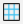
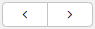

В системе поддерживается несколько режимов представления данных: 
- деревья 
- таблицы
- сводные таблицы
- календарь
- карта.

## Деревья 
Это представление служит для отображения и создания объектов с иерархической структурой, в основном это категории объектов, например, товарные группы.
    
Рис. 1 Иерархическое представление данных

## Табличное представление
Табличное представление данных является основным в системе, оно используется для ввода данных и работы с ними. 
Кнопка переводит представление данных в табличное.
    
Рис. 2 Табличное представление данных

## Ввод данных
- Внесения данных в поля таблицы напрямую.
  При заполнении любого поля программа предлагает варианты автозаполнения на основании ранее введенных данных.  

    
Рис. 3 Автозаполнение полей  

Отображение подсказок можно отключить для конкретного поля. Для этого необходимо:
1. правой клавишей мыши вызвать контекстное меню и нажать **Настройка политики свойства**
2. в открывшемся окне отметить признак **Отключить подсказки при вводе**
3. **Сохранить** изменения
4. для того чтобы настройка начала действовать необходимо перезагрузить сервер

    
Рис. 4 Отключение подсказок  

- **Копирование данных** из листов Excel в поля системы. При этом система подтягивает в форму соответствующую информацию, 
имеющуюся в системе, относительно скопированных данных. 
Например, если в документ скопировать точное наименование, система подтянет остальные необходимые атрибуты.  

    
Рис. 5 Копирование данных из Excel

- **Групповая корректировка.** Данное действие позволяет ввести одинаковые значения для всего массива записей одновременно. Для этого необходимо (рис. 6):   
1. доступными средствами фильтрации отобрать необходимые записи, и правой клавишей мыши вызвать контекстное меню в любом поле колонки, 
где будет осуществляться ввод нового значения,
2. выбрать команду Групповая корректировка,
3. ввести значение и нажать Ввод.   

   
Рис. 6 Применение групповой корректировки  
При применении групповой корректировки необходимо включить функцию корректировки на форме (см. [Как устроены формы](interface_forms.md)).  

## Упорядочивание данных
Упорядочить записи в колонках по возрастанию или убыванию можно дважды кликнув по заголовку колонки. 
Для упорядочивания по нескольким колонкам при дабл-клике необходимо удерживать клавишу CTRL и дважды кликнуть по заголовку.  
  
Рис.7 Упорядочивание  

## Отбор данных
В системе предусмотрено несколько механизмов отбора данных.  
- **Предзаложенные фильтры**. Как правило, они специфичны и адаптированы под содержание той формы, на которой размещены.  

  
Рис. 8 Предзаложенный фильтр на форме  
- Фильтрация по узлу дерева. На форме отображаются только те элементы, которые относятся к выбранному и вложенным узлам дерева (рис. 9(1))
- Быстрый отбор по признаку. Если в ячейку начать вводить значение, по которому необходимо отфильтровать данные, 
система предложит варианты имеющихся значений с введенным элементом, и произведет отбор по выбранному или введенному признаку (рис. 9(2)).

  
Рис. 9 Фильтрация по группе и введенному значению  

- **Отбор данных на основании пользовательского запроса**. 
Система позволяет составлять сложные запросы состоящие из нескольких условий для отбора необходимых записей (рис.10).  
1. Чтобы вызвать настройку пользовательского фильтра, необходимо использовать кнопку или поставить курсор в поле колонки, 
по которой нужно настроить фильтр и нажать F3.
2. Выбрать колонку, по которой будет производиться отбор.
3. Выбрать оператор условия, по которому будет производиться отбор.
4. Ввести значение для отбора записей. При необходимости добавить/удалить условие кнопками и.
5. Установить логику отбора "И" или "ИЛИ".

   - По умолчанию установлена "И". В системе есть возможность настроить отображение логики отбора текстом И/ИЛИ. 
     Для этого в **Администрирование - Система - Настройки - Параметры** необходимо для роли установить значение true 
     для параметра **useTextAsFiltrSeparator** (рис. 11)  
       
   
6. Для применения фильтра нажать или **Enter** на клавиатуре. Чтобы сбросить фильтр, и скрыть настройки нажмите.  

  
Рис. 10 Настройка пользовательского фильтра  

  
Рис. 11 Настройка отображения логики фильтра текстом  

Если необходимо добавить в фильтр несколько значений одной колонки, 
то не надо добавлять условие для каждого значения, все необходимые для отбора значения вводятся через запятую.  
  
Рис. 12 Несколько значений в одном условии  
Если необходимо отобрать только не пустые значения в колонке, необходимо выбрать 2 оператора !(Не) и Разрешить пустые значения, а поле значений оставить пустым.  
  
Рис. 13 Колонка до применения фильтра  
  
Рис. 14 Применение фильтра  

- При применении **"быстрого" фильтра**, открывается не вся панель фильтров, а только окно с условием. 
Применяется фильтр по нажатию **Enter** на клавиатуре. Чтобы воспользоваться "быстрым" фильтром, нужно поставить курсор в колонку, 
по которой осуществляется отбор и начать вводить значение с клавиатуры.  

  
Рис. 15 Быстрый фильтр  

## Сводные таблицы
Представление данных сводная таблица позволяет сформировать и визуализировать оперативный отчет (рис. 16). 
Пользователь выбирает данные для добавления в область строк, столбцов и значений и интерпретирует полученный результат. 
Кнопка на панели инструментов переводит табличное представление в режим сводной таблицы. 
Для создания отчета могут быть использованы все доступные на форме  колонки (рис. 16(1)). 
Для группировки данных соответствующие колонки надо переместить методом drag-and-drop в область строк (рис. 16(2)). 
Колонки с числовыми значениями и подсчет количества записей предопределены в фильтре Колонка (рис. 16(3)), 
где пользователь отмечает необходимые ему данные. Если для анализа необходимо использовать значения других колонок, 
не указанных в фильтре, их надо переместить в область столбцов. 
По каждому столбцу можно выбрать значения, которые будут использоваться (рис. 16(4)). 
Числовые данные интерпретируются в разрезе суммы, максимального или минимального значения (рис. 16(5)). 
В представлении поддерживаются механизмы упорядочивания и фильтрации.  
Построенный отчет может быть выгружен в Excel с сохранением всех группировок кнопкой в панели инструментов.  
Полученные сводные данные можно визуализировать с помощью тепловых карт и различных диаграмм (рис. 17), 
которые можно экспортировать в отдельное изображение. Кнопка в режиме сводной таблицы управляет отображением настроек таблицы (рис.18).  

    
Рис. 16 Представление "сводная таблица"  

    
Рис. 17 Визуализация данных сводной таблицы  

    
Рис. 18 Отображение без настроек сводной таблицы  

## Календарь
В этом представлении данные отображаются в календарной сетке. 
Кнопка переводит данные в режим календаря (рис. 19). Данные могут отображаться за месяц, неделю или день. 
Изменить дату объекта можно перетянув его в другую ячейку. 
Данные можно листать кнопками по месяцам/неделям/дням, в зависимости от выбранного варианта отображения.  
Кнопка Сегодня перемещает курсор на текущую дату.  
    
Рис. 19 Представление "Календарь"  

## Карта
**Карта** позволяет отображать список объектов в виде точек на карте. 
В данном представлении можно редактировать данные (например, перетянуть точку), и они будут сохранены, 
как если бы изменения вводились вручную в табличном представлении. 
Данное представление доступно только на формах, где представлены объекты с координатами. 
Для переключения в режим карты, используют кнопку на панели инструментов.
  
Рис. 20 Представление "Карта"  

   
