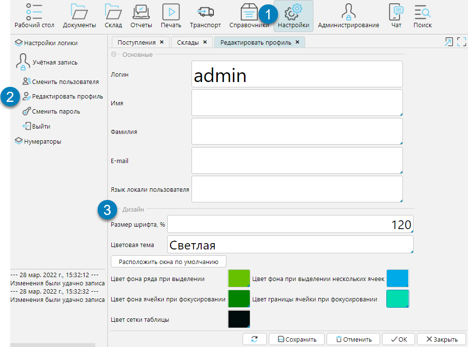
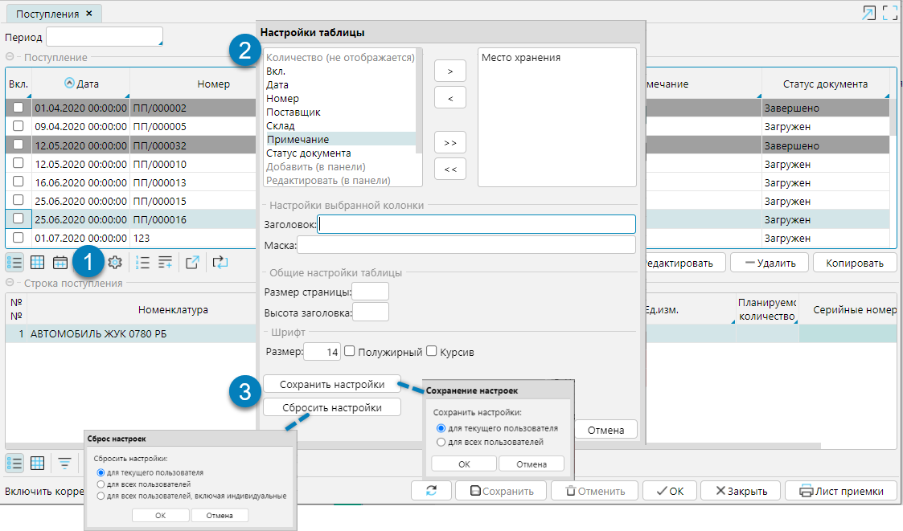

Любой пользователь может настроить индивидуальный дизайн своей учетной записи в системе и управлять отображением форм. 

## Индивидуальный дизайн
lsFusion поддерживает две темы: светлую, которая установлена по умолчанию, и темную. Кроме того, имеется возможность цветовых настроек: цвета сетки таблицы, цвета границы ячейки при фокусировании, цвета фона ячейки и ряда при выделении.

Настройка производится в модуле Настройка на форме Редактировать профиль (рис. 1).

Для того чтобы увидеть изменения, необходимо выйти из системы и выполнить повторный вход.

   
Рис. 1 Настройка дизайна учетной записи пользователя

## Настройка табличных форм
Пользователь может настроить табличный вид формы: отображение, порядок, наименование колонок, начертание шрифта - и сохранить настроенное отображение для дальнейшего использования.

На форме, подлежащей настройке, надо (рис. 2):
1. Кнопкой  открыть окно настроек 
2. Установить подходящие параметры:
   **Колонки**, перечисленные в левом столбике отображаются на форме, в правой - не отображаются. Чтобы переместить колонки используют кнопки >>, \<\<, >, \< или двойной клик по названию колонки. Чтобы изменить  порядок колонок на форме, в левом окне надо перетащить название колонки на нужное место
   **Заголовок** колонки можно изменить. Для этого надо выделить курсором колонку и в поле Заголовок напечатать новый заголовок.
   **Маска** - в этом поле можно задать стандартную маску и формат представления данных в колонке изменится в соответствии с маской, например #0,0000 для отображения 4-х знаков после запятой.
   Размер страницы
   **Высота заголовка** - высота строки заголовка устанавливается в пикселях.
   **Шрифт** - можно указать размер и изменить начертание шрифта
3. Сохранить настройки
   **ОК** - сохранит настройки только на время текущей сессии
   **Сохранить настройки** - сохранит настройки для текущего пользователя и форма будет всегда открываться в том виде, как ее настроил пользователь. Администратор системы может применить настройки не только к текущему пользователю, но и ко всем пользователям.
   **Сбросить настройки** - ранее сохраненные настройки будут сброшены до настроек, установленных администратором системы. Администратор системы может сбросить настройки для всех пользователей. Администратору доступна команда для всех пользователей, включая индивидуальные, по которой будут аннулированы не только настройки, которые были применены текущим пользователем, но индивидуальные настройки всех пользователей.
   
Рис. 2 Настройки табличных форм

