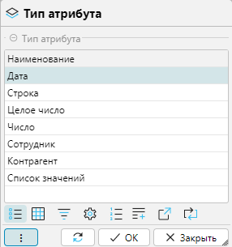

Механизм атрибутов позволяет пользователю самостоятельно добавлять необходимые свойства для разных объектов без  
привлечения разработчиков.

## Отображение справочника

Справочник отображается на форме **Настройки-Атрибуты** (рис. 1) 

 
_Рис. 1 Форма отображения справочника_

[//]: # (todo - заменить скриншот)

Структурно форма состоит из 2-х табличных частей:

- список добавленных атрибутов (верхняя часть),
- вкладки с дополнительными настройками и данными атрибутов.

В списке атрибутов находятся колонки объектов, для которых эти атрибуты могут быть заданы. Закрепление атрибутов за  
объектами производится непосредственно в табличной части установкой флажка в соответствующей колонке.

В нижней табличной части на вкладках отображаются дополнительные настройки и данные, связанные с выделенным 
атрибутом  в верхней части.

### Вкладка Настройки
На вкладке (рис. 1) отображается список объектов, который совпадает с колонками верхней табличной части формы. Для  
каждого объекта доступны дополнительные настройки атрибута, которые назначаются установкой соответствующих флажков:
    - **Обязательный** - если флажок установлен, то значение атрибута для объекта должно быть заполнено, иначе 
объект будет невозможно сохранить. 
      <info>
        - Контроль действует для всех новых записей, которые добавляются после создания атрибута.
        - Для записей, которые внесены до добавления атрибута в систему, контроль действует, если при редактировании 
объекта изменялось значение атрибута.
        - Если флажок **Обязательный** был назначен, а потом атрибут был отменен для объекта (снят флажок в колонке 
в верхней части), то повторное назначение атрибута, должно происходить в два этапа: 
            1. убрать флажок **Обязательный** и сохранить данные,
            2. назначить атрибут объекту, 
            3. установить дополнительные настройки.  
      </info>
    - **На форме списка** - если флажок установлен, то атрибут будет присутствовать на форме списка. Если не
      установлен, то атрибут будет доступен только на формах редактирования объекта и, например, в отчетах.
    - **В API** - если флаг установлен, то атрибут будет участвовать в GET и POST запросах при работе
      с [API](../intro/terminology.md#общие).

### Вкладка Товары

Вкладка **Товары** появляется для атрибутов, которые действуют для товаров (в верхней части в колонке **Товар**  
поставлен флажок (рис. 1).  

 
_Рис. 2 Вкладка Товары_

На вкладке настраивается, для каких товарных категорий будет использоваться атрибут:
- **Все категории** - если отмечено атрибут будет доступен для товаров любой товарной категории.
- **Вкл.** - атрибут будет доступен для категорий, для которых установден флажок в колонке.  

## Редактирование атрибута

В системе заложено 7 типов атрибутов, каждый из которых имеет специфические свойства. Тип атрибута задается при его  
создании и далее не может быть изменен.

 
_Рис. 3 Форма выбора типа атрибута_

У всех атрибутов присутствуют три одинаковых свойства, два из которых обязательны для заполнения.

 
_Рис. 4 Общие свойства атрибута_

- **Код** - уникальный идентификатор объекта, который может состоять из любых символов. Рекомендуем использовать 
  латинские буквы и цифры. 
- **Наименование** - название атрибута, которое используется на формах в системе.
- **Выкл.** - если флаг установлен, то атрибут становится неактивным, т.е. он не отображается на формах, в том числе 
  в  табличной части списка атрибутов, так как на форме постоянно действует фильтр 
  **Активные** ([рис. 1](attributes.md#отображение-справочника)). Чтобы в списке отобразились все атрибуты (активные 
  и  неактивные), фильтр нужно отключить.  

### Тип Дата
Атрибут для ввода даты. 

 
_Рис. 5 Форма редактирования атрибута типа Дата_

Дополнительно можно ограничить вводимые данные временным интервалом. Для этого используют блоки **Не больше**, 
**Не меньше** или оба. В каждом блоке есть флажок **Текущая дата**, временной интервал устанавливается следующим  
образом: 
- если флажок установлен, то задается количество дней, и интервал будет не больше/не меньше заданного количества дней
- от текущей даты;  
- если флажок снят, то устанавливается фиксированная дата, и интервал будет не больше/не меньше этой даты.

Для примера на рисунке 5 установлен интервал, что _Дата начала_ не может быть меньше даты 03.04.2025 и не может быть 
больше 3 дней от текущей даты.

***

### Тип Строка
Атрибут для ввода строковых значений. Могут использоваться любые символы. Дополнительно можно настроить шаблон,  
которому должно будет соответствовать вводимое значение.

 
_Рис. 6 Форма редактирования атрибута типа Строка_

**Шаблон (regex)** - шаблон, которому должно соответствовать значение, задается с помощью регулярного выражения.  
Например: 
    - *^\d+$* - строка содержит только цифры
    - *([a-zA-Z0-9._-]+@[a-zA-Z0-9._-]+\.[a-zA-Z0-9_-]+)* - строка содержит адрес электронной почты 
  
***

### Тип Целое число
Атрибут для ввода целого числа. Дополнительно можно настроить диапазон вводимых значений, установив ограничения в  
полях **Не меньше** и/или **Не больше**.  

 
_Рис. 7 Форма редактирования атрибута типа Целое число_

***

### Тип Число
Атрибут для ввода дробного числа. 

 
_Рис. 8 Форма редактирования атрибута типа Число_

Дополнительно можно настроить ряд ограничений на вводимое значение:
- **Точность** - максимальное общее количество цифр в числе, включая числа до и после запятой (точки)
- **Масштаб** - количество цифр после запятой (точки)
- **Не меньше** - нижнее ограничение
- **Не больше** - верхнее ограничение

На рисунке 8 приведен пример атрибута _Толщина металла_, который может принимать целые или дробные значения от 0,5 
мм  до 10мм с точностью до десятых миллиметра. 
***

### Тип Сотрудник
Атрибут для ввода сотрудника.

 
_Рис. 9 Форма редактирования атрибута типа Сотрудник_

На форме объекта редактирование значения атрибута вызывает форму списка
[Справочника сотрудников](referenceemployees.md) для выбора 
нужного значения.

 
_Рис. 10 Пример заполнения атрибута типа Сотрудник_
***

### Тип Контрагент
Атрибут для ввода контрагента.

 
_Рис. 11 Форма редактирования атрибута типа Контрагент_

На форме объекта редактирование значения атрибута вызывает форму списка [Справочника контрагентов](legalentites.md)  
для выбора
нужного значения.

 
_Рис. 12 Пример заполнения атрибута типа Контрагент_
***

### Тип Список значений
Атрибут для ввода значения из заданного списка.

 
_Рис. 13 Форма редактирования атрибута типа Список значений_

Для атрибута задается список возможных значений в таблице **Значение атрибута**:
- **Код** - уникальный идентификатор значения атрибута, который может состоять из любых символов. Рекомендуем  
  использовать латинские буквы и цифры.
- **Значение** - непосредственно значение атрибута, которое будет доступно для выбора из списка при редактировании  
  объекта.

В поле **Значение по умолчанию** можно установить значение из заданного списка, которое будет по умолчанию 
установлено  для атрибута при создании объекта. 
    

На рисунке 14 приведен пример выбора значения атрибута *Цвет* на форме редактирования
[карточки товара](items.md#редактирование-карточки-товара):

 
_Рис. 14 Пример заполнения атрибута типа Список значений_

