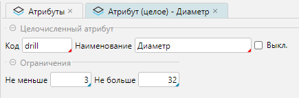

Механизм атрибутов позволяет пользователю без необходимости обращения к разработчикам самостоятельно добавлять
нужные свойства для разных объектов.

Справочник доступен из меню **Настройки-Атрибуты** (Рис. 1) 

## Отображение справочника

 
_Рис. 1 Форма отображения справочника_

Структурно форма состоит из 2-х табличных частей.
Верхняя табличная часть отражает:

- список добавленных атрибутов, которые редактируются отдельной формой
- колонки объектов, для которых эти атрибуты могут быть заданы. При этом закрепление атрибутов за
  объектами производится непосредственно в табличной части установкой соответствующего флажка.

Нижняя табличная часть (вкладка **Настройки**) отражает, связанные с атрибутами верхней части:

- список объектов, который совпадает по количеству с колонками верхней табличной части формы
- список дополнительных настроек атрибута, которые редактируются непосредственно в табличной части установкой нужных
  флажков:
    - **Обязательный** - если флажок установлен, а значение атрибута при редактировании объекта оказалось не заполнено,
      то сработает контроль, который не даст сохранить результаты редактирования объекта.
      <tip>
        - Контроль действует для всех новых записей создаваемых после создания атрибута
        - Если флаг был назначен ранее, а потом атрибут был отменен для использования (колонки верхней части). То
          повторное назначение атрибута, должно происходить в два этапа: убрать флаг **Обязательный** и сохранить
          данные.
          Затем назначить атрибут и установить дополнительные настройки.  
      </tip>
    - **На форме списка** - если флаг установлен, то атрибут будет присутствовать на форме списка. Если флаг не
      установлен, то атрибут будет доступен только на формах редактирования объекта и, например в отчетах.
    - **В API** - если флаг установлен, то атрибут будет участвовать в GET и POST запросах при работе
      с [API](../intro/terminology.md#общие)

При установке в колонке **Товар** (Рис. 1, верхняя табличная часть формы) флажка напротив кого либо из атрибутов, в 
нижней табличной части автоматически появляется вкладка **Товары**: 

 
_Рис. 2 Вкладка Товары_

Используя возможности, представляемые вкладкой, можно связать текущий атрибут:
- со всеми товарными категориями, установив флаг **Все категории**
- установить привязку к отдельным товарным категориям, установив флаг **Вкл.** напротив нужной категории. При этом 
  разные атрибуты будут доступны в карточке товара для своей товарной категории. 

<tip>
    Для примера можно привести использование разных атрибутов для разных товарных категорий: 
    - для электробытовых приборов могут быть интересны атрибуты модель устройства, тип питания от аккумуляторов или 
      сети, мощность, энергопотребление, материал корпуса  
    - для одежды могут быть интересны атрибуты, такие как бренд, материал изготовления, сезон года, пол     
</tip>

## Редактирование атрибута

Редактирование начинается с формы выбора типа атрибута:

 
_Рис. 3 Форма выбора типа атрибута_

Выбор из списка типа атрибута необходим, так как каждый из типов имеет свои индивидуальные формы редактирования. При
этом у всех атрибутов присутствуют три одинаковых свойства, два из которых обязательны для заполнения:

 
_Рис. 4 Общая форма редактирования атрибута_

Элементы ввода:
- **Код** - уникальный код, представляющий собой идентификатор, который начинается с символа и может
  включать латинских буквы, цифры, знак подчеркивания. **Примечание:** если код не уникальный, то система не даст
  сохранить результаты редактирования
- **Наименование** - подсказка при выводе атрибута в формах списка и редактирования
- **Выкл.** - если флаг установлен, то атрибут становится неактивным для использования. При установке флага и 
  сохранении данных атрибут исчезнет из табличной части списка атрибутов, так как на форме постоянно действует фильтр 
  **Активные** ([Рис. 1](attributes.md#отображение-справочника)), который влияет на вывод только активных атрибутов 
  или всех (активных и не активных, если фильтр отключен). 

### Тип Сотрудник
Позволяет создать атрибут, связанный со справочником контрагентов. Редактирование атрибута будет вызывать форму 
списка справочника контрагентов для выбора нужного значения. 

 
_Рис. 5 Форма редактирования Тип Сотрудник_

На рисунке 6 приводится пример заполнения атрибута **Сотрудник компании** при редактировании справочника сотрудников:
 
_Рис 6. Пример заполнения атрибута_
***

### Тип Дата
Можно задать атрибуты с типом Дата для ввода даты

 
_Рис. 7 Форма редактирования Тип Дата_

При назначении атрибута ему можно задать ограничения - контроль вводимых данных: 
- от текущей даты не больше и(или) не меньше на количество дней
- или задать фиксированные значения дат в диапазоне не больше и(или) не меньше  

Для примера на рисунке внесены ограничения, что **Дата начала** не может быть меньше даты 03.04.2025 (например, дата 
начала работы) и не может быть старше от текущей даты более, чем на 3 дня.

При заполнении реквизита можно ввести формат даты вручную или вызывать календарь.
***

### Тип Список значений
Позволяет создать атрибут, связанный с некоторым набором значений. Редактирование атрибута будет вызывать 
форму списка для выбора нужного значения, по принципу действия аналогично [Типу Сотрудник](attributes.md#тип-сотрудник).

 
_Рис. 8 Форма редактирования Тип Список значений_

Элементы ввода:
- **Значение по умолчанию** - значение, на котором в списке будет установлен курсор, если значение редактируемого 
  атрибута пустое  
- **Значение атрибута** - табличная часть, которая содержит 2 колонки:
    - **Код** - уникальный код, представляющий собой идентификатор, который начинается с символа и может включать 
      латинских буквы, цифры, знак подчеркивания. Примечание: если код не уникальный, то система не даст сохранить 
      результаты редактирования  
    - **Значение** - значение атрибута, видимое значение доступное из формы списка при редактировании атрибута

Для примера введен список цветов. По легенде существует необходимость вводить цвет товара. Выбор из списка исключает 
человеческий фактор в написании цветов: разный стиль написания, ошибки. Аналогично можно задавать торговые бренды, 
виды одежды, типы материалов и так далее.  
***  

### Тип Целое число
Позволят вводить целые числа. Дополнительно можно задавать ограничения на ввод вводимых значений.

 
_Рис. 9 Форма редактирования Тип Целое число_

Элементы ввода:
- **Не меньше** - нижнее ограничение
- **Не больше** - верхнее ограничение

Для примера атрибут Диаметр отражает диаметр сверл по бетону. Добавлено ограничение, что диаметр сверла не может 
быть меньше 3 мм и не должен превышать 32 мм.
***

### Тип Число
Позволят вводить дробные числа. Дополнительно можно задавать ограничения на ввод вводимых значений.

 
_Рис. 10 Форма редактирования Тип Число_

Элементы ввода:
- **Точность** - общее количество цифр в числе до запятой (точки)
- **Масштаб** - количество цифр после запятой (точки) 
- **Не меньше** - нижнее ограничение
- **Не больше** - верхнее ограничение

По легенде, для товара «листовой металл» введён атрибут «Толщина металла», который может быть как целым, так и 
дробным значением с точностью до десятых миллиметра. Задано ограничение на толщину: от 0.5 мм до 11 мм. 
***

### Тип Контрагент
Позволяет создать атрибут, связанный со справочником контрагентов. Редактирование атрибута будет вызывать форму 
списка справочника контрагентов для выбора нужного значения. По принципу действия аналогично  
[Типу Сотрудник](attributes.md#тип-сотрудник).

 
_Рис. 11 Форма редактирования Тип Контрагент_
***

### Тип Строка
Позволяет создать атрибут для ввода символьных значений. 

 
_Рис. 12 Форма редактирования Тип Строка_

Элементы ввода:
- **Шаблон (regex)** - шаблон регулярного выражения. Использование регулярных выражений позволяет задать необходимые 
  ограничения на ввод информации. Например: строка содержит только цифры, ввод e-mail, ввод интернет адреса, ввод 
  телефона в международном стандарте и так далее. Синтаксис и примеры регулярных выражений можно найти в интернет.

[//]: # (todo - 1. Отображение на форме)
[//]: # (todo - Не совсем понятна разница между Тип Сотрудник и Тип Контрагент)
[//]: # (todo - Заголовок при редактировании типа Число такой же, как и у Целое число)
