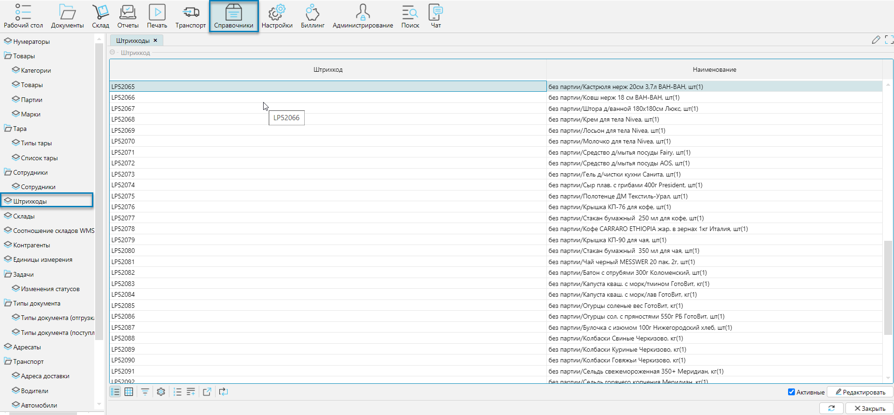

Справочник содержит все зарегистрированные объекты системы, которым присвоен штрихкод, например: товары, ячейки,
документы, сотрудники, и др.

## Отображение справочника
Справочник отображается на форме **Справочники-Штрихкоды** (рис. 1) или **Рабочий стол-Справочники-Штрихкоды**.

*Рис. 1 Форма отображения справочника*

Используя фильтр можно найти любой объект по его штрихкоду или наименованию и при необходимости отредактировать его.

## Редактирование объекта
При редактировании справочника вызывается форма, соответствующая типу объекта.

Для примера приведены фрагменты формы редактирования товара и ячейки хранения.

*Рис. 2 Фрагменты разных форм редактирования*

