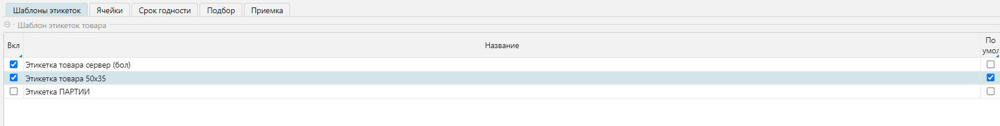
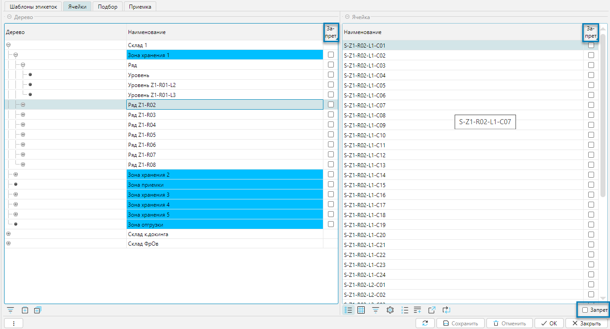

Справочник категорий является классификатором товаров по определенным признакам. На уровне категорий 
можно задавать отдельные свойства, которые будут применимы ко всем товарам, принадлежащим выбранной категории 
или дочерним категориям. Обратите внимание на особенность наследования значений:
- если установлены логические значения (флажки), то на уровне товара или дочерней категории их отменить нельзя
- если установлены строковые (числовые) значения, то на уровне товара или дочерней категории они будут отображаться 
  неактивным (_серым_) цветом и могут быть изменены при необходимости. При изменении значения последнее будет 
  выделяться активным цветом (_черным_). 

Справочник можно импортировать из внешней системы или создать и редактировать в lsFusion WMS.

## Отображение справочника

Справочник отображается на форме **Справочники-Категории** (рис. 1).

Справочник категорий представлен формой, состоящей из двух частей. В верхней части на вкладках **Дерево** и 
**Список** отображается перечень категорий. На вкладке **Дерево** представлена иерархия категорий (рис. 1), на 
вкалдке  **Список** (рис. 2) категории отображаются линейным списком. Колонка **Наименование** - это наименование
категории, а колонка **Родитель** содержит наименования предшествующих в иерархии категорий и порядок их вложенности,
используя символ "/". 

 
_Рис. 1 Форма отображения справочника, вкладка Дерево_

 
_Рис. 2 Форма отображения справочника, вкладка Список_

Редактирование справочника вызывается стандартно из верхней табличной части.

Нижняя табличная часть **Шаблон этикеток товара** позволяет связывать этикетки на товары, закрепляя их за товарной 
категорией. При этом редактирование можно выполнять непосредственно в табличной части, меняя значение флажков 
**Вкл** и **По умолч**.  

## Редактирование категории

 
_Рис. 3 Форма редактирования категории_

Форма редактирования категории (рис. 3) может быть условно разделена на 2 функциональные части:
- **Категория** - свойства категории
- **Вкладки** - дополнительные свойства категории

### Свойства категории
- **Родитель** - родительская категория, на один уровень выше текущей в иерархии.
- **Наименование** - название текущей категории.
- **Ввод ВГХ при сканировании** - если установлено, то при сканировании товара будет требоваться ввод весогабаритных 
  характеристик. 
- **Со сроком годности** - если установлено, то при вводе товара, будет запрашиваться либо срок годности, либо дата 
  производства. Если флаг установлен, то будет доступной новая вкладка: **Срок годности**.
***
[//]: # (TODO lдля ВГХ и Сроков годности нужно добавить, при сканировании/вводе товара где/куда, т.к. непонятно, это про документ, процесс или наполнение справочника товаров) 

### Вкладка Шаблоны этикеток
На вкладке за категорией закрепляются шаблоны этикеток.

 
_Рис. 4 Вкладка шаблоны этикеток_

Редактирование производится непосредственно в табличной части изменением значения в колонке **Вкл** (включен, то есть
шаблон используется категорией) и установкой значения в колонке **По умолч.** (шаблон по умолчанию). Флаги влияют на 
выбор отчетов для печати для разных форм. 

<tip>
Этикетки можно распечать:
- Из меню **Справочники-Товары** с выбором перед печатью шаблона этикетки из списка, закрепленных за товарной
  категорией (флажок **Вкл.**) этикеток, по текущей отдельной позиции
- Из меню **Печать-Товар-Печать этикеток товара** печать этикетки по умолчанию (флажок **Умолч.**) для всех  
отмеченных или
  только текущей товарной позиции
</tip>
***

### Вкладка Ячейки
На вкладке отображаются и настраиваются доступные для хранения ячейки.

 
_Рис. 5 Вкладка Ячейки_

На вкладке **Ячейка** слева отображается иерархическая структура доступных складов в виде дерева. Справа отображаются 
ячейки, принадлежащие складам и их структурным элементам. По умолчанию все ячейки разрешены для работы. Для  каждой 
редактируемой категории можно запретить 
использовать определенные места хранения, как на уровне складов и их структурных элементов (слева), так и отдельных 
ячеек (справа). Запрет устанавливается флажком в колонке **Запрет** напротив структурного элемента склада 
или ячейки. Если запретить какой-либо склад или его элемент, то запрещенными будут не только ячейки, относящиеся к 
запрещаемому элементу, но также ячейки вложенных элементов.   

Внизу формы справа присутствует фильтр **Запрет** (на рисунке выключен), который нужен для фильтрации запрещенных 
ячеек. Если фильтр включен, то будут отображаться только запрещенные ячейки, или список будет пуст, если 
запрещенных ячеек нет.

***

### Вкладка Срок годности
Вкладка доступна, если в разделе **Категории** установлен флажок **Со сроком годности**

 
_Рис. 5 Вкладка Срок годности_

При приемке товаров текущей категории будет запрошена дата производства, если установлен флажок 
**Указывать дату производства**. При этом срок годности рассчитается автоматически относительно даты производства и 
уставленных значений **Срока годности** (лет, месяцев, дней). 
***
[//]: # (TODO не понятно, как работает, если не установлен флажок, нужно добавить)
### Вкладка Подбор
На вкладке настраивается, как будет планироваться подбор для товаров, входящих в категорию.

 
_Рис. 7 Вкладка Подбор_

Настройки отвечают за особенности планирования товаров, входящих в текущую категорию, при отгрузке. 
Более подробно описано в разделе **Подбор**.
***

### Вкладка Приемка
На вкладке настраивается, в каких единицах будет приниматься товар, входящий в категорию.

 
_Рис. 8 Вкладка Приемка_

Товар, как правило, принимается и учитывается упаковками, то есть так, как он обычно и поступает на склад.
Если необходимо принимать товара в базовых единицах (_например, в штуках_), то надо установить флажок
**Принимать базовые единицы**. При этом на приемке товара при считывании штрихкода упаковки количество товара будет
определяться количеством базовых единиц, входящих в упаковку, и учитываться товар на складе будет в базовых единицах, а
не в упаковках.    

