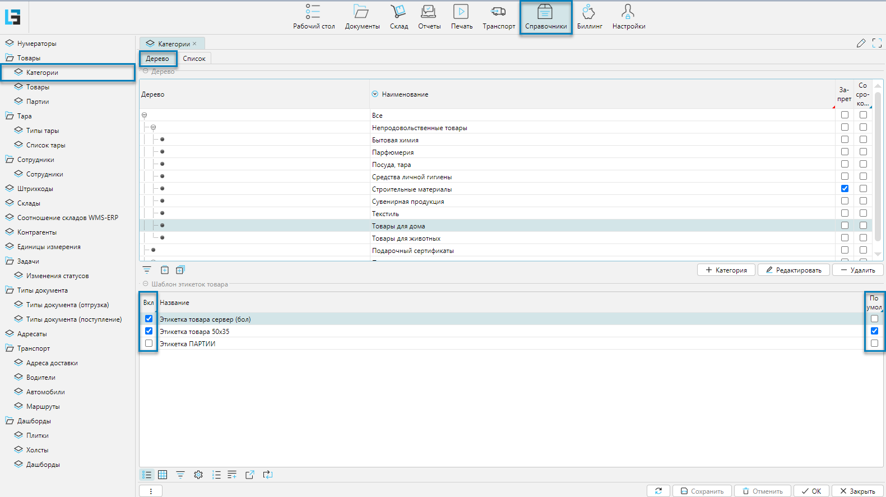
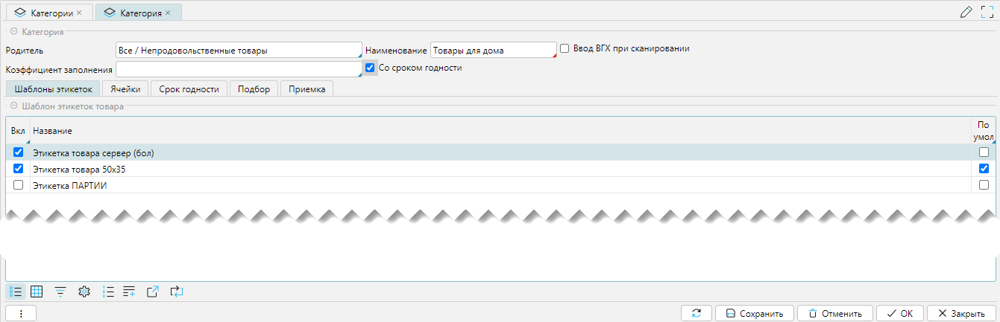
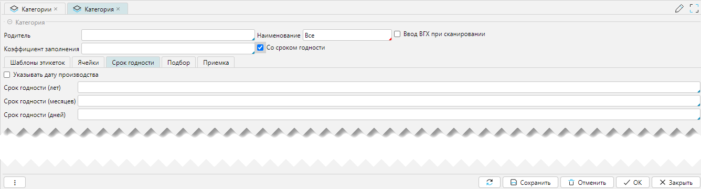

Справочник категорий является классификатором, группирующим товары по определенным признакам. На уровне категорий 
можно задавать отдельные свойства, которые будут применимы ко всем товарам, принадлежащим выбранной категории 
или к дочерним категориям. При этом:
- если установлены логические значения (флажки), то на уровне товара или дочерней категории их отменить нельзя
- если установлены строковые (числовые) значения, то на уровне товара или дочерней категории они будут отображаться 
  неактивным (_серым_) цветом и могут быть изменены при необходимости. При изменении значения последнее будет 
  выделяться активным цветом (_черным_). 

Справочник доступен из меню **Справочники-Категории** (Рис. 1). 
Справочник может как импортироваться из внешней системы, так и создаваться и редактироваться в lsFusion WMS.

## Отображение справочника

Справочник категорий представлен формой отображения имеющей разделение на две вкладки **Дерево** и **Список** (Рис. 1), 
различающиеся визуальными и функциональными особенностями. 

 
_Рис. 1 Форма отображения справочника, вкладка Дерево_

Редактирование справочника вызывается стандартно из верхней табличной части.

Нижняя табличная часть **Шаблон этикеток товара** позволяет связывать этикетки на товары, закрепляя их за товарной 
категорией. При этом редактирование можно выполнять непосредственной в табличной части, меняя значение флажков 
**Вкл** и **По умолч**.  

 
_Рис. 2 Форма отображения справочника, вкладка Список_

Форма отображения представлена линейным списком категорий. Колонка **Наименование** - это конечное наименование 
категории, а колонка **Родитель** отражает предшествующие категории по степени их вложенности, используя 
символ разделить **/**.

## Редактирование категории

 
_Рис. 3 Форма редактирования категории_

Форма редактирования категории (Рис. 3) может быть условно разделена на 2 функциональные части:
1. Категория - свойства категории
2. Вкладки - дополнительные свойства категории

### Свойства категории
- **Родитель** - родительская категория, на один уровень выше текущей в иерархии.
- **Наименование** - название текущей категории.
- **Ввод ВГХ при сканировании** - если установлено, то при сканировании товара будет требоваться ввод Весогабаритных 
  характеристик. 
- **Со сроком годности** - если установлено, то при вводе товара, будет запрашиваться либо срок годности, либо дата 
  производства. Если флаг установлен, то будет доступной новая вкладка: **Срок годности**.
***

### Вкладка Шаблоны этикеток
Вкладка закрепляет за категорией шаблоны этикеток.

 
_Рис. 4 Вкладка шаблоны этикеток_

Редактирование производится непосредственно в табличной части изменением значения в колонке "Вкл" (включен, то есть
отчет используется категорией) и установкой значения в колонке "По умолч." (отчет по умолчанию). Флаги влияют на выбор
отчетов для печати для разных форм.

<tip>
Этикетки можно распечать:
- Из меню **Справочники-Товары** с выбором перед печатью шаблона этикетки из списка, закрепленных за товарной
  категорией (флажок "Вкл.") этикеток, по текущей отдельной позиции
- Из меню **Печать-Товар-Печать этикеток товара** печать этикетки по умолчанию (флажок "Умолч.") для всех отмеченных или
  только текущей товарной позиции
</tip>
***

### Вкладка Ячейки
Вкладка отражает доступные для хранения ячейки

 
_Рис. 5 Вкладка Ячейки_

На вкладке Ячейка слева отображается иерархическая структура доступных складов в виде дерева. Справа отображаются 
ячейки, принадлежащие складам и их структурным элементам. Для каждой редактируемой категории можно запретить 
использовать определенные места хранения, как на уровне складов и их структурных элементов (слева), так и отдельных 
ячеек (справа). Запрет устанавливается установкой флажков в колонке **Запрет** напротив структурного элемента склада 
или ячейки. Если запретить какой-либо склад или его элемент, то запрещенными будут ячейки не только, принадлежащие 
запрещаемому элементу, но также ячейки вложенных элементов в соответствии с иерархическим порядком.   

<info>
**Логика работы**
- Логика работы построена таким образом, что по умолчанию все ячейки разрешены для работы
- Подход с разрешенными ячейками по умолчанию обеспечивает быструю организацию процессов приемки товара
</info>

Внизу формы справа присутствует фильтр **Запрет** (на рисунке не включен), который нужен для фильтрации запрещенных 
ячеек. Если фильтр включен, то будут отражаться слева только ранее запрещенные ячейки или список будет пуст, если 
запрещенных ячеек нет.

Существует несколько понятий, связанных с размещением товара:
- Свободное перемещение. Если кладовщику оно разрешено, то он может положить товар в ячейку, даже если хранение товара там запрещено.
- Плановое размещение. При плановом размещении считается план и кладовщик следует плану по размещению товара. 
При этом может действовать настройка разрешающая отклонение от плана или нет.  
***

### Вкладка Срок годности
Вкладка доступна, если в разделе **Категории** установлен флажок **Со сроком годности**

 
_Рис. 5 Вкладка Срок годности_

При приемке товаров текущей категории будет запрошена дата производства, если установлен флажок 
**Указывать дату производства**. При этом срок годности рассчитается автоматически относительно даты производства и 
уставленных значений **Срока годности** (лет, месяцев, дней). 
***

### Вкладка Подбор
Вкладка отвечает за то, как будет планироваться подбор для товаров, входящих в категорию.

 
_Рис. 7 Вкладка Подбор_

Настройки отвечают за особенности планирования товаров, входящих в текущую категорию, при отгрузке. 
Более подробно описано в разделе Подбор.
***

### Вкладка Приемка
Вкладка отвечает за то, в каких единицах будет приниматься товар, входящий в категорию, на приемке

 
_Рис. 8 Вкладка Приемка_

Товар, как правило, принимается и учитывается упаковками, то есть так, как он обычно и поступает на склад.
Если необходимо принимать товара в базовых единицах (_например, в штуках_), то надо установить флажок 
**Принимать базовые единицы**. При этом на приемке товара при считывании штрих кода упаковки, количество товара при 
приемке будет определяться количеством базовых единиц, входящих в упаковку, и учитываться товар на складе будет в 
базовых единицах, а не в упаковках.    

