Справочник товаров — это ключевой элемент, который обеспечивает централизованное хранение и управление информацией о
товарах. Содержит полную информацию о каждом товаре: название, артикул, описание, штрих-коды, весогабаритные 
характеристики и др. Позволяет присваивать каждому товару уникальный код для точного учета и отслеживания. Структурно
связан со справочником [категорий](categories.md).

Справочник товаров доступен из меню **Справочники-Товары-Товары** (рис. 1) или **Рабочий стол-Справочники-Товары**. 
Справочник может как импортироваться из внешней системы, так и создаваться и редактироваться в lsFusion WMS.

## Отображение справочника
Справочник товаров представлен на форме в виде иерархической структуры в разрезе товарных категорий, поэтому форма
отображения разбита на два связанных блока:

- **Дерево** (Рис. 1(1)), отражающая список категорий. Для редактирования категорий используются кнопки **Редактировать,
  Удалить**, а также кнопка **+Категория** (Рис. 1(3)), для доступа к полному функционалу работы
  с [категориями](categories.md).
- **Номенклатура** (Рис. 1(2)), отражающая список товаров.  

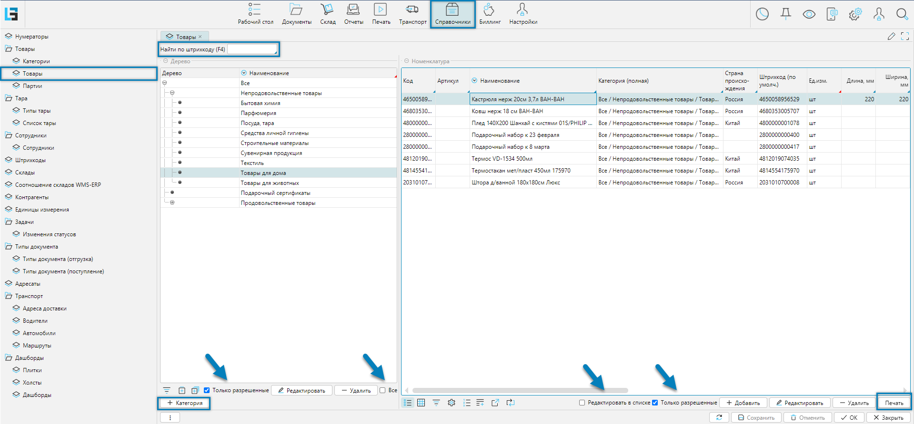 
Рис. 1 Форма отображения справочника

Также на форме отображения доступны следующие элементы:
- Фильтр **Только разрешенные** (Рис. 1(4)) - позволяет видеть текущему сотруднику только разрешенные для него категории
  или товары в зоне его ответственности
- Фильтр **Все** (Рис. 1(5)) - позволяет увидеть весь номенклатурный справочник без привязки к категориям.
  Это может быть удобно, например, когда надо что-либо найти
- Поиск **Найти по штрихкоду (F4)** ((Рис. 1(6))) - поиск товара по его штрих коду. После ввода в поле сканером или
  вручную кода товара будет выполнен поиск. При этом если товар будет найден, то указатели в справочнике категорий и
  номенклатуры установятся в нужных местах, иначе будет сообщение, что товар не найден.
- Чекбокс **Редактировать в списке** (Рис. 1(7)) - позволяет быстро, не заходя в форму редактирования, подправить
  какой-либо реквизит(ы) товара
- Кнопка **Печать** (Рис. 1(8)) - печать этикетки на товар. Этикетка может быть распечатана:
    - из текущей формы, в виде отдельной этикетки (Рис. 1.1)
    - из формы (см. меню: **Печать-Товар-Печать этикеток товара**) в виде группы этикеток по отмеченным товарам

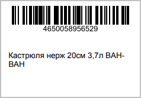 
Рис. 1.1 Пример печатной формы: Этикетка на товар

## Редактирование карточки товара

 
Рис. 2 Форма редактирования карточки товара

Форма редактирования справочника, представленная на рисунке 2, может быть поделена на 5 функциональных блоков:
1. Номенклатура - основные характеристики товара
2. Весогабаритные характеристики
3. Опции - дополнительные опции, влияющие на ввод товара
4. Оценки - факторы, влияющие на рекомендации системы по размещению товаров в местах хранения
5. Категория 3PL
6. Вкладки - дополнительные свойства товара

### Номенклатура 
- **Наименование** - наименование товара
- **Полное наименование** - полное наименование товара
- **Категория (полная)** - полный путь к категории товара, при этом уровни вложенности отделяются символом "/"
- **Описание** - дополнительное описание товара
- **Страна происхождения** - страна изготовления товара (*правильно*) или страна поступления 
- **Код** - код товара, как способ идентификации товара, значение может быть любым, например штрихкод
- **Артикул** - некий код, как способ идентификации товара
- **Ед.изм.** - базовая единица измерения (минимальная единица, в которой ведется учет)
- **Цена** - цена за единицу, необязательный справочный реквизит

### Весогабаритные характеристики 
- **Масса нетто, кг** - чистый вес базовой единицы товара без упаковки
- **Масса брутто, кг** - вес базовой единицы товара в упаковке
- **Длинна, мм** - базовой единицы
- **Ширина, мм** - базовой единицы
- **Высота, мм** - базовой единицы
- **Коэффициент заполнения** - это соотношение совокупного объема помещенных в ячейку товаров к объему ячейки, 
при достижении которого ячейка будет считаться заполненной. Максимальное значение 1.
- **Ввод ВГХ при сканировании** - если выбрано, то при сканировании товара будет требоваться ввод Весогабаритных характеристик 

### Опции 
- **Не запрашивать количество** - если установлено, то при вводе товара записывается единичка и дальнейший ввод
  количества не требуется
- **Со сроком годности** - если установлено, то при вводе товара, будет запрашиваться либо срок годности, либо дата
  производства.
- **Приемка по серийным номерам** - приемка производится по серийным номерам товаров.
  Если флаг установлен, то при приемке товара вместо количества запрашивается ввод серийного номера, количество при этом
  будет равно 1.
- **Приемка по маркам** модуль пока не готов (?)

[//]: # (todo - Приемка по маркам, нужна доработка)

### Оценки
Оценки влияют на оптимизацию алгоритмов размещения. Для товаров, пользующихся наибольшим спросом в рамках выбранной
оценки, будут предлагаться наиболее быстро-доступные места хранения, а для товаров, пользующихся наименьшим спросом,
будут предлагаться менее доступные места хранения.

- **ABC** - анализ оценка эффективности спроса товаров и их реализации
- **FMR** - анализ частоты обращения к товарам
- **XYZ** - анализ спроса на товары, на которые влияют внешние факторы: сезонность, рекламные кампании и т.д.

### Категория 3PL
Если подключен модуль "Ответственное хранение", то у товаров появляется еще один классификатор, который используется для
тарификации оплачиваемых операций склада. Каждый товар, операции, с которым необходимо тарифицировать и, по которому
нужно выставлять счет [поклажедателю](../intro/terminology.md#люди), должен быть привязан к группе этого классификатора.
Сам классификатор находится в разделе **Биллинг-Справочники-Категории 3PL**.
***

### Вкладка Упаковки
Задает дополнительные виды упаковок относительно базовой единицы измерения.

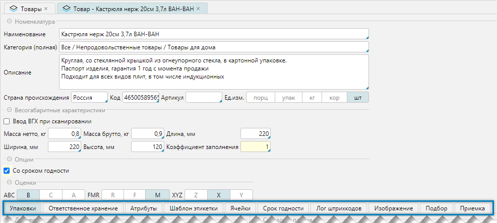 
Рис. 3 Вкладка Упаковки

Вкладка представлена 3-мя табличными формами:
1. **Дерево** - создаваемые упаковки могут иметь иерархическую структуру: упаковки могут входить в друг-друга. 
   В приводимом на примере (Рис 3(1)) базовая единица "шт" имеет еще 2 упаковки:
   ящик 2х5 и ящик 4х5 с разной вместимостью базовых единиц, 10 и 20 штук, соответственно.
   Для редактирования упаковок, используется форма, представленная на рис. 4

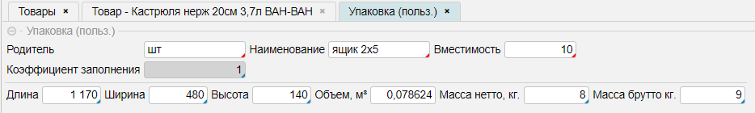 
Рис. 4 Форма редактирования упаковки

- **Родитель** - родительская категория, на один уровень выше текущей в иерархии. Выбирается автоматически в зависимости
  от того на каком пункте в дереве упаковок установлен курсор
- **Наименование** - наименование новой упаковки
- **Вместимость** - количество родительских единиц, входящих в новую упаковку
- **Коэффициент заполнения** - это соотношение совокупного объема помещенных в ячейку товаров к объему ячейки, при
  достижении которого ячейка будет считаться заполненной. Максимальное значение 1.
- **Длина, Ширина, Высота, Объем** - геометрические размеры упаковки. При этом объем рассчитывается автоматически, если
  заполнены первые три свойства.
- **Масса нетто, кг** - чистый вес товара в килограммах без упаковки
- **Масса брутто, кг** - общий вес упаковки с товаром

2. **Складская партия** - отражаются складские партии. Партия с наименованием **без партии** - это название партии, по
   которой в системе проходят все товары (Рис. 3 (2)) и это наименование будет присутствовать всегда для всех товаров.

<tip> 
- Понятие партии в WMS отлично от понятия в ERP, где партия завязана на документы прихода. В WMS у одного товара может
  быть несколько партий, а у одной партии может быть несколько товаров.
  - Наличие у одного товара нескольких партий. Например - это товары со сроком годности
  - У одной партии несколько товаров. Например, сборная мебель, состоящая из разных весогабаритных деталей, которые
    могут быть объединены общей партией. Похожий пример может существовать, например для некондиционных или бракованных
    товаров.
</tip>

3. **Штрихкод** - для каждой упаковки существует, как минимум один штрихкод, создаваемый автоматически. В примере (Рис.
   3(3,4)) для базовой единицы - это код LP52065. При этом могут быть заданы другие коды, в примере - это штрих-код
   4650058956529
***

### Вкладка Изображение
Вкладка разрешает связать товар с его изображением

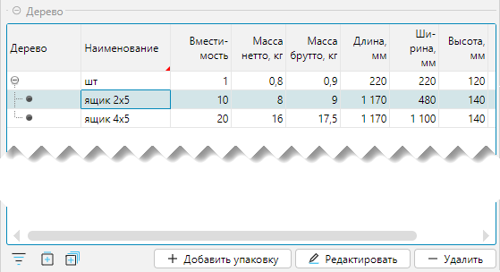 
Рис. 5 Изображение товара

Форма разделена на две части:
1. **Изображение** - используется для отображения на экране
2. **Уменьшенное изображение** - используется для ТСД. Уменьшенное изображение формируется автоматически после загрузки
   основного изображения (Рис. 5(3)) и сохранения данных.
3. Кнопка **Загрузить** открывает диалог для выбора графического файла
4. Кнопка **Открыть** открывает ранее загруженное изображение в альтернативном окне просмотра на весь экран
5. Кнопка **Сбросить** очищает ранее загруженное изображение

Если определены размеры изображений в **Настройки логики-Настройки-Справочники**, то загружаемое изображение может быть
скорректировано в сторону уменьшения. Надо помнить, что большие графические изображения будут влиять на размер базы
данных, что будет со временем требовать наличия больших технических ресурсов.

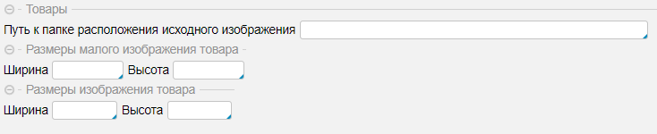 
Рис. 6 Редактирование настроек изображений

- **Путь к папке исходного изображения** - если задано, то при необходимости изображение может быть поднято с диска
- **Размеры малого изображения товара** - размеры для уменьшенного изображения (Рис. 5(2))
- **Размеры изображения товара** - не уменьшенное изображение (Рис. 5(1))

[//]: # (todo - Надо будет перенести Настройку изображение. Добавить См. также и ссылку)
***

### Вкладка Атрибуты
Вкладка доступна, если добавлены атрибуты. Атрибут - это дополнительная характеристика, расширяющая описание
редактируемого объекта, в данном контексте - справочника Товаров. Настройка атрибутов выполняется в разделе 
[Настройки-Атрибуты](attributes.md).

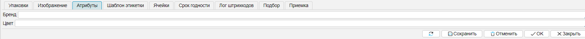 
Рис. 7 Вкладка Атрибуты
***

### Вкладка Шаблон этикетки
Вкладка отражает, назначенные за товарной категорией этикетки для печати.

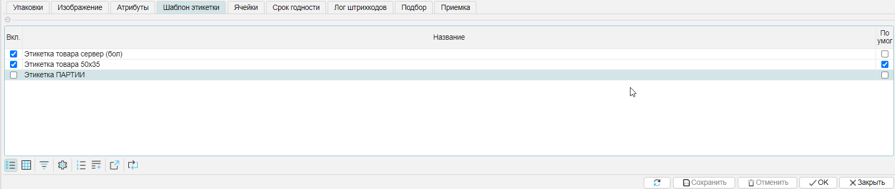 
Рис. 8 Вкладка Шаблон этикетки

<tip>
**Печать этикетки**
- Из меню **Справочники-Товары** с выбором перед печатью шаблона этикетки из списка, закрепленных за товарной
  категорией (флажок "Вкл.") этикеток, по текущей отдельной позиции
- Из меню **Печать-Товар-Печать этикеток товара** печать этикетки по умолчанию (флажок **По умолч**) для всех 
отмеченных или только текущей товарной позиции
</tip>
***

### Вкладка Ячейки
Вкладка отражает доступные для хранения товара ячейки

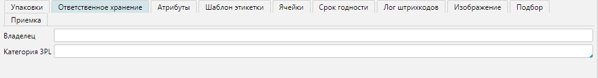 
Рис. 9 Вкладка Ячейки

На вкладке Ячейка отображается иерархическая структура (дерево) доступных складов и их структур (рис. 9(1)) с
детализацией каждого элемента до ячеек (рис.9(2)). Для управления отображения запрещенных ячеек на форме присутствует
фильтр **Запрет** (Рис. 9(4)). Если фильтр установлен, то отражаются только ранее запрещенные ячейки или список будет
пуст, если запрещенных ячеек нет.

Для каждой редактируемой категории можно запретить использовать определенные места хранения, как на уровне складов (рис.
9(1)), так и отдельных ячеек (рис.9(2)). Для того чтобы запретить использовать определенные места хранения, необходимо
установить флаг в поле колонки **Запр** (Рис. 9(3)).

<info>
**Логика работы**
- Логика работы построена таким образом, что по умолчанию все ячейки разрешены для работы 
- Подход с разрешенными ячейками по умолчанию обеспечивает быструю организацию процессов приемки товара
</info>

Существует несколько понятий, связанных с размещением товара:
- Свободное перемещение. Если кладовщику оно разрешено, то он может положить товар в ячейку, даже если хранение товара
  там запрещено
- Плановое размещение. При плановом размещении считается план и кладовщик следует плану по размещению товара 
При этом может действовать настройка разрешающая отклонение от плана или нет.  
***

### Вкладка Срок годности
Вкладка доступна, если в разделе **Опции** установлено **Со сроком годности**.

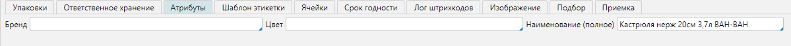 
Рис. 10 Вкладка Срок годности

При приемке товара будет запрошена дата производства, если установлен чекбокс "Указывать дату производства". При этом
срок годности рассчитается автоматически относительно даты производства и уставленных значений срока годности лет,
месяцев, дней.
***

### Вкладка Лог штрихкодов
Вкладка представляет собой журнал изменения штрихкодов.

 
Рис. 11 Вкладка Лог штрихкодов

Журнал хранит изменения, связанные со штрихкодами: какой штрихкод кем и когда был изменен. Назначение журнала - поиск
возможных ошибок.  
Можно настроить, как долго информация по логированию будет храниться. За это отвечает настройка в администрировании: (
Администрирование-Приложение-Настройки-Вкладка Логирование) поле "За сколько дней хранить лог пользовательских
штрихкодов". По умолчанию срок не определен и информация хранится без ограничений по времени. В настройках можно указать
количество дней для хранения информации, по истечению указанных дней информация будет удаляться автоматически.

[//]: # (todo - добавить ссылку на раздел Администрирования, ID options)
***

### Вкладка Подбор
Вкладка отвечает за то, как будет планироваться подбор для текущего товара.

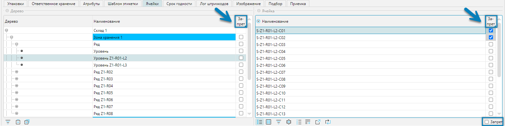 
Рис. 12 Вкладка Подбор

Настройки отвечают за особенности планирования товара при отгрузке. 
Более подробно описано в разделе Подбор.

[//]: # (todo - дать ссылку на раздел Подбор)
***

### Вкладка Приемка
Вкладка отвечает за то, в каких единицах будет приниматься товар на приемке.

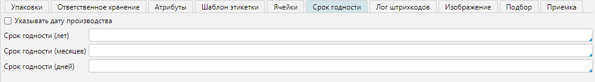 
Рис. 13 Вкладка Приемка

Товар, как правило, принимается и учитывается упаковками, то есть так, как он обычно и поступает на склад. Но иногда
бывает необходимо принимать товара в базовых единицах (_например, в штуках_). При установке чекбокса "Принимать базовые
единицы" на приемке товара при считывании штрих кода упаковки, количество товара при приемке будет определяться
количеством базовых единиц, входящих в упаковку, и учитываться товар на складе будет в базовых единицах, а не в
упаковках.   

