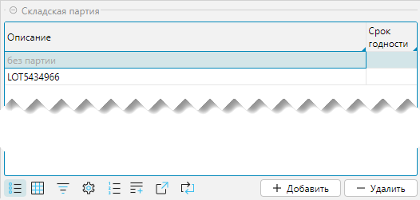
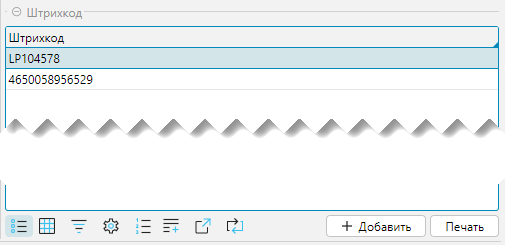

Справочник товаров обеспечивает централизованное хранение и управление информацией о
товарах. Cправочник содержит полную информацию о каждом товаре: название, артикул, описание, штрих-коды, весогабаритные 
характеристики и др.; структурно связан со справочником [категорий](categories.md).

Справочник можно импортировать из внешней системы или создать и редактировать в lsFusion WMS.

## Отображение справочника
Справочник отображается на форме **Справочники - Товары - Товары** (рис. 1) или **Рабочий стол - Справочники - Товары**.

Товары в справочнике можно просматривать в разрезе товарных категорий. Форма
отображения разбита на два связанных блока:

- **Дерево** - отображает иерархический список категорий. Для редактирования категорий используются кнопки 
  **Редактировать**, **Удалить**, **+Категория**. Подробнее о категориях читайте в
  статье [Справочник категорий](categories.md).
- **Номенклатура** - отображает список товаров, которые относятся к выделенной категории и ее ветвям.  

 
*Рис. 1 Форма отображения справочника*

Для работы на форме доступны следующие инструменты:

- **Найти по штрихкоду (F4)** - поиск товара по его штрихкоду. После ввода в поле сканером или вручную кода
  товара будет выполнен поиск, в результате которого указатель будет установлен на найденный товар и его категорию. Если
  товар не найден, то появится соответствующее сообщение.
- **Только разрешенные** - фильтр позволяет текущему сотруднику видеть только разрешенные для него категории или товары.
- **Все** - фильтр позволяет увидеть весь номенклатурный справочник без привязки к категориям. 
- **Редактировать в списке** - если отмечен чекбокс, реквизит(ы) товара можно изменить в полях таблицы, не заходя в
  форму редактирования.
- **Печать** - отправляет на печать этикетку товара. Также этикетку товара можно отправить в печать на форме 
**Печать - Товар - Печать этикеток товара**. Подробно о возможностях печати в разделе [Подсистема печати](print/print.md)

    
*Рис. 2 Пример печатной формы этикетки товара*

## Редактирование карточки товара

Карточка товаров cсостоит из нескольких функциональных блоков:
- **Номенклатура** - основные характеристики товара
- **Весогабаритные характеристики**
- **Опции** - дополнительные опции
- **Оценки** - факторы, влияющие на работу системы по размещению товара
- **Вкладки**

 
*Рис. 3 Форма редактирования карточки товара*
### Номенклатура 
- **Наименование** - название товара.
- **Категория (полная)** - полный путь к категории товара, при этом уровни вложенности отделяются символом "/".
- **Описание** - дополнительное описание товара.
- **Страна происхождения** - страна изготовления или поступления товара. 
- **Код** - уникальный идентификатор товара, который может состоять из любых символов, например кодом может 
  выступать  штрихкод.
- **Артикул** - дополнительный код, который может использоваться для идентификации товара.
- **Ед.изм.** - базовая единица измерения (минимальная единица, относительно которой рассчитываются упаковки в которых
  товар может быть учтен).

***

### Весогабаритные характеристики 
- **Ввод ВГХ при сканировании** - если флажок установлен, то на приемке при сканировании товара будет требоваться ввод 
  весогабаритных характеристик.
- **Масса нетто, кг** - чистый вес базовой единицы товара без упаковки.
- **Масса брутто, кг** - вес базовой единицы товара в упаковке.
- **Длинна, мм** базовой единицы
- **Ширина, мм** базовой единицы
- **Высота, мм** базовой единицы
- **Коэффициент заполнения** - это соотношение совокупного объема помещенных в ячейку товаров к объему ячейки, при 
  достижении которого ячейка будет считаться заполненной. Максимальное значение 1. 
***

### Опции 
- **Со сроком годности** - если установлено, то на приемке товара будет запрашиваться либо срок годности, либо дата
  производства. Подробнее о настройке опции в разделе [Вкладка Срок годности](#expiry-date). 
***

### Оценки
Оценки влияют на оптимизацию алгоритмов размещения. Для товаров, пользующихся наибольшим спросом в рамках выбранной
оценки, будут предлагаться наиболее быстро доступные места хранения, а для товаров, пользующихся наименьшим спросом,
будут предлагаться менее доступные места хранения.
- **ABC** - анализ оценки эффективности спроса товаров и их реализации
- **FMR** - анализ частоты обращения к товарам
- **XYZ** - анализ спроса на товары, на которые влияют внешние факторы: сезонность, рекламные кампании и т.д.
***

### Вкладка Упаковки
Вкладка представлена 3 блоками:
1. Дерево упаковок
2. Складская партия
3. Штрихкод

 
*Рис. 4 Вкладка Упаковки*

#### Дерево
Задает дополнительные виды упаковок относительно базовой единицы измерения. Упаковки могут иметь иерархическую 
структуру, то есть упаковки могут входить в друг-друга. 
В приводимом на примере базовая единица "шт" имеет еще 2 упаковки: ящик 2х5 и ящик 4х5 с разной вместимостью базовых 
единиц, 10 и 20 штук, соответственно.  

 
*Рис. 5 Дерево упаковок*

При добавлении (редактировании) новой упаковки открывается форма редактирования упаковки:

- **Родитель** - родительская упаковка, на один уровень выше текущей в иерархии. Заполняется автоматически в зависимости
  от того на каком пункте в дереве упаковок установлен курсор.
- **Наименование** - название новой упаковки.
- **Вместимость** - количество родительских единиц, входящих в новую упаковку.
- **Коэффициент заполнения** - это соотношение совокупного объема помещенных в ячейку упаковок товара к объему ячейки,
  при достижении которого ячейка будет считаться заполненной. Максимальное значение 1.
- **Длина, Ширина, Высота, Объем** - геометрические размеры упаковки. При этом объем рассчитывается автоматически, если
  заполнены первые три свойства.
- **Масса нетто, кг** - чистый вес товара в килограммах без упаковки
- **Масса брутто, кг** - общий вес упаковки с товаром

 
 *Рис. 6 Редактирование упаковки*
***

#### Складская партия
В блоке отображаются партии товара. В системе у всех товаров есть партия. Если партионный учет не ведется, то 
по умолчанию для товара существует партия с наименованием **без партии**. Это
наименование будет присутствовать всегда для всех товаров. 

 
*Рис. 7 Складская партия*

[//]: # (<tip> )

[//]: # (- Понятие партии в WMS отлично от понятия в ERP, где партия завязана на документы прихода. В WMS у одного товара )

[//]: # (может)

[//]: # (  быть несколько партий, а у одной партии может быть несколько товаров.)

[//]: # (</tip>)

[//]: # (todo - Вопрос почему можно добавить партию. Уточнить)
[//]: # (todo - Необходима отдельная статья по партиям в системе, т.к. это важная особенность. Нужно убрать "tip" и добавить ссылку на эту статью) 

***

#### Штрихкод
В блоке отображаются штрихкоды товара. Каждый штрихкод идентифицирует упаковку товара и на форме отображаются 
штрихкоды только той упаковки, которая выделена курсором. 
Для каждой упаковки существует как минимум один штрихкод, создаваемый автоматически.При этом могут быть заданы 
дополнительные штрихкоды. 
Для примера на рис. 8 показаны штрихкоды базовой единицы товара: автоматически сформированный штрихкод *LP104578* и 
дополнительный - *4650058956529*.  

Кнопка **Печать** вызывает печать этикетки относительно штрихкода, на котором стоит курсор.  

 
*Рис. 8 Штрихкоды упаковок*

[//]: # (todo - на скриншоте нужно показать, что отображаются штрихкоды по выделенной упаковке) 
***

### Вкладка Ответственное хранение
Вкладка отображается, если подключен модуль **Ответственное хранение**. 

- **Владелец** - на складе, кроме собственного товара, может храниться товар других владельцев
  ([поклажедателей](../intro/terminology.md#люди)).  В таком случае для каждого поклажедателя в корне справочника
  категорий создается отдельная категория, в которой находится его справочник товаров. В этом поле отображается 
  контрагент - владелец товара, который определяется по корневой категории товара.
- **Категория 3PL** - дополнительный классификатор, который используется для тарификации оплачиваемых операций 
  склада. Каждый товар, операции с которым тарифицируются и по которому выставляется счет 
  поклажедателю, должен быть привязан к группе этого классификатора. Сам классификатор находится в разделе 
  **Биллинг-Справочники-Категории 3PL**. 

 
*Рис. 9 Вкладка Ответственное хранение*
***

### Вкладка Атрибуты
Вкладка доступна, если для товаров настроены атрибуты. Атрибут - это дополнительная характеристика объекта, 
в данном контексте - товара. Подробнее о настройке атрибутов в разделе
[Атрибуты](attributes.md).

 
*Рис. 10 Вкладка Атрибуты*
***

### Вкладка Шаблон этикетки
На вкладке справочно отображается доступный список этикеток по товару. 

 
*Рис. 11 Вкладка Шаблон этикетки*

<info>
**Печать этикетки и управление шаблонами**
- Печать выполняется из меню **Справочники-Товары** с выбором перед печатью шаблона этикетки из списка, закрепленных за 
  товарной категорией (флажок "**Вкл.**") этикеток, по текущей отдельной позиции.
- Печать выполняется из меню **Печать-Товар-Печать этикеток товара** этикетки по умолчанию (флажок **По умолч**) для 
  всех отмеченных или только текущей товарной позиции. 
- Закрепление шаблонов этикеток за товаром производится на уровне 
  [справочника категорий](categories.md#вкладка-шаблоны-этикеток).
- Добавление новых шаблонов этикеток через меню **Печать-Товар-Шаблон этикеток товара**
- Подробнее о печати и управлении шаблонами в разделе [Подсистема печати](print/print.md).
</info>

[//]: # (todo - блок info yне нужен, т.к. есть целый раздел для печати, ссылки достаточно)
***

### Вкладка Ячейки
На вкладке отображаются и настраиваются доступные для хранения товара ячейки. Вкладка разделена на 2 части: 
- **Дерево** - иерархическая структура доступных складов и их сегментов (слева)
- **Ячейка** - список ячеек выделенного курсором структурного элемента и его дочерних элементов (справа)

По умолчанию все ячейки разрешены для работы. Для  товара можно запретить использовать определенные места хранения, 
как на уровне складов и их структурных элементов, так и на уровне отдельных ячеек. 
Запрет устанавливается флажком в колонке **Запрет** напротив структурного элемента склада
или ячейки. Если запретить какой-либо склад или его элемент, то запрещенными будут не только ячейки, относящиеся к
запрещаемому элементу, но также ячейки вложенных элементов.

Внизу формы справа присутствует фильтр **Запрет** (на рисунке выключен). Если фильтр включен, то будут отображаться  
только запрещенные ячейки, или список будет пуст, если запрещенных ячеек нет.

 
*Рис. 12 Вкладка Ячейки*

[//]: # (Существует несколько понятий, связанных с размещением товара:)

[//]: # (- Свободное перемещение. Если кладовщику оно разрешено, то он может положить товар в ячейку, даже если хранение товара)

[//]: # (  там запрещено)

[//]: # (- Плановое размещение. При плановом размещении считается план и кладовщик следует плану по размещению товара)

[//]: # (  При этом может действовать настройка разрешающая отклонение от плана или нет.)
  
[//]: # (todo - в описании товара информация о размещении лишняя, достаточно ссылок на разделы о приемке, размещении, отгрузки и т.п.)
***

### Вкладка Срок годности {#expiry-date}
Вкладка доступна, если в разделе **Опции** установлен признак **Со сроком годности**.

При приемке товара будет запрошена дата производства, если установлен флажок **Указывать дату производства**. При этом
срок годности рассчитается автоматически относительно даты производства и уставленных значений срока годности лет,
месяцев, дней.

[//]: # (TODO не понятно, как работает, если не установлен флажок, нужно добавить)
 
*Рис. 13 Вкладка Срок годности*
***

### Вкладка Лог штрихкодов
Вкладка представляет собой журнал изменения штрихкодов, в котором фиксируется пользователь, его действие и время 
внесения изменений.

По умолчанию данные логирования хранятся без ограничений по времени. Срок хранения можно установить в меню 
**Администрирование - Настройки**.  

[//]: # (Можно настроить, как долго информация по логированию будет храниться. За это отвечает настройка в администрировании )

[//]: # (системы **Администрирование-Приложение-Настройки-Вкладка Логирование**, )

[//]: # (параметр **За сколько дней хранить лог пользовательских штрихкодов**.  В настройках можно указать количество дней для хранения информации, по истечению )

[//]: # (указанных дней информация будет удаляться автоматически. )

 
*Рис. 14 Вкладка Лог штрихкодов*

[//]: # (todo - добавить ссылку на раздел Администрирования, ID options)
***

### Вкладка Изображение
Вкладка предназначена для загрузки/просмотра изображения товара, которое далее может использоваться в системе, 
например, для выгрузки в ТСД или вывода на печатные формы. 

Действия при работе с изображением:
- Загрузка изображения выполняется по клику мыши на области изображения, при этом вызывается стандартный
  диалог выбора файла с локального диска.
- Удаление ранее загруженного изображения выполняется по правому клику мыши на области изображения (рис. 15), при 
  этом появляется выпадающее меню из которого нужно выбрать пункт **Очистить**.

 
*Рис. 15 Изображение товара*
***

### Вкладка Подбор
На вкладке настраиваются параметры подбора текущего товара для отгрузки. Подробнее о настройках и самом процессе 
в разделе Подбор.

 
*Рис. 16 Вкладка Подбор*

[//]: # (todo - дать ссылку на раздел Подбор)
***

### Вкладка Приемка
 На вкладке определяется,в каких единицах будет приниматься товар. 

Как правило, товар принимается и учитывается упаковками, в которых поступает на склад. Если есть необходимость, то 
товар можно принимать и учитывать в базовых единицах, независимо от того, в каких упаковках он поступает. 
Если установлен флажок **Принимать базовые единицы**, то на приемке товара при считывании штрихкода упаковки 
будет фиксироваться количество базовых единиц, входящих в упаковку, соответственно количество поступивших упаковок 
будет пересчитано в количество базовых единиц, и учитываться товар на складе будет в базовых единицах.  

 
*Рис. 17 Вкладка Приемка*

 

