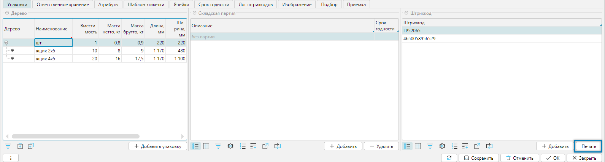
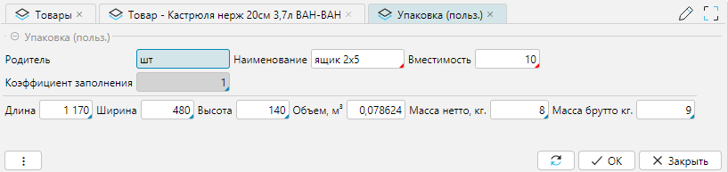

Справочник товаров — это ключевой элемент, который обеспечивает централизованное хранение и управление информацией о
товарах. Содержит полную информацию о каждом товаре: название, артикул, описание, штрих-коды, весогабаритные 
характеристики и др. Позволяет присваивать каждому товару уникальный код для точного учета и отслеживания. Структурно
связан со справочником [категорий](categories.md).

Справочник товаров доступен из меню **Справочники-Товары-Товары** (рис. 1) или **Рабочий стол-Справочники-Товары**. 
Справочник может как импортироваться из внешней системы, так и создаваться и редактироваться в lsFusion WMS.

## Отображение справочника
Справочник товаров представлен на форме в виде иерархической структуры в разрезе товарных категорий, поэтому форма
отображения разбита на два связанных табличных части:

- **Дерево**, отражающая список категорий. Для редактирования категорий используются кнопки **Редактировать,
  Удалить**, а также кнопка **+Категория**, для доступа к полному функционалу работы с [категориями](categories.md).
- **Номенклатура**, отражающая список товаров.  

 
Рис. 1 Форма отображения справочника

Для управления формой доступны:
- Поиск **Найти по штрихкоду (F4)** - поиск товара по его штрих коду. После ввода в поле сканером или вручную кода 
  товара будет выполнен поиск. При этом если товар будет найден, то указатели в справочнике категорий и номенклатуры 
  установятся в нужных местах, иначе будет сообщение, что товар не найден. 
- Фильтр **Только разрешенные** - позволяет видеть текущему сотруднику только разрешенные для него категории или
  товары в зоне его ответственности.
- Фильтр **Все** - позволяет увидеть весь номенклатурный справочник без привязки к категориям. Это может быть удобно,
  например, когда надо что-либо найти.
- Чекбокс **Редактировать в списке** - позволяет быстро, не заходя в форму редактирования, подправить какой-либо 
  реквизит(ы) товара 
- Кнопка **Печать** - разрешает печать этикетки на товар. 

 
Рис. 2 Пример печатной формы: Этикетка на товар

<info>
**Печать этикетки производится:**
- из текущей формы при нажатии на кнопку **Печать** по текущему товару
- из меню **Печать-Товар-Печать этикеток товара** группы этикеток по отмеченным товарам 
</info>

## Редактирование карточки товара

 
Рис. 3 Форма редактирования карточки товара

Форма редактирования справочника может быть поделена на несколько функциональных блоков:
- Номенклатура - основные характеристики товара.
- Весогабаритные характеристики.
- Опции - дополнительные опции.
- Оценки - факторы, влияющие на работу системы по размещению товара.
- Вкладки.

### Номенклатура 
- **Наименование** - наименование товара.
- **Категория (полная)** - полный путь к категории товара, при этом уровни вложенности отделяются символом "/".
- **Описание** - дополнительное описание товара.
- **Страна происхождения** - страна изготовления товара (*правильно*) или страна поступления. 
- **Код** - код товара, как способ идентификации товара, значение может быть любым, например штрихкод.
- **Артикул** - некий код, как способ идентификации товара.
- **Ед.изм.** - базовая единица измерения (минимальная единица, в которой ведется учет).
***

### Весогабаритные характеристики 
- **Ввод ВГХ при сканировании** - если флажок установлен, то при сканировании товара будет требоваться ввод 
  весогабаритных характеристик.
- **Масса нетто, кг** - чистый вес базовой единицы товара без упаковки.
- **Масса брутто, кг** - вес базовой единицы товара в упаковке.
- **Длинна, мм** - базовой единицы.
- **Ширина, мм** - базовой единицы.
- **Высота, мм** - базовой единицы.
- **Коэффициент заполнения** - это соотношение совокупного объема помещенных в ячейку товаров к объему ячейки, при 
  достижении которого ячейка будет считаться заполненной. Максимальное значение 1. 
***

### Опции 
- **Со сроком годности** - если установлено, то при вводе товара, будет запрашиваться либо срок годности, либо дата
  производства.
***

### Оценки
Оценки влияют на оптимизацию алгоритмов размещения. Для товаров, пользующихся наибольшим спросом в рамках выбранной
оценки, будут предлагаться наиболее быстро-доступные места хранения, а для товаров, пользующихся наименьшим спросом,
будут предлагаться менее доступные места хранения:
- **ABC** - анализ оценки эффективности спроса товаров и их реализации
- **FMR** - анализ частоты обращения к товарам
- **XYZ** - анализ спроса на товары, на которые влияют внешние факторы: сезонность, рекламные кампании и т.д.
***

### Вкладка Упаковки
Задает дополнительные виды упаковок относительно базовой единицы измерения

 
Рис. 4 Вкладка Упаковки

Вкладка представлена 3-мя табличными формами:
1. Дерево
2. Складская партия
3. Штрихкод

#### Форма Дерево
Упаковки могут иметь иерархическую структуру, то есть упаковки могут входить в друг-друга. 
В приводимом на примере базовая единица "шт" имеет еще 2 упаковки: ящик 2х5 и ящик 4х5 с разной вместимостью базовых 
единиц, 10 и 20 штук, соответственно.  

 
Рис. 5 Форма Дерево

При добавлении новой упаковки (редактировании) вызывается форма редактирования упаковки

 
Рис. 6 Редактирование упаковки

Редактирование:
- **Родитель** - родительская категория, на один уровень выше текущей в иерархии. Выбирается автоматически в зависимости
  от того на каком пункте в дереве упаковок установлен курсор
- **Наименование** - наименование новой упаковки
- **Вместимость** - количество родительских единиц, входящих в новую упаковку
- **Коэффициент заполнения** - это соотношение совокупного объема помещенных в ячейку товаров к объему ячейки, при
  достижении которого ячейка будет считаться заполненной. Максимальное значение 1.
- **Длина, Ширина, Высота, Объем** - геометрические размеры упаковки. При этом объем рассчитывается автоматически, если
  заполнены первые три свойства.
- **Масса нетто, кг** - чистый вес товара в килограммах без упаковки
- **Масса брутто, кг** - общий вес упаковки с товаром
***

#### Форма Складская партия
В форме отображаются партии товаров

 
Рис. 7 Форма Складская партия

Партия с наименованием **без партии** - это название партии, по которой в системе проходят все товары и это 
наименование будет присутствовать всегда для всех товаров. 

<tip> 
- Понятие партии в WMS отлично от понятия в ERP, где партия завязана на документы прихода. В WMS у одного товара может
  быть несколько партий, а у одной партии может быть несколько товаров.
</tip>

[//]: # (todo - Вопрос почему можно добавить партию. Уточнить)
***

#### Форма Штрихкод
В форме отображаются штрихкоды товара

 
Рис. 8 Форма Штрихкод

Для каждой упаковки существует, как минимум один штрихкод, создаваемый автоматически. 
В примере для базовой единицы - это код LP104578. При этом могут быть заданы другие коды, в примере - это штрих-код 
4650058956529.  
Кнопка **Печать** вызывает печать этикетки относительно штрихкода, на котором стоит курсор.  
***

### Вкладка Ответственное хранение
Вкладка отражает дополнительные характеристики если подключен модуль **Ответственное хранение**

 
Рис. 9 Вкладка Ответственное хранение

На складе, кроме собственного товара, может храниться товар других владельцев 
([поклажедателей](../intro/terminology.md#люди)).  В таком случае для каждого поклажедателя в корне справочника 
категорий создается своя категория, в которой находится его справочник товаров.
Редактирование:
- **Владелец** товара определяется владельцем корневой категории товара.
- **Категория 3PL** - дополнительный классификатор, который используется для тарификации оплачиваемых операций 
  склада. Каждый товар, операции, с которым необходимо тарифицировать и, по которому нужно выставлять счет 
  поклажедателю, должен быть привязан к группе этого классификатора. Сам классификатор находится в разделе 
  **Биллинг-Справочники-Категории 3PL**. 

### Вкладка Атрибуты
Вкладка доступна, если добавлены атрибуты. Атрибут - это дополнительная характеристика, расширяющая описание
редактируемого объекта, в данном контексте - справочника Товаров. Настройка атрибутов выполняется в разделе
[Настройки-Атрибуты](attributes.md).

 
Рис. 10 Вкладка Атрибуты
***

### Вкладка Шаблон этикетки
Вкладка отражает справочно доступный список этикеток по товару 

 
Рис. 11 Вкладка Шаблон этикетки

<info>
**Печать этикетки и управление шаблонами**
- Печать выполняется из меню **Справочники-Товары** с выбором перед печатью шаблона этикетки из списка, закрепленных за 
  товарной категорией (флажок "**Вкл.**") этикеток, по текущей отдельной позиции.
- Печать выполняется из меню **Печать-Товар-Печать этикеток товара** этикетки по умолчанию (флажок **По умолч**) для 
  всех отмеченных или только текущей товарной позиции. 
- Закрепление шаблонов этикеток за товаром производится на уровне 
  [справочника категорий](categories.md#вкладка-шаблоны-этикеток).
- Добавление новых шаблонов этикеток через меню **Печать-Товар-Шаблон этикеток товара**.
</info>
***

### Вкладка Ячейки
Вкладка отражает доступные для хранения товара ячейки

 
Рис. 12 Вкладка Ячейки

На вкладке Ячейка отображается две табличные части:  
- **Дерево** - иерархическая структура доступных складов и их сегментов (слева)
- **Ячейка** - список связанных с иерархической структурой ячеек (справа)

По умолчанию для всех товаров все ячейки разрешены для использования. При необходимости можно запретить для товара 
использование целиком отдельных сегментов или отдельных ячеек. Для запрета используются значение флажков колонок 
**Запрет** табличных частей **Дерево** и **Ячейка** (отмечено стрелкой).  
Табличная часть **Ячейка** содержит фильтр **Запрет**. Если флажок фильтра установлен, то отражаются только ранее 
запрещенные ячейки или список будет пуст, если запрещенных ячеек нет.

Существует несколько понятий, связанных с размещением товара:
- Свободное перемещение. Если кладовщику оно разрешено, то он может положить товар в ячейку, даже если хранение товара
  там запрещено
- Плановое размещение. При плановом размещении считается план и кладовщик следует плану по размещению товара
  При этом может действовать настройка разрешающая отклонение от плана или нет.
***

### Вкладка Срок годности
Вкладка доступна, если в разделе **Опции** установлено **Со сроком годности**.

 
Рис. 13 Вкладка Срок годности

При приемке товара будет запрошена дата производства, если установлен флажок **Указывать дату производства**. При этом
срок годности рассчитается автоматически относительно даты производства и уставленных значений срока годности лет,
месяцев, дней.
***

### Вкладка Лог штрихкодов
Вкладка представляет собой журнал изменения штрихкодов.

 
Рис. 14 Вкладка Лог штрихкодов

Журнал хранит изменения, связанные со штрихкодами: какой штрихкод кем и когда был изменен.  
Назначение журнала - поиск возможных ошибок.  
Можно настроить, как долго информация по логированию будет храниться. За это отвечает настройка в администрировании 
системы **Администрирование-Приложение-Настройки-Вкладка Логирование**, 
параметр **За сколько дней хранить лог пользовательских штрихкодов**. По умолчанию срок не определен и информация 
хранится без ограничений по времени. В настройках можно указать количество дней для хранения информации, по истечению 
указанных дней информация будет удаляться автоматически. 

[//]: # (todo - добавить ссылку на раздел Администрирования, ID options)
***

### Вкладка Изображение
Вкладка разрешает связать товар с его изображением

 
Рис. 15 Изображение товара

Действия при работе с изображением:
- Вставить изображение. Выполняется по левому клику мыши на области изображения, при этом вызывается стандартный 
  диалог открытия файла с диска.
- Очистить ранее загруженное изображение. Выполняется по правому клику мыши на области изображения (показано на 
  рисунке), при этом появляется выпадающее меню из которого надо выбрать верхний пункт **Очистить**.
***

### Вкладка Подбор
Вкладка отвечает за то, как будет планироваться подбор для текущего товара.

 
Рис. 16 Вкладка Подбор

Настройки отвечают за особенности планирования товара при отгрузке. 
Более подробно описано в разделе Подбор.

[//]: # (todo - дать ссылку на раздел Подбор)
***

### Вкладка Приемка
Вкладка отвечает за то, в каких единицах будет приниматься товар на приемке.

 
Рис. 17 Вкладка Приемка

Товар, как правило, принимается и учитывается упаковками, то есть так, как он обычно и поступает на склад. Но иногда
бывает необходимо принимать товара в базовых единицах (_например, в штуках_). При установке чекбокса "Принимать базовые
единицы" на приемке товара при считывании штрих кода упаковки, количество товара при приемке будет определяться
количеством базовых единиц, входящих в упаковку, и учитываться товар на складе будет в базовых единицах, а не в
упаковках.   

