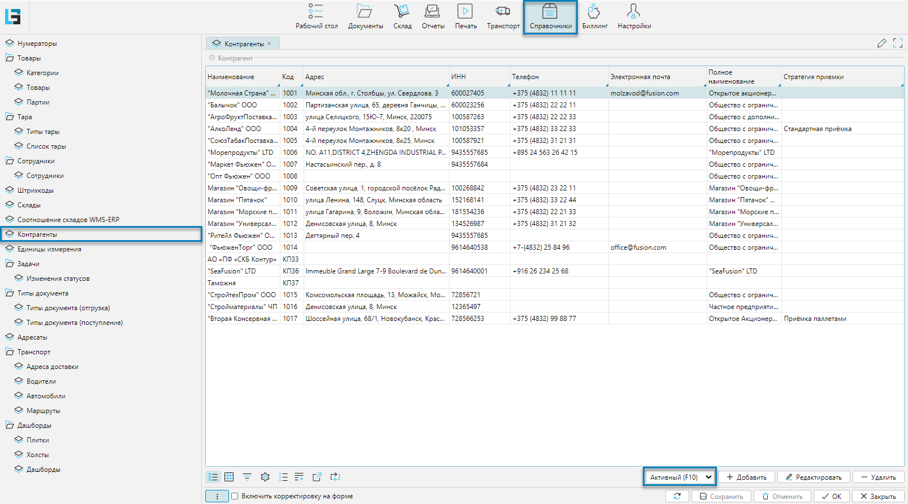

Справочник контрагентов - это инструмент, который помогает управлять информацией о партнёрах, таких как поставщики,
покупатели, перевозчики и другие участники цепочки поставок.

Справочник доступен из меню **Справочники-Контрагенты** (рис. 1) или **Рабочий стол-Справочники-Контрагенты**. 
Справочник может как импортироваться из внешней системы, так и создаваться и редактироваться в lsFusion WMS.

## Отображение справочника

   
_Рис. 1 Форма отображения справочника_

Для управления отображением контрагентов используют фильтр **Активный (F10)**. Фильтр позволяет управлять 
отображением активных и(или) неактивных контрагентов. 
<info>
  - Неактивный контрагент - это партнер, с которым в текущий момент времени отсутствует активная деятельность
  - Неактивные контрагенты недоступны для выбора при оформлении операций и документов
</info>

## Редактирование контрагента

   
_Рис. 2 Форма редактирования контрагента_

Форма редактирования контрагента (Рис. 2) может быть условно разделена на 2 функциональные части:
1. Общие свойства контрагента
2. Вкладки - дополнительные свойства контрагента

Свойства контрагента:
- **Код** - код контрагента, который является уникальным идентификатором
- **Наименование** - краткое наименование контрагента
- **Адрес** - физический адрес контрагента
- **ИНН** - идентификационный номер налогоплательщика
- **Телефон**
- **Электронная почта**
- **Неактивный** - если флажок установлен, то клиент будет считаться неактивным. Такого клиента нельзя выбрать при 
  оформлении приходно / расходных операций, но он будет виден в документах движения. 

### Вкладка Атрибуты
Вкладка содержит дополнительные [атрибуты](attributes.md) контрагента.

 
_Рис. 3 Вкладка атрибуты_

Элементы ввода:
- **Примечание** - дополнительная информация, примечание
- **Менеджер** 
- **Полное наименование** - наименование контрагента без сокращений и аббревиатур

[//]: # (todo - кто понимается под менеджером)
***

### Вкладка Поступления
Вкладка отображает список поступлений товара от контрагента

 
_Рис. 4 Вкладка Поступления_

[//]: # (todo - Что такое стратегия приемки)
***

### Вкладка Адреса
Вкладка отображает карту и адрес(а) доставки

 
_Рис. 5 Вкладка Адреса_

Форма разбита на две части:
1. Слева отображается адрес(а) доставки с данными геолокации
2. Справа отображается карта с адресом доставки

Элементы управления:
- **Только отмеченные** - фильтр (установлен по умолчанию), отображает закрепленные за контрагентом адреса доставки. 
  Если фильтр снят, то табличная часть формы отображает список доступных адресов доставки

   
  _Рис. 6 Список адресов доставки_

- **Вкл** - флажок в табличной части формы отвечает за закрепление адреса доставки за контрагентом. Адресов доставки 
  может быть несколько, соответственно на карте будет отмечено несколько точек. Список адресов настраивается из меню 
  **Транспорт-Справочники-Адреса доставки**   

[//]: # (todo - Необходимо дать ссылку на модуль Транспорт)
[//]: # (todo - Непонятно действие по элементу карта слева, отмечено стрелкой)
***

### Вкладка Маршрут
Вкладка отражает список маршрутов 

 
_Рис. 7 Вкладка Маршрут_

Список маршрутов настраивается из меню **Транспорт-Справочники-Маршруты**

[//]: # (todo - Необходим заполненный пример)
[//]: # (todo - Необходимо дать ссылку на модуль Транспорт)
***

### Вкладка Ответственное хранение

 
_Рис. 8 Вкладка Маршрут_

[//]: # (todo - Необходима дополнительная информация)
