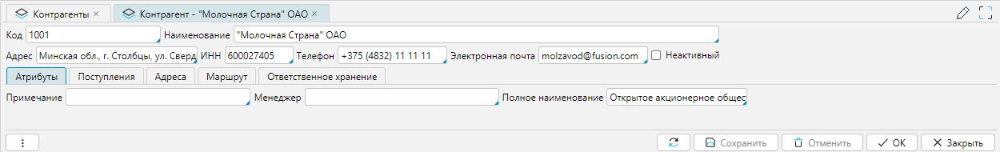

Справочник контрагентов cодержит информацию о партнёрах, таких как поставщики,
покупатели, перевозчики и другие участники цепочки поставок.

Справочник можно импортировать из внешней системы или создать и редактировать в lsFusion WMS.

## Отображение справочника

Справочник отображается на форме **Справочники-Контрагенты** (рис. 1) или **Рабочий стол-Справочники-Контрагенты**. По 
умолчанию на форме справочника установлен фильтр **Активный (F10)** и отображаются только активные контрагенты. 
Фильтр позволяет отобразить только **Активных**, только **Неактивных** и **Всех** контрагентов. 

[//]: # (TODO Нужно сделать скриншот с открытыми варииантами установки фильтра) 

   
_Рис. 1 Форма отображения справочника_

## Редактирование контрагента

   
_Рис. 2 Форма редактирования контрагента_

Форма редактирования контрагента (рис. 2) может быть условно разделена на 2 функциональные части:
- Общие свойства контрагента
-  Вкладки - дополнительные свойства контрагента

Свойства контрагента:
- **Код** - уникальный идентификатор конрагента
- **Наименование** - краткое наименование контрагента
- **Адрес** - физический адрес контрагента
- **ИНН** - идентификационный номер налогоплательщика
- **Телефон**
- **Электронная почта**
- **Неактивный** - если флажок установлен, то контрагент будет считаться неактивным. Такого контрагента нельзя выбрать 
  при 
  оформлении приходных/расходных операций, но он будет виден в документах движения. 

### Вкладка Атрибуты
На вкладке устанавливают значения дополнительно настроенных [атрибутов](../wmssettings/attributes.md) контрагента. На рисунке ниже 
приведен 
пример, где для контрагента есть дополнительные атрибуты **Полное наименование**, **Менеджер** и **Примечание**.

 
_Рис. 3 Вкладка атрибуты_

[//]: # (todo - кто понимается под менеджером. Нет смвсла описывать атрибуты, которые настроены дополнительно, 
достаточно того, что есть ссылка на статью о механизме атрибутов) 
***

### Вкладка Поступления
На вкладке отображается список поступлений товара от контрагента.

**Стратегия приемки** - параметр доступен при подключении модуля **Расширенная приемка**. Позволяет установить 
[стратегию приемки](../incoming/receiptstrategy.md), которая будет
использоваться в документах [поступления](../incoming/receipt.md) товаров на склад от этого контрагента.

 
_Рис. 4 Вкладка Поступления_

***

### Вкладка Адреса
Вкладка доступна при подключении модуля **Транспорт**. На вкладке отображаются адрес(а) доставки (слева) и их 
расположение на карте (справа). 

**Только отмеченные** - фильтр (установлен по умолчанию) отображает только закрепленные за контрагентом адреса доставки.
Для таких адресов установлен флажок **Вкл** (рис. 5). Если фильтр снят, то отображается список всех доступных адресов 
доставки в системе (рис.6).  Список адресов настраивается на форме **Транспорт-Справочники-Адреса доставки**.

 
_Рис. 5 Отображение адресов контрагента_

 
_Рис. 6 Отображение всех адресов_

[//]: # (todo - Необходимо дать ссылку на модуль Транспорт)
[//]: # (todo - Непонятно действие по элементу карта слева, отмечено стрелкой)
***

### Вкладка Маршрут
Вкладка доступна при подключении модуля **Транспорт**. На вкладке отображается список маршрутов. Список маршрутов 
настраивается на форме **Транспорт-Справочники-Маршруты**

 
_Рис. 7 Вкладка Маршрут_

[//]: # (todo - Необходим заполненный пример)
[//]: # (todo - Необходимо дать ссылку на модуль Транспорт)
***

### Вкладка Ответственное хранение

 
_Рис. 8 Вкладка Ответственное хранение_

[//]: # (todo - Необходима дополнительная информация)

[//]: # (todo заменить скриншоты, чтобы не было разрыва посередине)