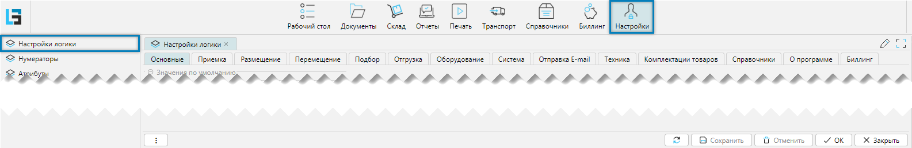
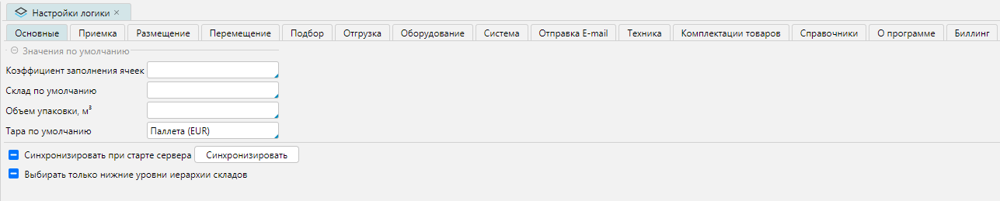
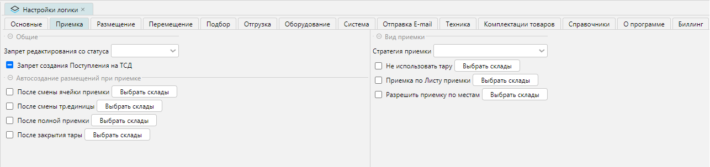

Форма **Настройка логики** определяет настройки системы по своим категориям. Представляет собой набор вкладок,
содержащих определенные свойства, влияющие на поведение системы.

Настройки логики доступны из меню **Настройки-Настройки логики** (Рис. 1).

 
Рис. 1 Форма настройки логики

## Вкладка Основные
Вкладка отвечает за основные общие настройки

 
Рис. 2 Вкладка Основные
***

## Вкладка Приемка
Вкладка отвечает за основные настройки приемки

 
Рис. 3 Вкладка Приемка

Панель **Общие**:
- **Запрет редактирования со статуса** - запрещает редактирование документа поступления, начиная с выбранного 
  статуса документа
- **Запрет создания поступления на ТСД** - запрещает передачу заданий на ТСД
***

Панель **Автосоздание размещений**:
- **После смены ячейки приемки** - 
- **После смены тр. единицы** -  
- **После полной приемки** -
- **После закрытия тары**
***

Панель **Вид приемки**: 
Задает предварительные настройки приемки для документов [поступления](../incoming/receipt.md)
при выборе склада, которые будут действовать для документа по умолчанию. При этом можно выбрать либо:
- [**стратегию приемки**](../incoming/receiptstrategy.md), если подключен модуль **Расширенная приемка**
- отдельными [**свойствами**](../incoming/receipttype.md):
  **Не использовать тару, Приемка по Листу приемки, Разрешить Приемку по местам**.

***

[//]: # (todo - Настройки логики. Требуется описание. Тр. единица - траспортная единица)

